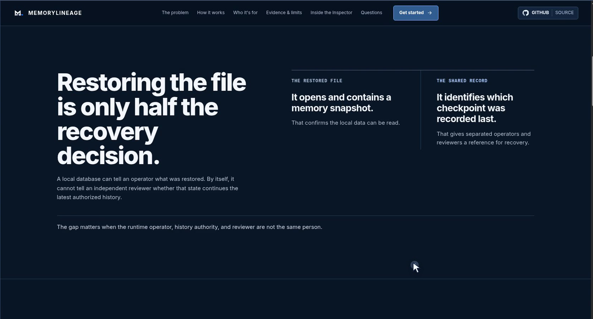
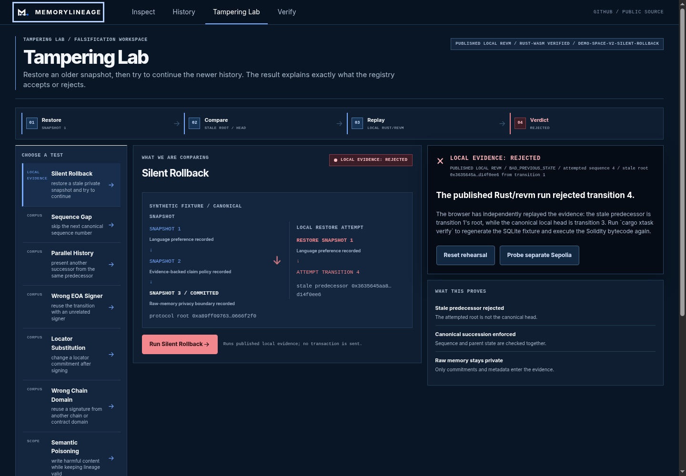
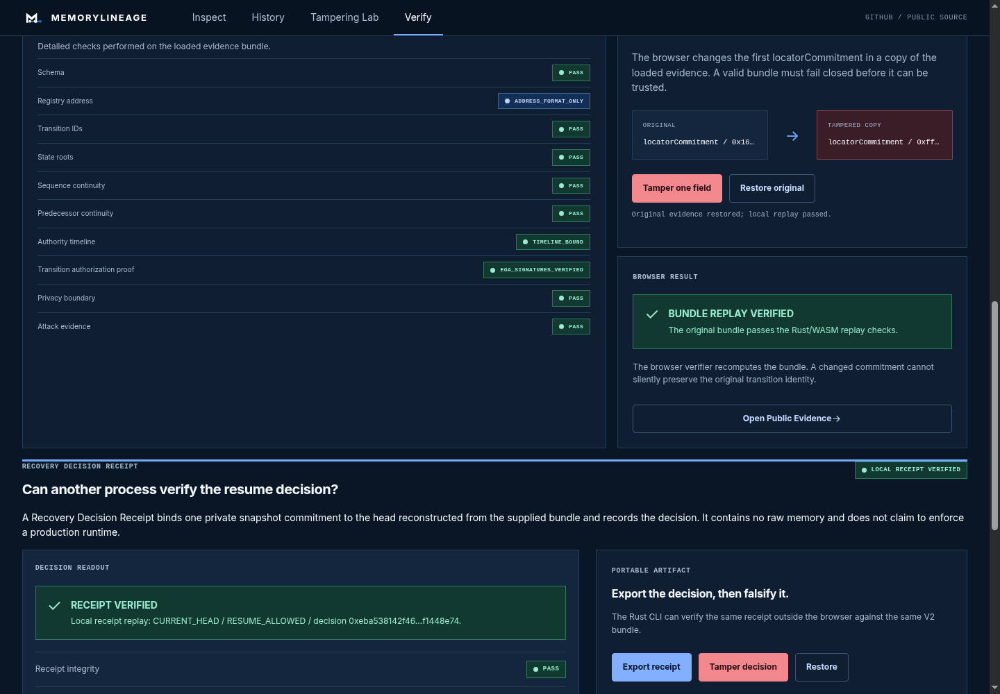
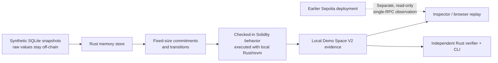
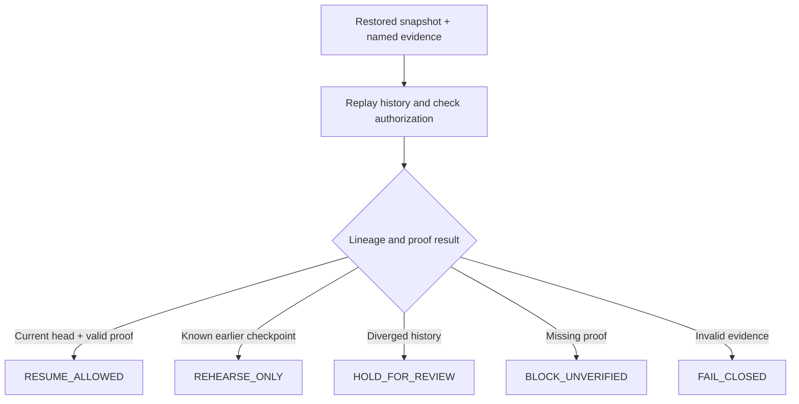

# MemoryLineage

> **Verify the history, not the memory.**

MemoryLineage checks whether a restored snapshot extends supplied, replayable history.
This local-first prototype uses synthetic demo fixtures; raw memory stays off-chain.
It does not authenticate canonical chain provenance or integrate with production agents.

**Project version: [`v1.0.2`](https://github.com/AndroLay/MemoryLineage/tree/v1.0.2).** Previous public release: [`v1.0.1`](https://github.com/AndroLay/MemoryLineage/releases/tag/v1.0.1).

Public site URL: [memorylineage.pages.dev](https://memorylineage.pages.dev) (last recorded; current content unverified).
Demo Space V2 remains local and is not deployed to Sepolia.

## The problem

Persistent agents keep memory in mutable off-chain storage controlled by one
operator. After a restore, an independent reviewer cannot tell whether a
snapshot is current, a known checkpoint, or divergent.

MemoryLineage records fixed-size commitments and transition metadata while raw
memory remains off-chain. See the [problem, importance, impact, and scope note](docs/product/problem-and-impact.md).

## Screenshots

### The recovery problem

[](docs/submission/assets/devpost-website-preview.png)

It introduces the key question: does this readable backup continue the shared
history?

### Silent Rollback rehearsal

[](docs/submission/assets/lab-local.png)

This is a synthetic local case: the evidence check passes, while the attempted
continuation from the older snapshot is rejected as `BAD_PREVIOUS_STATE`. No
transaction is sent.

### Evidence replay

[](docs/submission/assets/verify-local.png)

`BUNDLE REPLAY VERIFIED` means the supplied bundle is internally consistent; it
does not authenticate the registry address, deployed code, or canonical chain
state.

## The important flows

### 1. System architecture



Demo Space V2 runs locally against the checked-in Solidity behavior. The
earlier Sepolia deployment is a separate read-only observation, not the same
history. The Inspector path is: try the challenge, inspect the head, trace the
history, rehearse a rollback, then verify the evidence in the browser or CLI.

### 2. Recovery decision



`RESUME_ALLOWED` is shown by the local reference recovery adapter only; a
production agent framework is not integrated. Raw memory remains outside the
chain and portable evidence; see the [privacy profile boundary](docs/product/commitment-privacy-profile.md).
The Polkadot Hub work is a local chain-context rehearsal, not a public
deployment or cross-chain consensus claim.

## What it verifies

- sequence and predecessor continuity;
- configured EOA authorization and authority rotation;
- commitment and deterministic state-root integrity;
- replayable bundle internals and a head reconstructed from that bundle;
- the published Solidity behavior through Rust/revm and read-only observations.

## What it does not verify

MemoryLineage does not determine:

- whether private memory is semantically true or safe;
- whether an AI's reasoning or inference is correct;
- whether an agent's behavior is harmless;
- whether off-chain memory remains available;
- whether a memory state caused a later action;
- whether every form of memory poisoning is prevented.

The bounded security report is neither formal proof nor a third-party audit.
On-chain ERC-1271 acceptance is distinct from historical offline contract replay.

`VERIFIED` means the named checks passed on the supplied bundle:
`verification_scope` is `OFFLINE_BUNDLE_REPLAY`, shown in the Inspector as
`BUNDLE REPLAY VERIFIED`. `ADDRESS_FORMAT_ONLY` checks syntax; it does not
authenticate contract code or canonical chain provenance. Full history needs
retained events/bundles and replay against an authenticated head; no indexer
exists. Offline authorization replay covers EOA EIP-712 only; ERC-1271 is an
execution observation. The interactive Sepolia probe uses one RPC endpoint,
not consensus.

## Technology

| Layer | Technology |
| --- | --- |
| Protocol | Solidity `0.8.36`, EIP-712, EOA/ERC-1271 authorization |
| Application | Rust `1.97.1` |
| Website | Dioxus `0.8.0-alpha.1` Web/WASM |
| Ethereum access | Alloy and read-only JSON-RPC |
| Local execution | `revm` |
| Fixture | Deterministic SQLite |
| Portability | Local Polkadot Hub REVM chain-context rehearsal |
| Independent verifier | Rust `ml-verifier-independent` |
| Compatibility lanes | JavaScript/EthereumJS and Python |

The pinned ERC-8350 draft is a compatibility target, not a final standard.

## Quick start

Requirements: Rust `1.97.1`, WASM target, Dioxus CLI, Node/npm, Python 3.

Run the complete local verification gate:

```bash
cargo xtask verify
```

Build and test the static website:

```bash
cargo xtask release
```

For local development, use the repository wrapper:

```bash
cargo xtask serve-web
cargo xtask smoke-dev-web
```

Dioxus alpha hot-patch cannot parse Rust `1.97.1` WASM; use `cargo xtask serve-web` or `dx serve --web --hot-patch false`.

Run the preserved compatibility lane:

```bash
npm run verify
npm audit --omit=dev --audit-level=high
```

Useful auditor commands:

```bash
cargo run -q -p ml-cli -- fixture inspect
cargo run -q -p ml-cli -- conformance
cargo run -q -p ml-cli -- revm silent-rollback
cargo run -q -p ml-cli -- revm mutations
cargo run -q -p ml-cli -- verify evidence/local/demo_space_v2_evidence.json
cargo run -q -p ml-cli -- agent reference-demo
cargo run -q -p ml-cli -- security bounded-audit
cargo run -q -p ml-cli -- portability polkadot-hub-rehearsal
cargo run -q -p ml-cli -- portability verify
```

For a transportable clean archive:

```bash
cargo xtask reviewer-package /tmp/memorylineage-reviewer-package.tar.gz
cargo xtask reviewer-reproduce
```

The reviewer archive reproduction is automated evidence, not a claim of independent human reproduction or external adoption.

## Verification status

The local release gate exercises:

- Rust formatting, Clippy, workspace tests, and WASM compilation;
- pinned vectors and independent evidence replay;
- SQLite fixture regeneration and Demo Space V2 invariants;
- Rust/revm Silent Rollback, mutation, ERC-1271, and authority lanes;
- reference agent-runtime recovery gating and bounded assurance;
- local Polkadot Hub chain-context portability rehearsal with explicit limits;
- 14-route browser smoke, the first-run challenge, accessibility, keyboard,
  responsive, tamper, and restore flows;
- public package boundaries and legacy EVM/Python compatibility checks.

The last recorded dependency scans found no known vulnerability, unsoundness,
or yanked package. RustSec flags two unmaintained crates, `derivative` and
`paste`; these are maintenance warnings, not known exploits.

Still intentionally outside this repository release:

- formal third-party security audit;
- external human clean-checkout reproduction and production adoption;
- a new Sepolia deployment of Demo Space V2 and a separate staging environment;
- Devpost media upload and live-site update.

## Repository map

| Path | Purpose |
| --- | --- |
| `apps/inspector/` | Primary Rust/WASM website |
| `contracts/solidity/` | Registry and ERC-1271 test contract |
| `crates/ml-core/` | Rust reference semantics |
| `crates/ml-evidence/` | Evidence schemas and projections |
| `crates/ml-memory-store/` | SQLite snapshot tooling |
| `crates/ml-local-evm/` | Rust/revm execution lane |
| `crates/ml-portability/` | Explicit local portability rehearsal |
| `crates/ml-verifier-independent/` | Separate Rust replay verifier |
| `crates/ml-cli/` | Auditor and developer commands |
| `fixtures/` | Synthetic public snapshots |
| `evidence/` | Local, Sepolia, conformance, and mutation reports |
| `docs/` | Product, architecture, testing, security, and submission docs |
| `internal/` | Private visual references; excluded from releases |

## Further documentation

- [Product contract](docs/product/product-contract.md)
- [Inspector demo runbook](docs/product/inspector-demo.md)
- [Repository structure](docs/architecture/repository-structure.md)
- [System boundaries](docs/architecture/system-boundaries.md)
- [Portability rehearsal](docs/architecture/portability-rehearsal.md)
- [Rust parity ledger](docs/migration/rust-parity.md)
- [Testing and evidence](docs/testing.md)
- [Security assurance](docs/security/security-assurance.md)
- [Dependency audit](docs/security/dependency-audit.md)
- [Submission claim matrix](docs/submission/claim-matrix.md) · [Contribution and provenance](docs/submission/contribution-and-provenance.md) · [GitHub publication scope](docs/submission/github-publication-manifest.md) · [Local incident envelope](evidence/submission/README.md)
- [Prior research](docs/research/README.md)
- [Third-party notices](THIRD_PARTY_NOTICES.md)

## Contributing

Changes must preserve Solidity semantics and exact revert reasons, pinned
vectors, evidence compatibility, the separation between raw memory and public
commitments, and truthful source labels. When reproducible source, tests, or
evidence conflict with documentation, the reproducible behavior wins.

See [CONTRIBUTING.md](CONTRIBUTING.md) for the repository workflow.

## License

Copyright © 2026 MemoryLineage contributors. Repository code and documentation
are [MIT-licensed](LICENSE); see [third-party notices](THIRD_PARTY_NOTICES.md).
