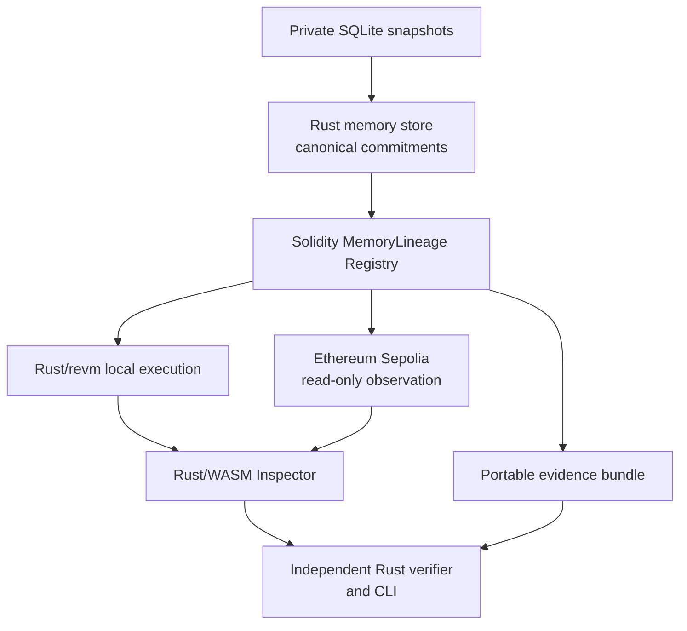
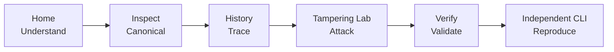
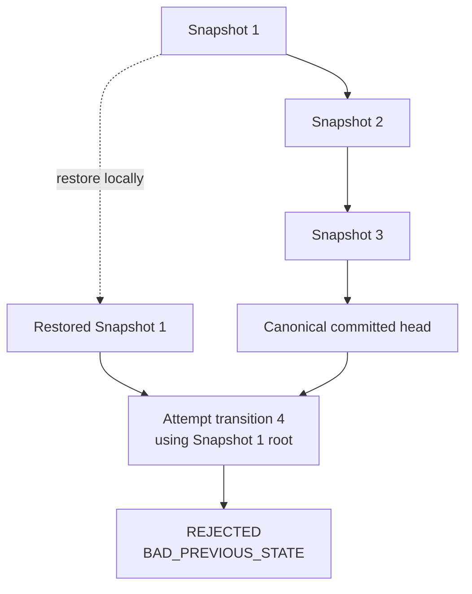
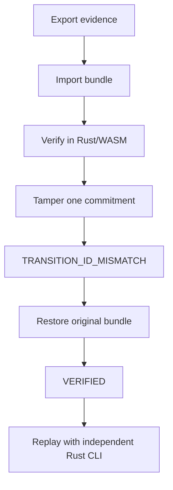
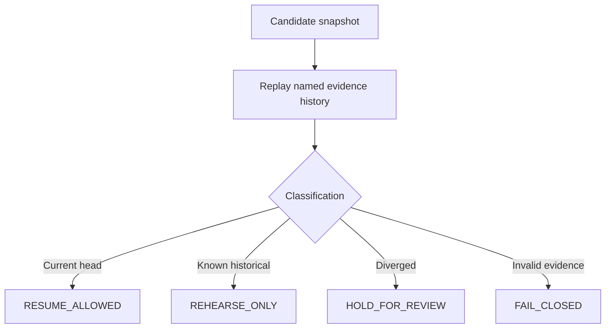
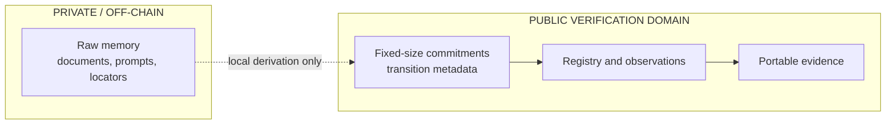
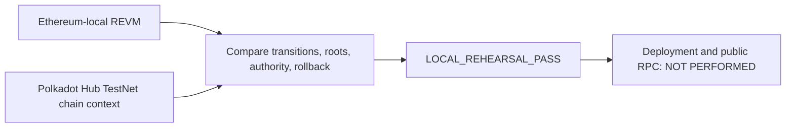

# MemoryLineage

> **Verify the history, not the memory.**

MemoryLineage is an independent auditor for private AI-agent memory history.
It verifies whether a committed memory state is the continuous, authorized
successor of the previously committed state without publishing raw memory
on-chain.

Release baseline: **`v1.0.0`** · current review candidate: [`v1.0.1-rc.3`](https://github.com/AndroLay/MemoryLineage/releases/tag/v1.0.1-rc.3)

Live website: [memorylineage.pages.dev](https://memorylineage.pages.dev) — the
static Rust/WASM Inspector is hosted on Cloudflare Pages. The local Demo Space
V2 remains separate and is not deployed to Sepolia.

## The problem

Persistent agents keep memory in mutable off-chain storage controlled by one
operator. After a restore, migration, or failover, an independent reviewer
cannot tell whether a candidate snapshot is the current authorized continuation,
a known historical checkpoint, or a divergent state.

MemoryLineage records fixed-size commitments and transition metadata while raw
memory remains off-chain. Read the complete [problem, importance, impact, and
scope note](docs/product/problem-and-impact.md).

## The important flows

### 1. System architecture



### 2. Reviewer journey



The Inspector has 11 routes. Four are primary tools: `/inspect`, `/history`,
`/lab`, and `/verify`. The other routes cover the home explanation,
transition detail, public evidence, architecture, security scope,
reproduction, and submission provenance.

### 3. The Silent Rollback



The local Demo Space V2 contains synthetic SQLite snapshots 1, 2, and 3. The
restored snapshot remains possible locally, but its actual stale root cannot be
accepted as the successor of the later canonical head.

### 4. Evidence verification



### 5. Recovery decision



### 6. Privacy boundary



Raw memory remains outside the chain and portable evidence. Demo Space V2 is
synthetic test data, not user data. The repository includes a separate Sepolia
readback observation; Demo Space V2 is not claimed as deployed to Sepolia.

### 7. Portability boundary



This is local portability preparation, not a public Polkadot deployment or cross-chain consensus claim.

## What it verifies

- sequence and predecessor continuity;
- configured EOA authorization and authority rotation;
- commitment and deterministic state-root integrity;
- replayable evidence and canonical committed head;
- the published Solidity behavior through Rust/revm and read-only observations.

## What it does not verify

MemoryLineage does not determine:

- whether private memory is semantically true or safe;
- whether an AI's reasoning or inference is correct;
- whether an agent's behavior is harmless;
- whether off-chain memory remains available;
- whether a memory state caused a later action;
- whether every form of memory poisoning is prevented.

The bounded security report is not a formal proof or a third-party security
audit. ERC-1271 results distinguish on-chain acceptance from full historical
offline signer-contract reexecution.

## Technology

| Layer | Technology |
| --- | --- |
| Protocol | Solidity `0.8.36`, EIP-712, EOA/ERC-1271 authorization |
| Application | Rust `1.97.1` |
| Website | Dioxus `0.8.0-alpha.1` Web/WASM |
| Ethereum access | Alloy and read-only JSON-RPC |
| Local execution | `revm` |
| Fixture | Deterministic SQLite |
| Portability | Local Polkadot Hub REVM chain-context rehearsal |
| Independent verifier | Rust `ml-verifier-independent` |
| Compatibility lanes | JavaScript/EthereumJS and Python |

The pinned ERC-8350 draft is a compatibility target, not a final standard.

## Quick start

Requirements: Rust `1.97.1`, the `wasm32-unknown-unknown` target, the pinned
Dioxus CLI, Node.js/npm, and Python 3.

Run the complete local verification gate:

```bash
cargo xtask verify
```

Build and test the static website:

```bash
cargo xtask release
```

For local development, use the repository wrapper:

```bash
cargo xtask serve-web
cargo xtask smoke-dev-web
```

The pinned Dioxus alpha's default hot-patch path cannot parse the WASM module
emitted by Rust `1.97.1`. The wrapper disables that path. Direct invocation
must use `dx serve --web --hot-patch false`.

Run the preserved compatibility lane:

```bash
npm run verify
npm audit --omit=dev --audit-level=high
```

Useful auditor commands:

```bash
cargo run -q -p ml-cli -- fixture inspect
cargo run -q -p ml-cli -- conformance
cargo run -q -p ml-cli -- revm silent-rollback
cargo run -q -p ml-cli -- revm mutations
cargo run -q -p ml-cli -- verify evidence/local/demo_space_v2_evidence.json
cargo run -q -p ml-cli -- agent reference-demo
cargo run -q -p ml-cli -- security bounded-audit
cargo run -q -p ml-cli -- portability polkadot-hub-rehearsal
cargo run -q -p ml-cli -- portability verify
```

For a transportable clean archive:

```bash
cargo xtask reviewer-package /tmp/memorylineage-reviewer-package.tar.gz
cargo xtask reviewer-reproduce
```

The reviewer archive reproduction is automated evidence, not a claim of independent human reproduction or external adoption.

## Verification status

The release gate currently covers:

- Rust formatting, Clippy, workspace tests, and WASM compilation;
- pinned vectors and independent evidence replay;
- SQLite fixture regeneration and Demo Space V2 invariants;
- Rust/revm Silent Rollback, mutation, ERC-1271, and authority lanes;
- reference agent-runtime recovery gating and bounded assurance;
- local Polkadot Hub chain-context portability rehearsal with explicit limits;
- 11-route browser smoke, accessibility, keyboard, responsive, tamper, and
  restore flows;
- public package boundaries and legacy EVM/Python compatibility checks.

The dependency scans report no known vulnerability, unsoundness, or yanked package. RustSec reports two unmaintained transitive crates, `derivative` and `paste`; these are maintenance warnings, not known exploits.

Still intentionally outside this repository release:

- formal third-party security audit;
- external human clean-checkout reproduction and production adoption;
- a new Sepolia deployment of Demo Space V2 and a separate staging environment;
- demo video recording.

## Repository map

| Path | Purpose |
| --- | --- |
| `apps/inspector/` | Primary Rust/WASM website |
| `contracts/solidity/` | Registry and ERC-1271 test contract |
| `crates/ml-core/` | Rust reference semantics |
| `crates/ml-evidence/` | Evidence schemas and projections |
| `crates/ml-memory-store/` | SQLite snapshot tooling |
| `crates/ml-local-evm/` | Rust/revm execution lane |
| `crates/ml-portability/` | Explicit local portability rehearsal |
| `crates/ml-verifier-independent/` | Separate Rust replay verifier |
| `crates/ml-cli/` | Auditor and developer commands |
| `fixtures/` | Synthetic public snapshots |
| `evidence/` | Local, Sepolia, conformance, and mutation reports |
| `docs/` | Product, architecture, testing, security, and submission docs |
| `internal/` | Private visual references; excluded from releases |

## Further documentation

- [Product contract](docs/product/product-contract.md)
- [Inspector demo runbook](docs/product/inspector-demo.md)
- [Repository structure](docs/architecture/repository-structure.md)
- [System boundaries](docs/architecture/system-boundaries.md)
- [Portability rehearsal](docs/architecture/portability-rehearsal.md)
- [Rust parity ledger](docs/migration/rust-parity.md)
- [Testing and evidence](docs/testing.md)
- [Security assurance](docs/security/security-assurance.md)
- [Dependency audit](docs/security/dependency-audit.md)
- [Submission claim matrix](docs/submission/claim-matrix.md)
- [Prior research](docs/research/README.md)
- [Third-party notices](THIRD_PARTY_NOTICES.md)

## Contributing

Changes must preserve Solidity semantics and exact revert reasons, pinned
vectors, evidence compatibility, the separation between raw memory and public
commitments, and truthful source labels. When reproducible source, tests, or
evidence conflict with documentation, the reproducible behavior wins.

See [CONTRIBUTING.md](CONTRIBUTING.md) for the repository workflow.

## License

MemoryLineage is released under the [MIT License](LICENSE). Third-party
dependency notices are recorded in [THIRD_PARTY_NOTICES.md](THIRD_PARTY_NOTICES.md).
