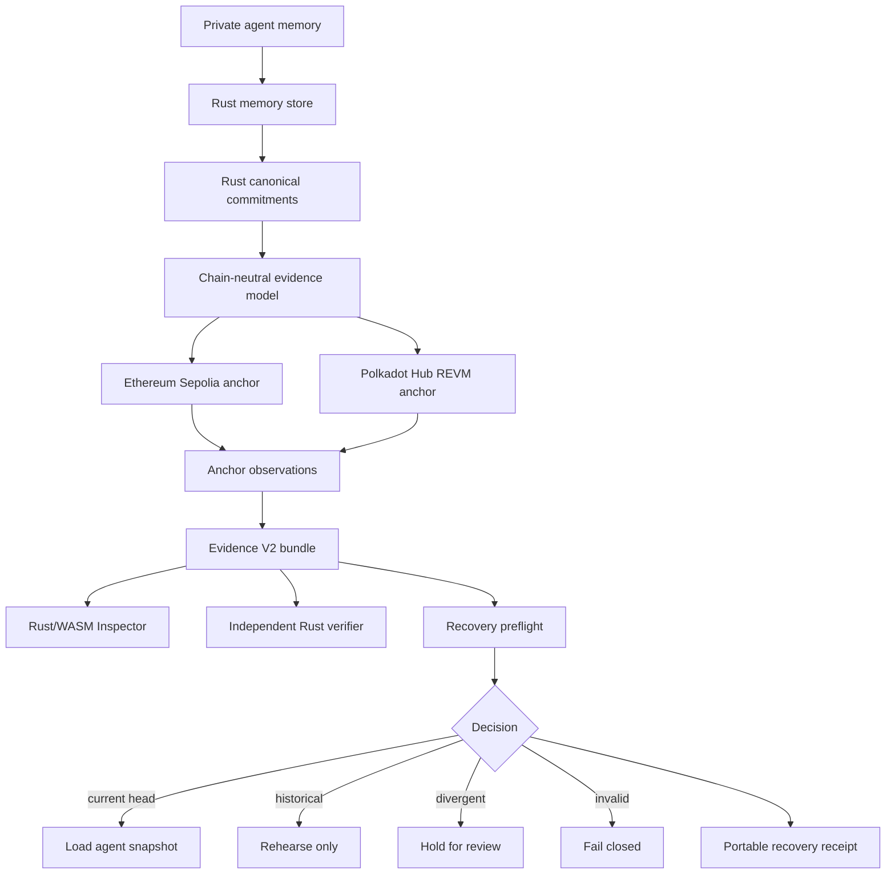
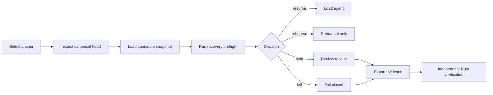

# MemoryLineage — Polkadot Strategic Portability Roadmap

Status: **proposed roadmap; not a current implementation claim**
Date: **20 September 2026**

This document defines how MemoryLineage can use Polkadot Hub to become a
portable recovery-integrity layer for private AI-agent state. It does not claim
that Polkadot support already exists, that a second deployment has already been
performed, or that portability alone creates adoption.

The primary product remains MemoryLineage. Polkadot is an additional execution
anchor and ecosystem path, not a reason to replace the current Ethereum
implementation.

## Strategic decision

MemoryLineage should evolve from:

```text
an Ethereum-based auditor for private agent-memory history
```

into:

```text
a chain-portable recovery-integrity layer for private agent state
```

The product question remains:

> **Can this private snapshot be classified and authorized before an agent loads it?**

The answer remains one of:

```text
RESUME_ALLOWED
REHEARSE_ONLY
HOLD_FOR_REVIEW
FAIL_CLOSED
```

Polkadot adds a second execution environment in which the same commitment,
authority, evidence, and recovery rules can be observed. It does not change the
meaning of those decisions.

## Why Polkadot is relevant

Polkadot Hub documentation describes two smart-contract execution paths:
REVM for standard Ethereum bytecode and PVM as a native execution engine. The
REVM path is specifically intended to let existing Solidity projects migrate
with minimal changes, while PVM is an optional path for native performance and
different execution needs.

That combination is unusually relevant to MemoryLineage:

```text
existing Solidity registry
        ↓
Polkadot Hub REVM compatibility
        ↓
optional Rust/PVM research path
```

The first path preserves current contract semantics. The second path can later
test whether the protocol model is portable beyond the EVM. These are two
separate milestones and must not be conflated.

The official Polkadot hackathon material also emphasizes ecosystem usage,
quality implementation, design, impact, and creativity. The practical lesson
for MemoryLineage is to present a complete user workflow and a useful
ecosystem role rather than adding a chain as decoration.

## The problem to solve

Long-lived AI agents can outlive a process, machine, provider, or deployment.
Their private state may be restored from a local database, copied between
operators, or recovered after an incident. A local snapshot can be:

```text
the current canonical head
an older but known checkpoint
an authorized branch
a stale snapshot from another history
a divergent snapshot
malformed or unverifiable evidence
```

If the loader treats all snapshots as equivalent, the agent may resume from a
history that an external reviewer cannot classify. A database timestamp or a
local operator assertion does not provide a shared canonical authority.

The problem becomes more difficult when an agent moves across execution
environments:

```text
Ethereum deployment
        ↓
provider or infrastructure migration
        ↓
Polkadot-compatible deployment
        ↓
same private memory, different public anchor
```

Without a portable evidence model, the migration may preserve bytes while
losing the ability to explain which history was authorized, which authority was
active, and whether the candidate snapshot may be loaded.

MemoryLineage should solve the integrity and classification part of this
problem. It should not claim to solve semantic memory safety, data availability,
or agent reasoning correctness.

## The strategic role of MemoryLineage in Polkadot

MemoryLineage should not be positioned as another consumer application that
stores AI data on-chain. Its strategic role should be:

> **A neutral audit and recovery layer that lets an agent or operator carry a
> verifiable recovery decision across compatible execution environments.**

The role has four parts:

### 1. Recovery gate

Before a private snapshot is loaded, MemoryLineage evaluates whether it is a
valid continuation, known historical checkpoint, authorized branch, divergent
candidate, or invalid evidence.

### 2. Public authority anchor

The registry records commitments, ordering, configured authority, and canonical
head. Raw memory remains outside the chain.

### 3. Portable evidence layer

The same evidence format can contain observations from Ethereum and Polkadot
without pretending that the two chains share consensus.

### 4. Independent verifier

An agent operator, auditor, or developer can replay the evidence without
trusting the MemoryLineage website or a central backend.

## What is innovative and defensible

The innovation should not be described as “we invented blockchain memory” or
“we made AI memory safe”. The defensible innovations are the combination and
the operational boundary:

### Pre-load recovery classification

Most observability products explain an execution after it happened. The target
MemoryLineage workflow classifies a private snapshot before the agent loader is
allowed to use it.

```text
candidate snapshot
        ↓
lineage and authority preflight
        ↓
explicit decision
        ↓
load / rehearse / hold / fail closed
```

This becomes a real innovation only when a runtime adapter proves that the
loader is not called for `HOLD_FOR_REVIEW` or `FAIL_CLOSED`.

### Portable recovery receipt

Each decision can produce a receipt containing:

```text
candidate snapshot commitment
anchor identity
chain ID
space ID
observed canonical head
decision
machine-readable reason
authority/configuration observation
evidence hash
spec/vector pin
verifier version
observation time
```

The receipt proves what was observed and what decision was made. It does not
prove that the private memory is true or safe.

### Cross-execution conformance

The same published corpus should be evaluated against:

```text
Rust reference model
Ethereum Solidity registry
Polkadot Hub REVM registry
independent Rust verifier
local revm execution
```

This creates a measurable portability claim. A second deployment without this
comparison would be much weaker.

### Chain-neutral recovery vocabulary

The recovery decision should remain stable across environments:

```text
RESUME_ALLOWED
REHEARSE_ONLY
HOLD_FOR_REVIEW
FAIL_CLOSED
```

The evidence must still identify the chain-specific source and exact reason.
Portability means consistent semantics, not hidden equivalence.

### Explicit privacy boundary

The public anchor stores fixed-size commitments and transition metadata. It does
not require:

```text
raw memory
private documents
prompts
private locator contents
signing keys
```

This remains a protocol property to be tested and inspected, not an absolute
privacy guarantee.

## What Polkadot must not become

Polkadot must not be used to imply:

- that two chains form a consensus system for the same memory history;
- that the same snapshot is automatically canonical on both chains;
- that a bridge or message path has been secured when it has not been built;
- that a second deployment proves adoption;
- that the PVM path is implemented when only REVM has been tested;
- that MemoryLineage detects semantic memory poisoning;
- that the system is formally verified or third-party audited.

The correct language is:

```text
Ethereum observation
Polkadot observation
independent comparison
chain-specific authorization domain
portable evidence
```

## Target architecture



The source of truth remains the observed registry and the independently
verified bundle. The website is an inspection client, not an authoritative
database.

## Three portability levels

Portability must be delivered in layers.

### Level 1 — Evidence portability

Evidence V2 becomes chain-aware but not chain-dependent:

```text
anchorType
networkFamily
chainId
registryAddress
registryCodeHash
spaceId
specPin
head
transitions
observations
```

A verifier can inspect an Ethereum or Polkadot observation using the same
schema. This is the lowest-risk and highest-priority layer.

### Level 2 — Semantic portability

The same corpus is replayed in the Rust model and compared with each anchor.
The tests explicitly classify values:

```text
chain-independent commitment
chain-bound domain value
chain-bound signature
anchor-specific observation
```

Do not assume every hash or signature must be byte-identical across chains.
EIP-712 domain values normally include chain-specific information. The test
suite must define which values are expected to match and which differences are
expected.

### Level 3 — Execution portability

Deploy the unchanged or minimally changed Solidity registry to Polkadot Hub
REVM and produce actual observations:

```text
deployment
space registration
valid transitions
authority rotation
stale predecessor eth_call
event history
code hash
independent reread
```

Only after this level may the project say that the registry has a demonstrated
Polkadot execution path.

## Proposed Rust boundaries

The current Ethereum-specific crate should expose a narrow anchor interface.
The exact trait can evolve, but the responsibilities should be equivalent to:

```text
trait ExecutionAnchor {
    fn identity(&self) -> AnchorIdentity;
    fn read_head(&self, space: SpaceId) -> Result<HeadObservation>;
    fn read_history(&self, space: SpaceId) -> Result<Vec<TransitionObservation>>;
    fn read_authority(&self, space: SpaceId) -> Result<AuthorityObservation>;
    fn simulate_transition(&self, call: TransitionCall) -> Result<SimulationResult>;
}
```

Implementations:

```text
EthereumAnchor
PolkadotHubRevmAnchor
```

The interface must not hide chain-specific limitations. Every observation must
retain:

```text
source label
RPC endpoint label, not secret
block/height
transaction hash where available
chain ID
registry address
code hash
observation timestamp
```

## Evidence model changes

Do not create a separate incompatible Polkadot evidence format. Extend the
existing versioned model with an explicit anchor record.

Recommended structure:

```json
{
  "schemaVersion": "memorylineage-evidence-v2",
  "anchors": [
    {
      "family": "ethereum",
      "environment": "sepolia",
      "chainId": "...",
      "registry": "0x...",
      "codeHash": "0x...",
      "observationRole": "canonical-source"
    },
    {
      "family": "polkadot",
      "environment": "hub-testnet",
      "chainId": "...",
      "registry": "0x...",
      "codeHash": "0x...",
      "observationRole": "portability-observation"
    }
  ],
  "recoveryDecision": {
    "decision": "HOLD_FOR_REVIEW",
    "reasonCode": "STALE_PREDECESSOR",
    "candidateSnapshotCommitment": "0x...",
    "observedHead": "0x..."
  }
}
```

This example is a schema target, not a statement that these fields already
exist in the current production bundle. Exact field names must follow the
implemented schema and generated validation.

## Polkadot implementation plan

### Phase A — Freeze Ethereum semantics

Before adding Polkadot:

- fix ambiguous snapshot serialization;
- make `cargo test --workspace` pass without special filtering;
- confirm all published vectors and mutation cases;
- freeze Solidity bytecode and ABI used for portability;
- record the Ethereum Demo Space V2 evidence hash;
- preserve Ethereum as the primary trust anchor.

Exit condition:

```text
Ethereum vectors = PASS
Rust reference = PASS
independent verifier = PASS
revm execution = PASS
website evidence = same bundle
```

### Phase B — Add chain-neutral types

Update the passive specification/evidence types with:

```text
AnchorIdentity
AnchorObservation
RecoveryDecision
RecoveryReceipt
```

Keep algorithms out of `ml-spec-types`. Keep the independent verifier
independent from `ml-core`.

Exit condition:

```text
old V1/V2 evidence remains importable where supported
unknown critical fields fail closed
Ethereum output is byte-for-byte unchanged
```

### Phase C — Build Polkadot Hub REVM adapter

The first Polkadot implementation should use the REVM-compatible path so that
the existing Solidity contract can be tested with the smallest semantic delta.

Tasks:

1. add a Rust RPC/ABI adapter;
2. configure chain ID and registry address explicitly;
3. deploy the exact or bytecode-pinned registry to the selected testnet;
4. register a dedicated test space;
5. commit the same canonical Demo Space V2 transitions;
6. perform authority rotation;
7. call the stale-predecessor simulation without broadcasting a transaction;
8. read events and head from an independent RPC observation;
9. export a Polkadot anchor bundle;
10. verify it with the independent Rust verifier.

Exit condition:

```text
valid transition accepted
stale predecessor rejected
authority history readable
code hash recorded
event history replayed
evidence bundle verified
```

### Phase D — Cross-anchor comparison

Create a report that distinguishes:

```text
same protocol input
same chain-independent commitment
different chain-bound domain value
different registry address
different block/transaction observation
same recovery decision
```

The report must not flatten all values into a simplistic “everything matches”.

### Phase E — Recovery receipt

Generate a receipt from a real decision on each anchor:

```text
Ethereum: RESUME_ALLOWED
Polkadot: RESUME_ALLOWED
```

Then use an intentionally stale candidate:

```text
Ethereum: HOLD_FOR_REVIEW / FAIL_CLOSED
Polkadot: HOLD_FOR_REVIEW / FAIL_CLOSED
```

If the results differ, the product must explain why. The receipt should never
hide an anchor-specific error.

### Phase F — Optional PVM/Rust-native experiment

Only after REVM portability is complete should the team evaluate a native PVM
implementation. The goal would be a separate conformance implementation, not a
rewrite of the primary registry under deadline pressure.

Required before calling it supported:

- deterministic build instructions;
- immutable or explicitly governed deployment;
- ABI/message specification;
- equivalent state and authority tests;
- independent verifier support;
- stale-predecessor rejection evidence;
- code hash and artifact provenance;
- documented differences from EVM behavior.

If these are not complete, label PVM as `RESEARCH ONLY`.

## The product experience

The website should add a chain selector only after real observations exist:

```text
Anchor
├── Ethereum Sepolia / OBSERVED
└── Polkadot Hub / OBSERVED
```

The first screen must still explain the same problem. It should not become a
multichain dashboard.

Recommended flow:



The UI must show the source honestly:

```text
LIVE RPC
PUBLISHED EVIDENCE
LOCAL REVM
NOT YET DEMONSTRATED
```

No fallback may be labeled as live Polkadot data.

## Target problems and measurable outcomes

| Problem | Product response | Evidence required |
| --- | --- | --- |
| Stale private snapshot is loaded after recovery | Preflight blocks or holds before loader invocation | Runtime adapter test with zero loader calls on rejection |
| Operator is the only history authority | Public registry and configured authorizer | On-chain event and authority-history evidence |
| History differs across environments | Portable evidence and anchor comparison | Same corpus evaluated on Ethereum and Polkadot |
| Auditor must trust a dashboard | Exportable evidence and independent CLI | Browser/WASM and CLI produce matching verdicts |
| Historical checkpoint is confused with malicious rollback | Branch-aware decision vocabulary | Separate known historical, branch, divergent, invalid cases |
| Private memory cannot be published | Commitments without raw content | Schema, secret scan, and generated-bundle inspection |
| Chain migration loses provenance | Anchor-specific receipt and code hash | Before/after observation and receipt replay |
| Evidence changes silently | Tamper-bound receipt and transition IDs | Exact failure such as `TRANSITION_ID_MISMATCH` |

## Competitive position after implementation

The intended comparison is:

| Capability | Forkline-style replay tool | MemoryLineage with portability |
| --- | --- | --- |
| Explain divergence | Strong | Supported through lineage and mutation views |
| Replay evidence | Strong | Independent Rust replay |
| Pre-load recovery decision | Not established by the public material reviewed | Core target |
| Public authority anchor | Not established by the public repository reviewed | Ethereum plus optional Polkadot anchor |
| Private snapshot boundary | Product-specific | Explicit commitment/evidence boundary |
| Cross-execution conformance | Not established by the public material reviewed | Core portability target |
| Recovery receipt | Not established by the public material reviewed | Core product extension |
| Claim discipline | Benchmark to match | Required across every page and artifact |

This table is intentionally conservative. “Not established” means the public
material reviewed did not establish the capability; it does not prove that the
other project can never implement it.

## Success criteria

Portability is successful only when all of the following are true:

```text
1. Ethereum behavior remains unchanged.
2. The exact Polkadot execution environment is named.
3. The registry artifact and code hash are recorded.
4. The same published corpus is executed on both anchors.
5. Valid transitions agree with the reference model.
6. Stale predecessor rejection is observed on both anchors.
7. Authority history is independently readable.
8. Chain-bound signature differences are documented.
9. Evidence bundles are verified without the website.
10. Recovery receipts fail when security-relevant fields are modified.
11. No raw memory appears on-chain or in portable evidence.
12. The runtime loader is gated by the decision.
13. At least one external developer reproduces the release.
14. Claims distinguish implementation, observation, and adoption.
```

The target should be strengthened to two external developers and one external
runtime adapter before claiming meaningful impact or adoption.

## Risks and mitigations

### Semantic drift

Risk: Ethereum and Polkadot implementations silently accept different
transitions.

Mitigation: freeze vectors, compare exact reverts/decisions, and keep a
chain-specific error mapping.

### Signature-domain confusion

Risk: a signature or digest from one chain is reused on another chain.

Mitigation: bind domain, chain ID, registry address, and configuration nonce;
make cross-chain replay tests mandatory.

### False portability claim

Risk: a second deployment is presented as cross-chain support.

Mitigation: require live observation, event replay, code hash, and independent
verification before using the word `supported`.

### Scope explosion

Risk: Polkadot, PVM, XCM, bridges, and multiple adapters delay the core
recovery workflow.

Mitigation: REVM first, one test space, one receipt, one verifier. PVM and
cross-chain messaging remain later milestones.

### Build reproducibility

Risk: a Rust/WASM smart-contract artifact cannot be reproduced byte-for-byte.

Mitigation: pin toolchain and dependencies, record build metadata, publish
artifact hashes, and keep the Solidity/REVM path as the compatibility baseline.

### Privacy overclaim

Risk: commitments are described as complete privacy.

Mitigation: state exactly what is absent from the bundle and document metadata,
availability, and dictionary-attack limitations where relevant.

## Release sequence

```text
v1.0
Ethereum-first recovery gate
Evidence V2
Rust/WASM Inspector
independent Rust verifier
local runtime adapter

v1.1
chain-neutral anchor interface
Polkadot Hub REVM deployment
Polkadot evidence observation
cross-anchor conformance
portable recovery receipt

v1.2
external runtime adapter
external clean-checkout reproduction
optional PVM research lane

v2.0
only if real users require it:
cross-chain recovery policy
provider migration workflow
additional execution environments
```

## Final strategic statement

The strongest role for Polkadot is not to make MemoryLineage “multichain” for
marketing. It is to test whether the same recovery-integrity contract can be
carried from Ethereum into a second ecosystem while preserving:

```text
canonical history
authorization
private-memory boundary
recovery decisions
portable evidence
independent verification
```

If the Polkadot path passes those gates, MemoryLineage becomes more than an
Ethereum registry demo. It becomes a portable infrastructure component for
recovering long-lived agents across execution environments.

If the gates do not pass, the correct result is to report Polkadot as
`NOT YET DEMONSTRATED` and keep the proven Ethereum product. A smaller truthful
release is better than a larger portability claim that cannot be reproduced.

## Sources

- [Polkadot 2025 hackathon](https://polkadot.devpost.com/)
- [Polkadot Hub smart contracts and REVM/PVM](https://docs.polkadot.com/polkadot-protocol/smart-contract-basics/polkavm-design/)
- [Polkadot smart-contract overview](https://docs.polkadot.com/smart-contracts/overview)
- [Arbitrum developer documentation](https://docs.arbitrum.io/)
- [Arbitrum Stylus Rust quickstart](https://docs.arbitrum.io/stylus/quickstart)
- [OpenZeppelin Stylus SDK audit](https://docs.arbitrum.io/assets/files/2024_09_05_open_zeppelin_security_audit_stylus_rust_sdk-a78b94ded01f4e5f96dfd55a47158680.pdf)
- [Solana Rust program documentation](https://solana.com/docs/programs/rust)
- [Solana program model](https://solana.com/docs/core/programs)
- [CosmWasm documentation](https://cosmwasm.com/)
- [CosmWasm book](https://book.cosmwasm.com/)
