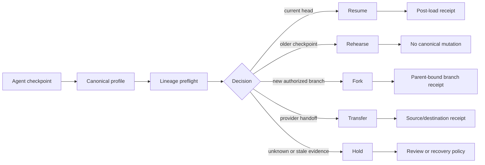
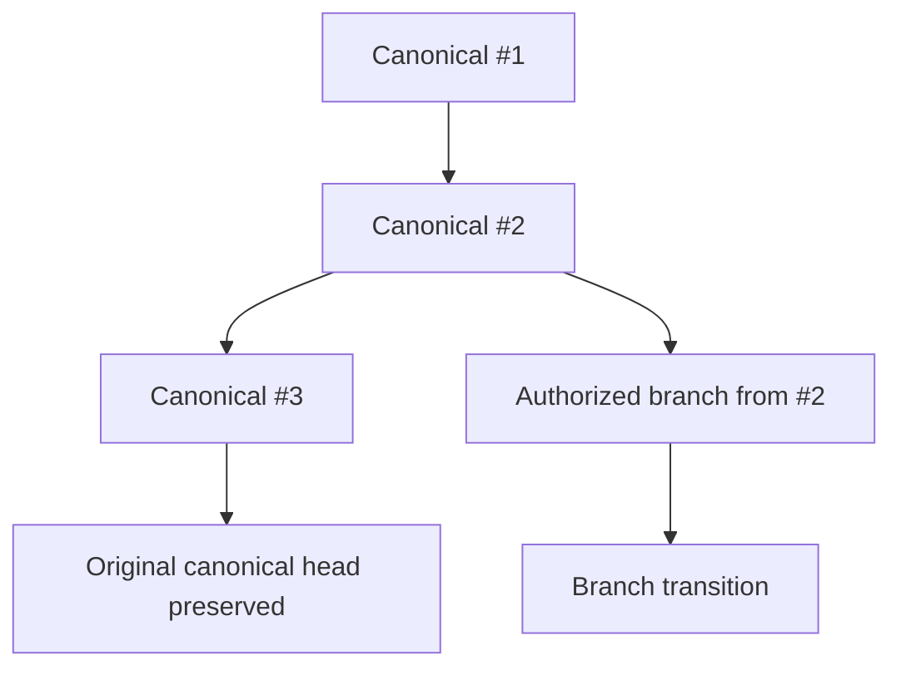
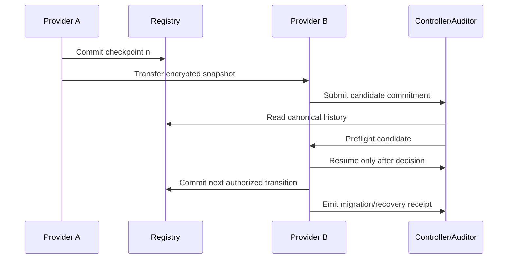
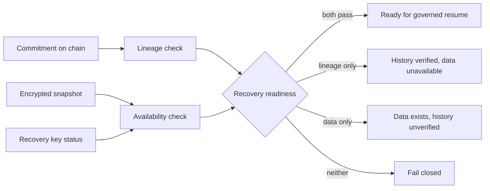
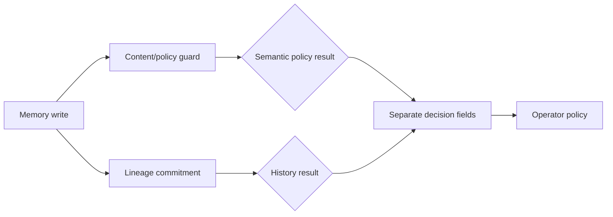

# MemoryLineage — Potential Expansion and Product Maturity Map

Status: **research and product strategy**
Date: **20 September 2026**
Scope: **product potential beyond the current Inspector, demo fixture, and submission package**

This document records additional opportunities identified from the current
MemoryLineage source, its evidence model, and public Web3 and agent projects
from 2025–2026. A proposal here is not evidence that the feature already
exists.

The central product remains:

> **MemoryLineage is a Restore Preflight and independent auditor for private
> agent history.**

Its operational question is:

> **Before an agent resumes, is this checkpoint the authorized continuation of
> the shared history, a legitimate historical checkpoint, a new branch, a
> divergent state, or an unverifiable candidate?**

The project should become more useful by making that decision reliable inside a
real recovery workflow. It should not become a generic AI-safety platform,
agent wallet, reputation registry, or semantic memory detector.

## Executive decision

The next maturity step is not another dashboard page or another chain. It is a
complete recovery lifecycle:



The strongest product evolution is:

```text
INSPECT → REHEARSE → AUTHORIZE → RESUME/FORK → RECEIPT → VERIFY
```

The current product has strong evidence for `INSPECT`, `REHEARSE`, and
`VERIFY`. `AUTHORIZE`, `RESUME`, `FORK`, and post-load `RECEIPT` are the main
areas where it can grow.

## Current maturity baseline

| Area | Current position | Correct interpretation |
| --- | --- | --- |
| Solidity registry | Implemented | Enforces the tested ordered transition and authorization rules. |
| Rust core and verifier | Implemented | Replays the published protocol/evidence behavior. |
| Rust/revm | Implemented | Exercises local bytecode behavior and mutation cases. |
| SQLite fixture | Implemented | Reproducible synthetic private-state demonstration. |
| Restore Preflight | Implemented for fixture evidence | Classifies the supplied bundle; it is not a universal runtime gate. |
| Reference runtime | Implemented locally | Shows a generic loader boundary; it is not framework adoption. |
| Browser Inspector | Implemented | Presents evidence and rehearsal workflows. |
| Public Sepolia observation | Implemented separately | Must remain distinct from local Demo Space V2. |
| Real agent framework adapter | Not demonstrated | Required for an adoption-oriented product claim. |
| Branch/merge semantics | Not implemented | A historical checkpoint is not automatically a malicious rollback. |
| Production privacy profile | Not implemented | The public fixture commitment is not a production hiding scheme. |
| Snapshot availability proof | Not implemented | A registry commitment does not recover a missing private snapshot. |

There is also a concrete correctness issue in the current fixture commitment
profile. [`snapshot_commitment()`](crates/ml-memory-store/src/lib.rs:139)
serializes key/value pairs with `|` and `=` without escaping or length
prefixes. A source-equivalent reproducer using the real `snapshot-3.db` showed
that two different key/value maps can produce identical canonical bytes. This
is an encoding ambiguity, not a Keccak collision. It must be fixed and
regression-tested before this profile is reused by a real loader.

The recovery gate currently derives a candidate commitment and decides whether
the loader may run. [`preflight_snapshot()`](crates/ml-recovery-gate/src/lib.rs:38)
and [`protected_resume()`](crates/ml-recovery-gate/src/lib.rs:55)
are valuable boundaries, but they operate on named local evidence. They do not
alone prove that an arbitrary external runtime loaded the same state.

## 1. Production-grade canonicalization and privacy profile

This is the prerequisite for every other opportunity.

Create a versioned profile separate from the public fixture profile:

```text
memorylineage/private-snapshot/v2
  domain
  space id
  profile id
  schema version
  sequence
  entry count
  key length + key bytes
  value length + value bytes
  ordered entries
  optional blinding nonce
```

Use canonical binary encoding, ABI-style length prefixes, or another precisely
specified format. The choice is less important than one pinned encoding with
vectors and independent implementations.

Required tests:

- the actual delimiter collision from `snapshot-3.db` produces different
  commitments after the fix;
- key order does not change the commitment;
- empty maps, empty strings, Unicode, long values, duplicate keys, invalid
  input, and maximum sizes have explicit behavior;
- profile, domain, space, and schema changes change the commitment;
- the blinding value never enters evidence, URLs, logs, screenshots, or
  calldata;
- the verifier distinguishes replaying public lineage from recomputing private
  state, which requires private input and blinding material.

This converts the fixture commitment from a demonstration convenience into a
bounded, reviewable profile.

## 2. One real agent-runtime adapter

The framework-neutral runtime proves the shape of a loader gate, but not that a
real agent checkpoint system can be protected. The next adapter should be small
and real.

LangGraph is a strong first candidate because its official documentation
separates checkpoint, replay, and fork semantics. It also defines thread IDs,
checkpoint namespaces, super-step boundaries, and pending writes.

The adapter should translate native checkpoint metadata into a MemoryLineage
profile:

```text
framework thread_id
framework checkpoint_id
parent checkpoint_id
checkpoint namespace
schema/profile version
state commitment
runtime manifest commitment
source class
```

Acceptance cases:

```text
current checkpoint       → preflight allows resume
older checkpoint         → rehearsal only
changed checkpoint       → hold for review
unknown checkpoint       → fail closed
valid fork               → new branch receipt
invalid evidence         → loader never runs
```

The adapter must test the actual framework API, not a copied SQLite fixture.
The Rust core can remain the canonicalization and verification engine; the
adapter may use the host framework's language when that is the smallest reliable
integration.

## 3. Branch-aware recovery

An older checkpoint can be a debugging replay, a disaster-recovery candidate,
an experiment, an authorized branch, or an unauthorized attempt to replace the
canonical head. Treating every older checkpoint as tampering is incomplete.

LangGraph documents that a fork from an old checkpoint creates a new branch
while retaining the original history. MemoryLineage should adopt that
conceptual distinction even if branch support comes later.



A branch receipt should bind:

- canonical parent transition ID;
- parent state root;
- branch ID;
- branch authorizer;
- branch policy/profile;
- creation time or block context;
- rehearsal-only or publishable status;
- merge permission, if any.

Do not call a local restore a fork until a durable parent-bound record exists.
Do not add branch UI without defining how the registry or a companion receipt
preserves the original canonical history.

## 4. Provider migration and disaster recovery

This is the clearest business-like use case for the protocol.



The migration receipt should identify source and destination profiles, source and
destination checkpoints, transformation version, commitments before and after,
operator and approving authority, evidence hash, availability result, and
whether the conversion is lossless, lossy, or not independently comparable.

This does not prove semantic equivalence of two memory formats. It proves only
the declared transformation and its authorization. Lossy migration must be
visible.

## 5. Preflight and post-load receipts

The current recovery receipt describes a preflight decision. It does not
independently prove what happened after the loader was called.

Separate the lifecycle:

```text
PreflightReceipt
  candidate → evidence → decision → policy

RuntimeResumeReceipt
  run ID → selected checkpoint → preflight ID → loader result → runtime profile
```

A post-load receipt may include runtime instance ID, run/session ID, framework
checkpoint ID, selected commitment, preflight decision ID, loader outcome,
runtime version manifest, timestamp, block context, and runtime signature.

Call this a runtime assertion unless a stronger attestation mechanism exists.
A signature proves that a key made the assertion; it does not prove that a model
used a memory value or that the memory caused a later action.

## 6. Explicit recovery governance

Fail-closed behavior is appropriate for invalid evidence, but it can stop an
agent during RPC failure, unavailable storage, or an index problem. Recovery
policy must handle that operational risk explicitly.

Recommended modes:

```text
NORMAL_RESUME
REHEARSAL_ONLY
READ_ONLY_QUARANTINE
HOLD_FOR_REVIEW
BREAK_GLASS_PENDING
BLOCK_UNVERIFIED
```

A break-glass path should require a separate authority, two-person or threshold
approval where appropriate, a reason code, a delay or review window, a
cancellable request, an incident or branch receipt, and a visible statement
that canonical continuity was not proven.

Never create a silent override that changes `BLOCK_UNVERIFIED` into
`RESUME_ALLOWED`.

Safe's guard documentation is a useful warning: a guard can block execution,
and a broken guard can cause denial of service, so recovery mechanisms must be
designed together with the guard.

## 7. Evidence freshness and trust-domain binding

The current bundle replay proves that a bundle is internally consistent. A
production decision also needs to know whether it is the right bundle and fresh
enough.

Bind a production preflight to:

```text
chain ID
registry address
space ID
spec/profile version
observed block number and hash
RPC/provider label
finality policy
authority configuration
bundle hash
```

Downgrade or reject evidence when the registry/space is not trusted, the bundle
is too old, block identity cannot be pinned, authority changed after the bundle,
or the provider returned inconsistent block data. Use `UNVERIFIED` or
`STALE_EVIDENCE`, not a green fallback.

## 8. Snapshot availability and retention

Lineage and availability are separate properties.



A future bundle may include an object or content-address locator commitment,
encryption profile, retrieval test timestamp, size/schema metadata, retention
policy, and key-availability status without exposing the key.

This proves only that a named retrieval check succeeded at a stated time. It
does not prove permanent availability or physical deletion of every copy.

## 9. Migration and schema evolution

Real agent runtimes change state schemas. A checkpoint from version 1 may not be
loadable by version 2.

Represent migration explicitly:

```text
checkpoint profile v1
        ↓ migration recipe M1→M2
checkpoint profile v2
        ↓ preflight
resume or hold
```

Require versioned profiles, deterministic recipe IDs, input/output commitments,
migration vectors, lossless/lossy declaration, authority approval, and fail-closed
behavior when the recipe is missing.

This distinguishes an old checkpoint from a structurally incompatible one.

## 10. Concurrency and conflict evidence

The current fixture is a single ordered map. Production memory may be written by
workers, tools, subgraphs, or human operators.

The adapter needs a conflict model:

```text
single parent → accepted successor
same parent + independent successors → parallel candidates
two writers at one checkpoint → conflict review
partial super-step → pending-write policy
```

A conflict receipt should identify the parent, competing child commitments,
writer/source classes, and selected resolution. A linear sequence alone should
not be presented as a complete model of concurrent runtime behavior.

## 11. Semantic safety as a companion layer

MemoryLineage should not become a semantic detector, but it can compose with one.



The OWASP Agent Memory Guard project illustrates a complementary layer with
content detectors, source provenance, quarantine, rollback, and actions such as
`allow`, `redact`, `quarantine`, and `block`.

MemoryLineage should expose separate statuses:

```text
LINEAGE_VALID
SEMANTIC_POLICY_UNKNOWN / ALLOWED / QUARANTINED / BLOCKED
```

Never combine them into one `SAFE` badge and never claim semantic poisoning
detection from lineage checks.

## 12. Agent identity and validation compatibility

Identity registries and validation systems can identify an agent or record an
external check. They do not replace private-state lineage.

An optional integration could bind a receipt to an agent identity, controller,
runtime operator, validation result, and authority rotation event. The core must
continue to work without that identity system.

The useful question is:

> Which identity and authority were responsible for this checkpoint decision?

It is not:

> Is this agent globally reputable?

## 13. Action and memory boundary receipts

MemoryLineage does not prove that memory caused an action. It can still improve
incident review by making the boundary explicit.

An action receipt may bind:

```text
agent run ID
active checkpoint commitment
preflight decision ID
policy/runtime manifest
action request hash
transaction hash, if applicable
```

The UI should label this as `RECORDED CONTEXT`, not `CAUSAL PROOF`.

This lets MemoryLineage complement agent-payment and action-policy projects. A
payment project can control spending; MemoryLineage can record which committed
history was declared active before the action.

## 14. Recovery rehearsal as an operational simulator

The existing Tampering Lab demonstrates rejection cases. A more useful surface
would let an operator rehearse a recovery plan:

```text
select snapshot
select evidence source
select runtime/profile version
select policy
simulate load
show lineage decision
show availability result
show authority requirements
produce receipt
```

The simulator should show exact blockers and state differences without implying
that a simulation changed the agent or chain. Tenderly is a useful interaction
benchmark because it previews consequential operations against state and exposes
result context before execution.

## 15. Public adapter conformance kit

The long-term ecosystem opportunity is a small framework-neutral test suite:

```text
checkpoint identity
canonicalization
current-head resume
historical rehearsal
valid fork
stale predecessor
divergent state
authority rotation
evidence tampering
unavailable evidence
schema migration
post-load receipt
```

Each adapter should produce machine-readable results containing adapter name,
framework version, profile version, vector, expected and observed result, runtime
version, and evidence hash.

This is more valuable than adding many integrations without a common contract.

## 16. Developer SDK and CLI ergonomics

The current Rust CLI can grow into a clear developer surface:

```text
memorylineage preflight snapshot.db --evidence bundle.json
memorylineage rehearse snapshot.db --from sequence=2
memorylineage fork snapshot.db --parent transition-id
memorylineage verify receipt.json
memorylineage adapter test langgraph
memorylineage doctor
```

Commands must use the same vocabulary as the website and identify whether the
source is fixture evidence, public observation, or a real adapter.

Prefer typed decisions over an ignored boolean:

```rust
match preflight(candidate) {
    Decision::ResumeAllowed(receipt) => load(candidate, receipt),
    Decision::RehearseOnly(receipt) => rehearse(candidate, receipt),
    Decision::ForkRequiresApproval(receipt) => request_approval(receipt),
    Decision::HoldForReview(receipt) => quarantine(candidate, receipt),
    Decision::BlockUnverified(receipt) => fail_closed(receipt),
}
```

## 17. Observability and incident response

A mature recovery product needs privacy-safe operational evidence:

- preflight started and completed;
- evidence source and freshness class;
- candidate classification;
- loader allowed or held;
- branch requested;
- break-glass requested or cancelled;
- migration succeeded or failed;
- post-load receipt emitted;
- verifier mismatch;
- availability check failed.

Events may contain identifiers, hashes, policy IDs, and reason codes. They must
not contain raw memory, prompts, documents, secret locators, or blinding values.

An incident timeline should answer:

```text
what was presented
what was verified
which authority approved it
what the runtime declared it loaded
what remained unknown
```

## 18. Cost, cadence, and anchoring policy

If a runtime creates a checkpoint on every super-step, anchoring every state on
Ethereum may be expensive or noisy. Measure rather than assume.

Benchmark:

| Dimension | Measurement |
| --- | --- |
| Commit cadence | transitions per minute and per agent run |
| Registry gas | registration, normal transition, rotation, branch |
| Evidence size | bundle size by transition count |
| Verification time | browser, CLI, low-resource machine |
| RPC reads | calls per inspect/preflight/rehearsal |
| Snapshot size | small, medium, large profiles |
| Failure recovery | time and calls when evidence/RPC fails |

Possible policy modes:

```text
anchor every authority/policy change
anchor selected security checkpoints
anchor periodic state roots
keep high-frequency local lineage and publish periodic checkpoints
```

The chosen mode must be visible in the profile. A periodic anchor must not be
called a complete record of every intermediate memory state.

## 19. Independent evidence packaging

The evidence system can become a portable incident package:

```text
manifest/
lineage/
runtime/
recovery/
availability/
migration/
conformance/
```

The manifest should contain profile/schema versions, registry and space identity,
source commit, evidence hashes, observation block context, verification results,
and limitations.

The package should support partial disclosure. Public lineage and decisions can
be shared without sharing the snapshot or recovery key. The verifier must report
which checks are possible and which are `NOT_INCLUDED`.

## 20. Explicit multi-party trust model

MemoryLineage is most useful when trust roles differ:

```text
runtime operator       stores and loads private state
controller/authorizer  approves succession or policy changes
auditor                verifies shared evidence
storage provider       may hold encrypted backups
agent                  executes using loaded state
```

The product should show which roles are combined. If one party controls all
roles, it should say that a local signed log may be sufficient. This strengthens
the Web3 argument: Ethereum is useful for shared ordering and authorization
across parties, not merely because the data contains hashes.

## Lessons from stronger Web3 projects

These projects are focused benchmarks, not instructions to copy their entire
architecture:

| Benchmark | Transferable pattern | MemoryLineage adaptation |
| --- | --- | --- |
| Fangorn | Difficult primitive explained through a human access consequence; CLI and visualizer agree. | Explain recovery through an operator decision and keep CLI/Inspector parity. |
| Nani | Plugin boundary, real event stream, RPC failover, API, deployable workflow. | Make runtime adapters pluggable and expose a conformance API/CLI. |
| Agora | Infrastructure depth tied to a concrete coordination problem. | Tie the registry to cross-party recovery/handoff, not generic AI memory. |
| Polka Blue | Real-world measurement rather than fabricated input. | Use a real framework checkpoint and loader integration. |
| ChopDot | One complete user outcome, mobile usability, clear action. | Complete one recovery outcome: inspect, approve/rehearse, resume or hold, receipt. |
| PolkaShield | Web2 integration and portable permission surface. | Let existing agent applications call the adapter without rebuilding the runtime. |
| Ocean Fin | Simulate before executing a consequential action. | Make recovery rehearsal a first-class preflight operation. |
| Safe | Authority and recovery model; guard failure can cause DOS. | Design break-glass, delay, cancellation, and quarantine with the gate. |
| Tenderly | State-aware simulation and traceable result. | Explain why a candidate was accepted, held, or rejected. |
| OWASP Agent Memory Guard | Content policy, provenance, quarantine, rollback, and framework recipes. | Compose content safety with lineage integrity as separate verdicts. |

The official Polkadot Builder Party report identifies award recipients but does
not provide a complete judge rationale for each project. Any explanation of why
a pattern appears successful here is an inference from public artifacts and the
organizer's objectives, not a statement from the jury.

## Ideas that should remain out of scope

Before the recovery lifecycle is proven, do not add:

- generic AI chatbot features;
- token, NFT, DAO, or marketplace mechanics;
- a semantic truth score for memory;
- a claim of protection against all memory poisoning;
- ZK added only for appearance;
- several new chains without a concrete user requirement;
- a generic agent identity or wallet product;
- every conversation token on-chain;
- runtime attestation claims from ordinary application signatures;
- local fixture results described as external adoption;
- preflight receipt described as proof that a model used memory;
- an authoritative backend database hidden behind the website.

## Prioritized development map

### P0 — Correctness foundation

1. Replace delimiter-based encoding with unambiguous versioned canonicalization.
2. Add the real fixture collision as a regression vector.
3. Add schema, domain, space, profile, and optional blinding semantics.
4. Test the recovery gate with a structurally different snapshot that previously
   produced the same canonical bytes.
5. Update claims so fixture and production profiles cannot be confused.

**Exit condition:** distinct snapshot maps cannot share a commitment through an
encoding ambiguity, and the altered candidate is held by the loader gate.

### P1 — Real runtime integration

1. Select one framework with native checkpoints and replay/fork semantics.
2. Implement a thin adapter.
3. Capture native checkpoint ID, parent, namespace, schema, and runtime profile.
4. Run current-head, historical, divergent, invalid, and fork cases.
5. Produce adapter evidence without exporting raw state.

**Exit condition:** a real runtime, rather than the fixture helper, reaches the
loader only after a verified decision.

### P2 — Recovery lifecycle

1. Add branch-aware decisions.
2. Add preflight and post-load receipts.
3. Add provider handoff/migration receipts.
4. Add availability and freshness status.
5. Add governed quarantine and break-glass workflow.

**Exit condition:** resume, rehearse, fork, handoff, hold, and fail-closed paths
are distinct and portable.

### P3 — Ecosystem and operational maturity

1. Publish the adapter conformance kit.
2. Add SDK/CLI ergonomics.
3. Add privacy-safe observability and incident timelines.
4. Benchmark cost, cadence, bundle size, and verification time.
5. Add optional content-safety and identity integrations.

**Exit condition:** another developer can implement an adapter without reading
MemoryLineage internals, and an operator can investigate recovery without raw
memory access.

## Final claim boundary

After this roadmap, the strongest defensible statement would be:

> MemoryLineage lets independent parties verify and govern the succession,
> rehearsal, branching, and handoff of committed private agent checkpoints. It
> exports evidence about the decision and the runtime's declared outcome without
> publishing raw memory.

| Claim | Required evidence |
| --- | --- |
| History is continuous | Lineage profile and evidence replay. |
| Transition was authorized | Supported authorization proof level. |
| Bundle is fresh | Pinned chain observation and freshness policy. |
| Snapshot can be restored | Availability and loader test. |
| Runtime loaded snapshot | Runtime receipt; preflight alone is insufficient. |
| Memory is true or safe | Out of scope for lineage. |
| Agent reasoned correctly | Out of scope. |
| Memory caused an action | Separate narrow action-binding evidence. |
| Snapshot is permanently available | Not proven by an on-chain commitment. |
| System is formally secure | Requires formal verification or third-party audit. |

## Recommended product sentence

> **MemoryLineage is a recovery preflight for persistent agents: it checks
> whether a private checkpoint is the authorized continuation of a shared
> history, distinguishes safe resume from rehearsal and fork, and produces a
> portable receipt before the runtime loads it.**

This wording makes the product more useful while preserving its most important
boundary: the chain verifies history and authority, not the truth or meaning of
private memory.

## Source register

- [LangGraph time travel](https://docs.langchain.com/oss/python/langgraph/use-time-travel)
- [LangGraph checkpointers](https://docs.langchain.com/oss/python/langgraph/checkpointers)
- [OWASP Agent Memory Guard](https://github.com/OWASP/www-project-agent-memory-guard)
- [Polkadot Builder Party official report](https://forum.polkadot.network/t/polkadot-builder-party-hackathon-report/16254)
- [Nani Devpost submission](https://devpost.com/software/nani-65mnxo)
- [Nani source repository](https://github.com/cenwadike/nani)
- [Polka Blue source repository](https://github.com/elbertronnie/proof-of-location)
- [Safe Guards documentation](https://docs.safe.global/advanced/smart-account-guards)
- [Tenderly simulation documentation](https://docs.tenderly.co/what-you-get)
- [Agent Allowance ETHGlobal project](https://ethglobal.com/showcase/agent-allowance-8xm1o)
- [Preflight-Agents ETHGlobal project](https://ethglobal.com/showcase/preflight-agents-1s5hv)
- [LedgerMind ETHGlobal project](https://ethglobal.com/showcase/ledgermind-v1y6k)
- [Existing product-evolution research](./2026-09-20-memorylineage-winning-patterns-and-product-evolution.md)
- [Existing uniqueness and impact audit](./2026-09-20-memorylineage-uniqueness-impact-adoption-audit.md)
