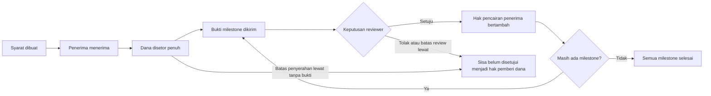

# Rekomendasi Proyek untuk 3rd-Web-Hack

Tanggal penyusunan dan audit: **8 September 2026**. Status: **audit keputusan; implementasi belum dimulai**.

**Hasil loop audit terbaru: belum ada kandidat yang saat ini terbukti mendekati 5.** Deep research berikutnya menemukan `MemoryLineage Auditor / ERC-8350` dengan **rating riset 4,3/5** setelah koreksi pembulatan dan spike lokal yang mencocokkan golden vector serta menolak enam mutasi; angka itu bukan skor MVP karena belum ada kontrak atau testnet kita. `PlanSeal Conformance Lab` tetap **3,8/5** sebagai rating riset eksternal, `Warden Compromise Lab` tetap **3,8/5** sebagai rating reference-backed, dan `SlippageTruth Lab` tetap **3,6/5** sebagai spike lokal dengan batas arithmetic/local. Target bersyarat **4,7** belum tercapai; jalur conditional 4,7 yang baru hanya boleh dipertahankan untuk MemoryLineage setelah gerbang EVM, independent replay, mutation, dan user evidence lulus. Lihat [deep research terbaru](<DEEP_RESEARCH_2026-09-08.md:1>), [audit nilai ideal](<AUDIT_NILAI_IDEAL_2026-09-08.md:1>), [audit kandidat](<AUDIT_IDE_KANONIK_2026-09-08.md:1>) dan [audit klaim versus aktual](<AUDIT_KLAIM_VS_AKTUAL_2026-09-08.md:1>).

GrantTrail adalah rekomendasi awal sebelum pencarian adversarial dan sekarang hanya menjadi fallback. AttestScope tetap disimpan sebagai kandidat Clear Signing yang ditahan, tetapi pencarian lanjutan menambah ruang yang lebih konkret di EIP-7702, ERC-7715, ERC-5792, ERC-7683, ERC-8203, ERC-8244, dan standar ERC terbaru. Bagian 19 adalah ranking kanonik terbaru; bagian 18 dan bagian 17 tetap menjadi histori audit, sedangkan bagian 16 tetap menjadi histori audit AttestScope.

Asumsi perencanaan: satu pengembang utama yang cukup nyaman dengan aplikasi web, waktu fokus sekitar 4–5 jam sehari, dan ruang belajar smart contract dasar. Jumlah anggota, pengalaman Solidity, dan waktu nyata tim belum diketahui. Rekomendasi serta nilai feasibility di bawah berlaku bila tersedia **setidaknya sekitar 60 jam terfokus**; pengalaman Solidity yang masih sangat awal dapat membuat kebutuhan waktu lebih besar.

## 1. Aturan yang memengaruhi keputusan

| Hal | Temuan dan implikasi |
| --- | --- |
| Tenggat | **27 September 2026, pukul 15.00 WITA / 14.00 WIB / 07.00 UTC**. Halaman resmi menampilkan 12.30 IST. Tetapkan target internal 25 September agar ada waktu memperbaiki submission. |
| Penilaian | Innovation, Technical Feasibility, Uniqueness, dan Design. Bobot masing-masing tidak dicantumkan pada halaman yang diperiksa. |
| Hasil yang diminta | Masalah dan solusi yang jelas, MVP berjalan, penjelasan stack, repositori GitHub beserta cara menjalankan, demo, serta presentasi. |
| Orisinalitas | Proyek harus orisinal dan dikembangkan untuk hackathon. Catat kontribusi baru serta atribusi library, template, dan aset yang digunakan. |
| Teknologi | Blockchain/Web3 harus memiliki peran nyata dalam solusi. Tidak ditemukan kewajiban menggunakan jaringan tertentu pada halaman yang diperiksa. |

Rujukan: [overview dan kriteria lomba](https://3rd-web-hack.devpost.com/), [aturan resmi](https://3rd-web-hack.devpost.com/rules), dan [jadwal resmi](https://3rd-web-hack.devpost.com/details/dates).

**Eligibility masih ambigu:** overview menampilkan “Students only” dan persyaratan usia dewasa, sedangkan halaman rules menulis “Open to students and evelopers”. Jangan menyimpulkan bahwa pengembang nonmahasiswa pasti boleh ikut. Status mahasiswa dan usia setiap anggota perlu diperiksa; bila tim mencakup nonmahasiswa, minta penjelasan tertulis dari penyelenggara sebelum mengandalkan kelayakan submission. Penyusunan ide tetap dapat dilakukan. [Overview peserta](https://3rd-web-hack.devpost.com/), [teks eligibility](https://3rd-web-hack.devpost.com/rules).

## 2. Perbandingan ide yang layak

Nilai berikut adalah **perkiraan pra-audit**, bukan nilai juri atau probabilitas menang. Tabel ini dipertahankan sebagai histori dan tidak boleh dipakai sebagai dasar keputusan; audit kanonik terbaru ada pada bagian 18, dengan bagian 15–17 sebagai histori audit kandidat sebelumnya. Skala 1–5; nilai lebih tinggi lebih baik. Feasibility mempertimbangkan asumsi waktu di atas; Design menilai potensi pengalaman pengguna, bukan tampilan yang sudah dibuat.

| Ide | Masalah dan batas produk | Innovation | Feasibility | Uniqueness | Design | Rata-rata |
| --- | --- | ---: | ---: | ---: | ---: | ---: |
| **GrantTrail** | Microgrant Web3 yang membutuhkan aturan pencairan, bukti progres, dan penyelesaian sisa dana yang jelas | 4 | 4 | 3,5 | 4,5 | **4,00** |
| **SkillProof** | Bukti kontribusi proyek yang dapat diterbitkan, diverifikasi, dan dicabut oleh penerbit tepercaya | 3 | 4,5 | 2,5 | 4 | **3,50** |
| **AllowanceLens** | Membantu pengguna memahami siapa yang boleh membelanjakan tokennya dan mencabut izin yang tidak dibutuhkan | 3 | 4 | 2,5 | 4 | **3,38** |
| **QuietVote** | Voting kelompok dengan pembuktian keanggotaan tanpa membuka identitas pemilih pada bukti tersebut | 4 | 2,5 | 3,5 | 3,5 | **3,38** |

Alasan di balik penilaian:

- **GrantTrail:** dua hasil yang mudah didemokan—milestone disetujui dan sisa dana dikembalikan. Risiko utamanya adalah logika uang, ketergantungan pada reviewer, serta kemiripan dengan produk grant yang ada.
- **SkillProof:** ruang implementasinya lebih kecil dan tidak menyimpan dana. Namun, kredibilitas tetap berasal dari penerbit, dan pencabutan attestation sudah didukung EAS. Pembeda harus berasal dari kebutuhan pengguna tertentu. [EAS: revocation](https://docs.attest.org/docs/core--concepts/revocation).
- **AllowanceLens:** masalah izin token nyata, tetapi Revoke.cash sudah menangani pemeriksaan/pencabutan approval, dan MetaMask menyediakan advanced permissions dengan batas jumlah serta masa berlaku. Dashboard approval umum memiliki ruang pembeda terbatas. [Revoke.cash: token approvals](https://revoke.cash/learn/approvals/what-are-token-approvals), [MetaMask: advanced permissions](https://support.metamask.io/more-web3/dapps/advanced-permissions/).
- **QuietVote:** Semaphore menyediakan pembuktian keanggotaan anonim dan pencegahan pengiriman berulang. Tantangan MVP tetap mencakup penerimaan anggota, metadata yang dapat mengungkap identitas, dan pengalaman membuat proof. Keanggotaan grup tidak otomatis membuktikan satu orang hanya mempunyai satu identitas. [Semaphore: konsep dan fitur](https://docs.semaphore.pse.dev/).

Selisih skor pra-audit ini kecil dan bukan bukti pasar. Pilihan GrantTrail pada bagian ini adalah keputusan awal sebelum audit adversarial; keputusan tersebut sudah digantikan oleh audit pada bagian 15.

Cadangan SkillProof cukup dibatasi pada satu penerbit tepercaya, bukti kontribusi proyek publik, serta tiga tindakan: terbitkan, periksa, dan cabut attestation. Validasi siapa yang membutuhkan bukti tersebut tetap diperlukan sebelum memilihnya.

## 3. GrantTrail: masalah dan pengguna pertama

Target pertama adalah **komunitas developer Web3 atau klub mahasiswa yang memberikan hibah kecil untuk satu proyek open source**. Contoh kasus: komunitas mendanai pembuatan alat developer senilai 200 unit token uji, dibagi menjadi dua milestone.

Hipotesis masalah yang perlu divalidasi:

1. Pemberi dana kesulitan menghubungkan pembayaran dengan hasil pekerjaan dan keputusan reviewer.
2. Penerima ingin memastikan dana benar-benar telah disediakan sebelum mulai bekerja.
3. Ketika pekerjaan berhenti atau reviewer tidak merespons, para pihak tidak memiliki aturan penyelesaian sisa dana yang mudah dipahami.

Hipotesis ini masuk akal untuk diteliti: dokumentasi Allo menjelaskan bahwa proses alokasi modal dapat melibatkan pekerjaan manual dan menawarkan berbagai mekanisme distribusi, termasuk milestone. Itu mendukung relevansi kategori masalah, **belum membuktikan kebutuhan khusus klub mahasiswa terhadap GrantTrail**. [Allo Protocol](https://docs.allo.gitcoin.co/).

Validasi awal yang disarankan: tiga percakapan singkat dengan calon pengguna—pengelola hibah/komunitas, penerima hibah, dan reviewer. Cari satu kejadian konkret, alur kerja saat ini, titik macet, serta pendapat mereka tentang aturan timeout pada bagian 6. Catat temuan tanpa identitas pribadi yang tidak diperlukan. Percakapan ini belum dilakukan.

Lanjutkan konsep ini bila minimal dua calon pengguna dapat menjelaskan masalah serupa dan ada calon pemberi/penerima yang bersedia mencoba alur testnet. Angka tersebut hanya gerbang eksplorasi awal, bukan validasi statistik atau bukti adopsi.

## 4. Mengapa blockchain diperlukan dan apa pembeda kita

Dalam usulan ini, smart contract memegang dana yang telah disetor dan menentukan siapa berhak menariknya. Persetujuan reviewer mengubah hak pencairan; lewatnya batas waktu memungkinkan penyelesaian sisa dana. Transaksi dan hash bukti menyediakan catatan yang dapat diperiksa oleh pihak lain.

Dengan demikian, operator website tidak menjadi pihak yang dapat mengedit saldo atau memutuskan transfer secara sepihak. Apabila semua peserta memilih mempercayai satu bendahara dan pembayaran bank, aplikasi biasa bisa lebih sesuai. Sasaran GrantTrail adalah kelompok yang memang ingin menjalankan pendanaan menggunakan aset onchain dan aturan bersama yang dapat diperiksa.

Perbandingan awal dengan solusi yang sudah ada:

| Referensi | Kemampuan yang sudah tersedia | Arah pembeda yang harus kita buktikan |
| --- | --- | --- |
| [Allo Protocol](https://docs.allo.gitcoin.co/) | Infrastruktur alokasi modal dengan pilihan mekanisme distribusi, termasuk pembayaran milestone | Alur microgrant yang sangat kecil, aturan timeout yang dijelaskan sebelum kesepakatan, dan bukti bahwa jalur pencairannya bisa digunakan secara mandiri |
| [Questbook](https://www.questbook.app/) | Platform pengelolaan grant untuk builder Web3 | Pengalaman satu kesepakatan langsung: tiga peran, dua milestone, dan halaman keputusan/dana yang mudah dibaca |

Ini perbandingan berdasarkan dokumentasi publik, bukan pengujian menyeluruh produk pesaing. **Jangan mengklaim Allo atau Questbook tidak mempunyai fitur tertentu tanpa memeriksanya.** Pertanyaan penentu pada hari pertama adalah apakah paket pengalaman yang kita tawarkan memberi manfaat yang cukup dibandingkan konfigurasi solusi tersebut.

Tiga pembeda yang layak diprioritaskan:

1. **Aturan uang yang terlihat sebelum disetujui.** Pengguna melihat contoh nominal yang akan diterima/dikembalikan untuk setiap hasil, termasuk reviewer diam.
2. **Bukti keputusan yang dapat dibawa keluar.** Ekspor memuat jaringan, alamat kontrak, ID grant, hash bukti, keputusan, dan referensi transaksi; pemeriksa membaca ulang kontrak dan mencocokkan bukti.
3. **Jalur pencairan mandiri.** Sediakan petunjuk memanggil kontrak menggunakan ABI dan alat umum apabila website utama tidak tersedia. Akses blockchain, RPC, gas, dan kunci pengguna tetap diperlukan.

Kebaruan yang ditawarkan adalah rancangan produk dan penanganan proses yang macet. Kita belum memiliki dasar untuk menyebutnya protokol pertama atau masalah Web3 yang sepenuhnya terselesaikan.

## 5. Batas MVP yang disarankan

**Satu jaringan testnet, satu jenis token, satu pemberi dana, satu penerima, satu reviewer, dua milestone berurutan, dan satu alur keputusan final per milestone.** Ketiga peran menggunakan alamat berbeda; perbedaan alamat tidak menjamin orang yang mengendalikannya independen.

| Fitur wajib | Perilaku yang harus benar-benar berfungsi |
| --- | --- |
| Membuat kesepakatan | Menentukan peran, nominal dua milestone, hasil yang diminta, tenggat penyerahan, tenggat review, dan aturan pengembalian |
| Menerima syarat dan mendanai | Penerima menerima syarat onchain sebelum pendanaan; pemberi dana menyetor seluruh nilai grant; UI menampilkan saldo yang benar-benar telah masuk |
| Mengirim bukti | Penerima menautkan artefak publik dan mencatat hash paket bukti untuk milestone aktif |
| Menilai dan mencairkan | Reviewer menyetujui/menolak; persetujuan memberi penerima hak menarik nominal milestone tersebut |
| Menyelesaikan timeout | Dana yang belum menjadi hak penerima dialokasikan kembali ke pemberi dana sesuai aturan yang disepakati |
| Halaman publik dan ekspor | Pembaca tanpa wallet dapat melihat aturan, status, bukti, pembagian dana, dan transaksi; paket ekspor dapat diverifikasi ulang |

Fitur lanjutan setelah MVP lulus: pemberitahuan, beberapa reviewer, integrasi Safe/Allo, atau penerbitan attestation kontribusi. Kebutuhan pengguna menentukan urutannya.

Batas untuk hackathon ini: dana testnet dan artefak contoh publik; tanpa crowdfunding banyak donor, token baru, yield, lintas jaringan, arbitrase, revisi keputusan, upgrade proxy, atau AI yang menentukan pembayaran. Tidak ada admin yang boleh mengambil saldo escrow atau mengganti aturan grant setelah diterima. Batas ini menjaga jumlah keadaan kontrak tetap dapat diuji dalam waktu yang tersedia.

## 6. Aturan uang dan kepercayaan yang harus jelas

Alur ringkas:



Diagram menyederhanakan alur. Aturan berikut berlaku untuk setiap milestone yang aktif, termasuk milestone kedua:

- Nominal, penerima, reviewer, token, tenggat, dan deskripsi hasil dibekukan sejak kesepakatan dibuat. Penerimaan terikat pada ID grant dan hash syarat yang diperiksa penerima; perubahan syarat memerlukan kesepakatan baru. Pekerjaan belum dianggap dimulai sebelum seluruh dana masuk.
- Dua milestone berjalan berurutan. Konfigurasi wajib memenuhi `fundBy < submitBy1 < reviewBy1 < submitBy2 < reviewBy2`, dengan `fundBy` masih di masa depan saat dibuat. Setoran hanya diterima sebelum `fundBy`. Jarak antartenggat harus memberi waktu kerja/review yang dipahami penerima saat menerima syarat.
- Penyerahan hanya sah sebelum `submitBy`. Timeout penyerahan berlaku pada/sesudah `submitBy` hanya bila belum ada bukti. Jika bukti masuk tepat waktu, reviewer masih boleh memutuskan sebelum `reviewBy`; timeout review berlaku pada/sesudah `reviewBy` hanya bila belum ada keputusan. Keputusan terlambat ditolak meskipun transaksi penyelesaian timeout belum dipanggil.
- Baik persetujuan maupun penolakan mensyaratkan grant sudah didanai penuh, milestone sedang aktif, dan bukti milestone tersebut sudah tercatat. Keputusan atas milestone tanpa bukti atau milestone mendatang ditolak. Bukti yang sudah diajukan tidak dapat diganti dalam MVP ini.
- Persetujuan memindahkan nominal milestone dari dana terkunci ke **hak tarik penerima**. Penerima menariknya dengan transaksi terpisah. Hak yang sudah disetujui tidak boleh diambil kembali oleh pemberi dana.
- Jika bukti tidak dikirim tepat waktu, reviewer menolak, atau review melewati tenggat, grant berakhir. Nilai milestone yang belum disetujui beserta milestone berikutnya menjadi **hak tarik pemberi dana**. Hak penerima dari milestone sebelumnya tetap tersedia.
- Penyelesaian timeout boleh dipicu siapa pun setelah syarat terpenuhi, tetapi penerima uang selalu alamat yang sudah ditetapkan. Waktu yang berlalu tidak mengirim transaksi dengan sendirinya; UI menyediakan tombol penyelesaian dan penarikan.
- Dana untuk setiap grant dihitung terpisah. Transaksi satu grant tidak boleh memakai saldo hak tarik grant lain.

Contoh yang wajib diperagakan: total 200 token uji; milestone pertama sebesar 100 disetujui tetapi belum ditarik; milestone kedua melewati batas. Pemberi dana hanya berhak atas 100, dan penerima tetap bisa menarik 100 yang sebelumnya disetujui.

Persamaan yang harus selalu terjaga untuk dana yang dicatat melalui pendanaan grant:

```text
dana disetor = sudah dibayar ke penerima + sudah dikembalikan
            + hak tarik penerima + hak tarik pemberi dana + dana masih terkunci
```

**Kompromi terbesar:** reviewer tetap dipercaya untuk menilai pekerjaan. Reviewer yang tidak adil atau tidak aktif dapat membuat pekerjaan yang sudah dilakukan tidak dibayar. Timeout yang dipilih melindungi pengembalian sisa dana pemberi dana, bukan menjamin keadilan bagi kedua pihak. Penerima harus memahami ini sebelum menerima syarat. Jika calon pengguna menuntut arbitrase atau jaminan pembayaran atas hasil yang disengketakan, desain MVP ini belum memenuhi kebutuhan mereka; jangan menambahkan mekanisme sengketa secara tergesa-gesa.

Hash bukti hanya membantu menunjukkan bahwa paket data tertentu cocok dengan catatan; hash tidak membuktikan pekerjaan berkualitas, bebas plagiarisme, atau benar secara faktual. Tautan artefak dapat hilang. Simpan salinan bukti publik yang tepat dalam paket ekspor dan tentukan format/hash secara konsisten agar pemeriksaan dapat diulang. Jangan menaruh PII, dokumen privat, atau rahasia di blockchain maupun penyimpanan publik.

## 7. Stack dan bentuk aplikasi

| Bagian | Usulan | Alasan |
| --- | --- | --- |
| Frontend | React, TypeScript, Vite, CSS dengan token desain sederhana | Cocok untuk aplikasi yang mayoritas membaca kontrak dan meminta transaksi melalui wallet |
| Integrasi wallet | Wagmi, Viem, TanStack Query | Menangani koneksi, pembacaan/penulisan kontrak, serta state permintaan; ikuti kombinasi versi yang kompatibel saat setup |
| Kontrak | Solidity dan komponen OpenZeppelin yang relevan | Logika peran, nominal, tenggat, dan transfer token; review tetap dibutuhkan untuk kode khusus kita |
| Pengujian kontrak | Foundry: Forge dan Anvil | Tes unit, fuzz/invariant, dan alur lokal yang dapat diulang |
| Jaringan demo | Base Sepolia, chain ID `84532` | Satu lingkungan EVM testnet untuk semua transaksi demo |
| Token | USDC testnet resmi; token mock lokal untuk tes deterministik | Demo nominal yang mudah dipahami dan pengujian yang tidak bergantung faucet |
| Bukti dan data baca | Artefak publik, paket JSON yang diekspor, state/event kontrak melalui RPC | Otorisasi dan saldo tidak bergantung database aplikasi |

Rujukan teknis yang mendasari pilihan integrasi: [Wagmi: setup React, Viem, dan TanStack Query](https://wagmi.sh/react/getting-started), [OpenZeppelin Contracts](https://docs.openzeppelin.com/contracts/5.x), [Base: detail jaringan](https://docs.base.org/get-started/connect-to-base), serta [Circle: kontrak USDC mainnet/testnet](https://developers.circle.com/stablecoins/usdc-contract-addresses).

USDC pada testnet tidak mempunyai nilai finansial dan tidak didukung dolar nyata. Gunakan label **USDC testnet** pada seluruh nominal demo. Gas di Base Sepolia menggunakan ETH testnet. Alamat token harus diambil dari sumber resmi saat konfigurasi; token mock harus diberi nama berbeda jika digunakan sebagai cadangan. [Circle: token testnet](https://developers.circle.com/stablecoins/usdc-contract-addresses), [Base: jaringan dan currency](https://docs.base.org/get-started/connect-to-base).

Pilih satu kontrak utama dengan pencatatan per ID grant dan satu alamat token tetap. Gunakan approval sebesar dana yang diperlukan. Untuk MVP, daftar grant demo dapat berupa daftar ID dari deployment; detailnya tetap dibaca dari kontrak. Indeks pencarian global dan backend unggahan belum diperlukan. Data RPC yang gagal dimuat harus ditampilkan sebagai belum tersedia, bukan saldo nol atau transaksi berhasil.

Struktur calon repository berikut adalah usulan; file implementasinya belum dibuat:

```text
contracts/src/GrantTrail.sol       # Aturan grant dan hak pencairan
contracts/test/                    # Tes peran, tenggat, dan konservasi dana
contracts/script/                  # Deployment dan penyiapan data testnet
web/src/features/grants/           # Form, halaman publik, dan tindakan tiap peran
web/src/lib/contracts.ts           # ABI, jaringan, alamat kontrak, pembacaan state
web/src/lib/evidence.ts            # Format paket bukti dan pemeriksaan hash
web/public/demo/                   # Artefak contoh yang memang boleh dibagikan
docs/demo-script.md                # Alur demo dan transaksi contoh
docs/pitch.md                      # Materi presentasi
README.md                         # Setup, menjalankan, pengujian, dan keterbatasan
```

## 8. Tampilan yang perlu diprioritaskan

Gunakan tampilan seperti alat kerja pendanaan: tipografi jelas, ruang yang cukup, warna status konsisten, dan informasi uang yang dominan. Antarmuka utama disarankan berbahasa Inggris untuk demo; dokumen internal dapat tetap berbahasa Indonesia.

Empat layar cukup:

1. **Grant overview:** tujuan pekerjaan, tiga peran, dua milestone, dan pembagian saldo terkunci/dapat ditarik/sudah dibayar.
2. **Create agreement:** form singkat dengan pratinjau hasil finansial untuk persetujuan, penolakan, dan timeout sebelum menerima syarat.
3. **Milestone detail:** hasil yang diminta, bukti, batas penyerahan/review dengan zona waktu, keputusan, dan satu tindakan utama sesuai peran.
4. **Public receipt:** rangkaian pendanaan, penyerahan, review, dan pencairan, dengan ekspor serta tautan transaksi untuk pemeriksaan lanjut.

Keadaan yang harus dirancang: tanpa wallet, jaringan salah, menunggu tanda tangan, tanda tangan ditolak, transaksi pending, transaksi revert, RPC gagal, bukti tidak tersedia, dan tenggat terlewati. Status tidak boleh hanya mengandalkan warna. Halaman harus tetap terbaca di ponsel dan dapat dioperasikan dengan keyboard.

## 9. Rencana hingga tenggat

Jadwal ini adalah **rencana GrantTrail historis yang belum dijalankan**. Jadwal aktif untuk AttestScope ada pada bagian 14. Satu pengembang utama memegang implementasi agar kontrak dan UI tidak memakai aturan berbeda. Orang kedua, bila tersedia, dapat mengurus validasi pengguna, tes independen, atau demo.

| Tanggal 2026 | Hasil yang ditargetkan | Gerbang selesai |
| --- | --- | --- |
| **8–9 Sep** | Memeriksa eligibility, tiga percakapan pengguna, menilai pesaing, memilih konsep, dan menggambar empat layar | Masalah spesifik serta kompromi reviewer/timeout dapat dijelaskan dan diterima calon pengguna; pembeda cukup jelas |
| **10–12 Sep** | Irisan pertama: kesepakatan, penerimaan, pendanaan, submit, approve, withdraw satu milestone | Alur lokal berjalan, tes peran dan nominal lulus; bila belum tercapai, kurangi ruang lingkup sebelum memperluas UI |
| **13–15 Sep** | Dua milestone, rejection, timeout, dan pemisahan saldo tiap grant | Tes keadaan batas dan persamaan dana lulus; review logika uang selesai |
| **16–18 Sep** | Empat layar terhubung, bukti/ekspor, deployment testnet | Alur tiga wallet berjalan di browser dengan transaksi yang dapat diperiksa |
| **19–21 Sep** | Uji calon pengguna, perbaikan error state, tampilan mobile, jalur pencairan mandiri | Tiga pengguna mencoba tugas utama; masalah pemahaman kritis diperbaiki; hak tarik dapat diakses tanpa website utama |
| **22–23 Sep** | Pembekuan fitur, README, pitch, dan data demo | Setup berhasil dari checkout bersih dan dua skenario demo bisa diulang |
| **24–25 Sep** | Rekam video, rapikan presentasi, siapkan dan kirim submission | Repo, video, presentasi, dan demo dapat dibuka oleh penilai |
| **26–27 Sep** | Cadangan untuk masalah akses atau submission | Periksa kiriman sebelum **27 Sep pukul 15.00 WITA** |

Estimasi kerja terfokus sekitar **60–85 jam**, termasuk belajar, validasi, perbaikan, dan bahan submission. Ini perkiraan perencanaan, bukan komitmen durasi. Bila tenggat internal meleset, potong notifikasi, pencarian, efek visual, dan integrasi opsional terlebih dahulu; aturan uang dan demo nyata tetap menjadi inti.

Anggaran awal yang disarankan: **tanpa belanja wajib** untuk eksplorasi lokal dan token uji. Free tier hosting/RPC/faucet perlu diperiksa saat dipakai dan mungkin memiliki batas. Jangan membeli layanan sebelum terbukti diperlukan. Akses testnet, faucet, dan hosting belum diuji dalam tahap rekomendasi ini.

## 10. Bukti teknis dan demo yang harus kita hasilkan

Tes kontrak yang paling penting:

- Alamat yang tidak berwenang gagal menerima syarat, mendanai sebagai pihak lain, mengirim bukti, menilai, atau mengambil dana.
- Pendanaan parsial/berulang ditolak; grant tidak aktif sebelum syarat diterima dan setoran lengkap.
- Penerimaan dengan hash syarat yang berbeda, konfigurasi urutan tenggat yang tidak valid, dan pendanaan pada/sesudah `fundBy` ditolak.
- Approve/reject sebelum pendanaan, sebelum bukti tercatat, atau atas milestone mendatang selalu gagal.
- Bukti milestone berikutnya tidak dapat diajukan sebelum milestone sebelumnya disetujui.
- Persetujuan, penolakan, penyelesaian timeout, dan penarikan berulang tidak menggandakan pembayaran.
- Periksa waktu tepat sebelum, tepat pada, dan sesudah kedua tenggat; approve dan timeout tidak bisa sama-sama mengambil nominal yang sama.
- Hak penerima yang sudah disetujui tetap dapat ditarik setelah milestone berikutnya gagal.
- Urutan panggilan acak pada beberapa grant tetap menjaga persamaan dana dan isolasi saldo.
- Token transfer yang gagal atau percobaan masuk ulang ke fungsi penarikan tidak merusak state; dukungan token dibatasi pada token yang ditetapkan.

Verifikasi aplikasi harus mencakup transaksi nyata pada testnet, pembacaan ulang sesudah refresh, pergantian wallet/jaringan, dan kecocokan angka UI dengan state kontrak. Pemeriksa harus dapat membedakan bukti yang cocok, bukti yang telah berubah, dan bukti yang tidak tersedia. Paket ekspor yang dimodifikasi tidak boleh ditampilkan sebagai terverifikasi.

Calon perintah gate: `forge test --root contracts`, serta script `pnpm --dir web typecheck`, `pnpm --dir web lint`, dan `pnpm --dir web build` yang perlu didefinisikan saat setup. Perintah tersebut **belum dijalankan dan belum menjadi bukti kelulusan**. Pemeriksaan browser dan alur wallet tetap diperlukan setelah build berhasil.

Target video **sekitar tiga menit** adalah saran penyajian, bukan durasi wajib yang ditemukan pada aturan:

| Waktu | Isi |
| --- | --- |
| 0:00–0:25 | Ceritakan satu kasus: dana disiapkan untuk proyek kecil, tetapi pencairan dan proses ketika review macet tidak jelas |
| 0:25–1:05 | Perlihatkan kesepakatan dua milestone, syarat timeout, penerimaan, dan dana testnet yang telah disetor |
| 1:05–1:50 | Penerima mengirim bukti; reviewer menyetujui; hak tarik dan pencairan diperiksa |
| 1:50–2:30 | Perlihatkan grant kedua yang melewati tenggat: sisa dana dapat dikembalikan, hak dari milestone yang disetujui tetap terlindungi |
| 2:30–3:00 | Tunjukkan public receipt, ekspor/pemeriksaan, peran blockchain, dan kompromi kepercayaan pada reviewer |

Siapkan grant timeout sebelumnya dengan tenggat uji yang jelas agar video tidak menunggu berhari-hari. Percepatan waktu hanya boleh dipakai pada jaringan lokal dan harus disebut sebagai simulasi lokal. UI, rekaman, dan README harus membedakan data mock, transaksi lokal, dan transaksi testnet. Rekaman cadangan berguna apabila RPC gagal saat demo langsung.

Pitch singkat yang bisa dikembangkan:

> GrantTrail helps small Web3 communities fund open-source work with clear milestone payments, verifiable progress records, and predefined rules for returning unresolved funds.

Presentasi enam slide: masalah dan bukti pengguna; solusi dan alur; pembeda terhadap produk yang ada; arsitektur dan batas kepercayaan; demo serta hasil pengujian; dampak yang terukur dan pengembangan selanjutnya. Semua angka penggunaan atau dampak harus berasal dari hasil nyata, bukan data contoh.

## 11. Ukuran keberhasilan dan paket submission

Target internal MVP:

- Tiga calon pengguna dapat menjelaskan siapa yang mendapat dana pada skenario approve, reject, dan timeout setelah membaca pratinjau.
- Dua skenario end-to-end—pencairan berhasil dan pengembalian sisa dana—dapat diulang dengan angka yang cocok pada UI, kontrak, dan transaksi.
- Pengguna baru dapat menjalankan demo lokal dari README tanpa bantuan pembuatnya.
- Bukti yang diubah terdeteksi, hak tarik yang sudah disetujui tetap tersedia, dan jalur mandiri bekerja tanpa backend aplikasi.

Checklist yang perlu disiapkan saat implementasi:

- [ ] Problem statement dengan temuan validasi pengguna yang benar-benar dilakukan.
- [ ] Penjelasan solusi, penggunaan Web3, dan pembeda yang dapat diperagakan.
- [ ] MVP berjalan, dengan label jaringan/token uji yang jelas.
- [ ] GitHub berisi source code, setup, cara demo, tes, atribusi dependensi, dan konfigurasi contoh tanpa kredensial.
- [ ] Video atau demo langsung serta presentasi singkat.
- [ ] Daftar fitur selesai, keterbatasan, dan hasil pengujian aktual.
- [ ] Kelayakan peserta serta kesesuaian submission dengan aturan terbaru diperiksa kembali.

**Keputusan awal yang sudah digantikan:** bawa GrantTrail ke validasi singkat pada 8–9 September, lalu kembangkan MVP terbatas di atas jika kebutuhan dan kompromi aturannya diterima. Audit bagian 15 membatalkan keputusan ini sebagai rekomendasi utama.

Dokumen ini disusun dari informasi lomba yang diberikan, pemeriksaan folder lokal yang belum berisi proyek, serta sumber publik resmi yang dirujuk di dekat klaimnya. Pemeriksaan sumber dilakukan pada 8 September 2026; sebagian informasi dokumentasi tersedia melalui cuplikan indeks pencarian. Belum ada wawancara, kode MVP, pengujian kontrak/browser, deployment, atau bukti keunikan menyeluruh. Tahap berikutnya adalah memvalidasi konsep dan mengunci aturan produk sebelum implementasi.

## 12. Kandidat tambahan dari pencarian lanjutan: IntentWatch

**Catatan audit:** skor dan keputusan pada bagian ini adalah histori pencarian awal. Keduanya telah diturunkan dan digantikan oleh audit bagian 15.

Pencarian lanjutan menghasilkan kandidat yang lebih kuat untuk diuji bersama GrantTrail: **IntentWatch**, monitor integritas descriptor transaksi yang memeriksa apakah deskripsi Clear Signing masih sesuai setelah smart contract yang menjadi target mengalami upgrade. Nama ini masih nama kerja dan tidak menggantikan GrantTrail pada tahap ini.

Masalah yang mendasarinya memiliki rujukan ekosistem yang lebih langsung. Laporan Security Challenges Ethereum mencatat blind signing, risiko upgrade contract, dan kekurangan tooling sebagai masalah keamanan. Ethereum Foundation juga mendorong Clear Signing agar transaksi dapat dijelaskan secara manusiawi dan diverifikasi sebelum disetujui. ERC-7730 menjelaskan binding descriptor ke deployment dan kebutuhan memperbarui descriptor ketika proxy mengalami perubahan yang memengaruhi perilaku. ERC-1967 menyediakan slot implementation dan event `Upgraded` yang dapat dipakai untuk pemeriksaan perubahan.

Rujukan: [Security Challenges Overview](https://ethereum.org/reports/trillion-dollar-security/), [Clear Signing announcement](https://blog.ethereum.org/2026/05/12/clear-signing-announcement), [ERC-7730](https://eips.ethereum.org/EIPS/eip-7730), [ERC-1967](https://eips.ethereum.org/EIPS/eip-1967), dan [OpenZeppelin proxy documentation](https://docs.openzeppelin.com/contracts/5.x/api/proxy).

Alur produk yang dapat diperagakan:

1. Descriptor Clear Signing didaftarkan untuk sebuah proxy dan dikaitkan dengan hash descriptor serta implementation yang diperiksa.
2. Dashboard menampilkan status `Fresh` ketika implementation live masih cocok dengan snapshot yang diperiksa.
3. Proxy di-upgrade sementara alamat proxy tetap sama.
4. IntentWatch membaca slot atau event upgrade, lalu mengubah status menjadi `Stale` atau `Review Required`.
5. Descriptor baru diperiksa dan di-attest ulang sebelum status kembali menjadi `Fresh`.

MVP dibatasi pada satu jaringan EVM, satu pola EIP-1967, satu descriptor, satu registry, serta demo lokal Foundry/Anvil. Dashboard cukup menampilkan hash descriptor, implementation address, code hash, blok pemeriksaan, status, dan alasan perubahan. RPC gagal harus menghasilkan `Unknown`, bukan status aman. Wallet penuh, pemindaian semua pola proxy, analisis semantik umum, dan integrasi banyak registry berada di luar MVP.

| Kandidat | Innovation | Feasibility | Uniqueness | Design | Catatan bukti |
| --- | ---: | ---: | ---: | ---: | --- |
| **IntentWatch** | **4,7** | **4,5** | **4,4** | **4,7** | Masalah tercatat dalam sumber resmi; implementasi runtime dan validasi pengguna belum ada |
| GrantTrail | 3,8 | 3,5 | 2,8 | 4,5 | Demo kuat, tetapi overlap dengan Allo, Questbook, dan pola escrow umum |
| SkillProof | 3,2 | 4,6 | 2,7 | 4,2 | Implementasi ringan, tetapi primitive attestation dan revocation sudah tersedia |

Angka IntentWatch adalah **potensi sementara**, bukan nilai juri. Skor 5 baru dapat dipertanggungjawabkan setelah terdapat prototype yang dapat diulang, pengujian perubahan implementation, dan evaluasi calon pengguna. Pada pencarian awal, registry resmi yang diperiksa menunjukkan generator, linter, registry, dan panduan attestation; pencarian ulang kemudian menemukan Lucent yang juga mendokumentasikan pemantauan drift. Karena itu, bagian berikut memperbarui penilaian kebaruan IntentWatch. Ini tetap hasil pencarian terbatas, bukan bukti bahwa tidak ada produk lain di seluruh ekosistem.

Pencarian juga menemukan diskusi ERC-8176 yang secara eksplisit membahas descriptor stale, integrity attestation, dan kebutuhan menangani perubahan implementation atau state yang memengaruhi maksud transaksi. Karena diskusi tersebut masih merupakan proposal, IntentWatch tidak boleh mengklaim telah mengimplementasikan standar final. Posisi yang aman adalah **reference implementation untuk live descriptor-integrity monitoring**.

Gerbang pembuktian sebelum memilih IntentWatch:

- Lima skenario deterministik harus diuji: descriptor dan implementation tetap cocok; implementation berubah; implementation berubah tetapi ABI tetap; RPC gagal; dan descriptor baru di-attest ulang.
- Status stale tidak boleh hilang hanya karena website dimuat ulang atau backend tidak tersedia.
- Tiga developer Web3 harus dapat menjelaskan perbedaan `Fresh`, `Stale`, dan `Unknown` tanpa instruksi pembuat.
- Perbandingan dengan generator, linter, registry, dan workflow auditor resmi harus ditulis di README; jangan mengklaim membuat Clear Signing dari nol.

Rujukan tambahan: [Clear Signing registry](https://github.com/ethereum/clear-signing-erc7730-registry), [auditor workflow](https://github.com/ethereum/clear-signing-erc7730-registry/blob/master/auditors/README.md), dan [ERC-8176 discussion](https://ethereum-magicians.org/t/erc-8176-integrity-verification-for-erc-7730/27911).

## 13. Hasil pencarian ulang: mempersempit IntentWatch menjadi AttestScope

**Catatan audit:** tabel skor pada bagian ini adalah skor kerja sebelum pemeriksaan bukti terakhir. Nilainya tidak lagi dianggap tervalidasi; gunakan bagian 15.

Pencarian setelah bagian IntentWatch ditulis menemukan tiga fakta yang harus menurunkan klaim kebaruannya:

1. Workflow auditor resmi Clear Signing sudah meminta pemeriksaan proxy dan `stateRefs` untuk intent mutability, serta mengharuskan attestation dipelihara ketika descriptor berubah.
2. Lucent sudah mendokumentasikan pipeline `attest.py` dan `watch.py` untuk attestation serta pemantauan drift descriptor.
3. UptoMe, sebuah proyek ETHGlobal, sudah mendemonstrasikan pemantauan event `Upgraded` yang memicu permintaan pencabutan approval.

Dengan bukti itu, **IntentWatch sebagai monitor upgrade saja tidak layak mempertahankan skor Uniqueness 4,4**. Nilai kerja yang lebih jujur adalah sekitar Innovation 4,3, Feasibility 4,4, Uniqueness 3,6, dan Design 4,5. IntentWatch tetap berguna sebagai komponen teknis, tetapi bukan lagi keseluruhan pembeda.

Rujukan pembanding: [workflow auditor resmi](https://github.com/ethereum/clear-signing-erc7730-registry/blob/master/auditors/README.md), [Lucent](https://glama.ai/mcp/servers/beepboop2025/lucent), dan [UptoMe di ETHGlobal](https://ethglobal.com/showcase/uptome-hs7v3).

### Kandidat yang lebih sempit: AttestScope

**AttestScope** adalah nama kerja untuk verifier status kepercayaan descriptor yang bisa dipakai wallet. Fokusnya bukan membuat descriptor, melakukan lint, atau sekadar memantau commit. Fokusnya adalah mengubah bukti yang tersebar menjadi status yang dapat diverifikasi dan dijelaskan: `Unattested`, `Fresh`, `Stale`, `Revoked`, `Conflicted`, atau `Unknown`.

Masalahnya terlihat jelas pada diskusi ERC-8176. Draft tersebut menyerahkan kebijakan kepercayaan kepada wallet, sedangkan diskusi lanjutannya meminta model status yang konsisten untuk descriptor yang baru diterbitkan, sudah di-attest, dicabut, atau memiliki attestation yang bertentangan. EAS sudah menyediakan mekanisme membaca dan mencabut attestation, tetapi belum memberi kebijakan khusus Clear Signing tentang cara menggabungkan status attestation, deployment, dan mutability menjadi satu keputusan tampilan.

Rujukan: [ERC-8176 discussion](https://ethereum-magicians.org/t/erc-8176-integrity-verification-for-erc-7730/27911), [Ethereum Clear Signing tutorial](https://ethereum.org/developers/tutorials/clear-signing), dan [EAS revocation documentation](https://docs.attest.org/docs/tutorials/revoking-attestations).

Alur yang dapat dibuktikan:

1. AttestScope mengambil descriptor dan menghitung `descriptorHash` dengan canonicalization yang sama seperti ERC-8176.
2. AttestScope memeriksa signature atau EAS attestation, identitas attester, expiry, dan revocation.
3. AttestScope membaca deployment, implementation proxy, code hash, serta `stateRefs` yang dinyatakan descriptor dari satu block yang jelas.
4. AttestScope menggabungkan bukti itu menjadi status dan alasan yang deterministik. Attestation yang cocok tetapi implementation atau `stateRef` berubah menjadi `Stale`; attestation yang dicabut menjadi `Revoked`; attestation terpercaya dengan hash berbeda menjadi `Conflicted`; kegagalan membaca bukti menjadi `Unknown`.
5. Wallet-like demo hanya merender descriptor pada status `Fresh`; status lain menampilkan alasan dan fallback yang eksplisit.

MVP dibatasi pada satu jaringan EVM, descriptor ERC-7730 v2, EIP-1967 proxy, EAS, dan satu SDK/API verifier. Tidak perlu membuat wallet penuh atau registry baru. Bukti harus dapat diekspor sebagai JSON yang berisi descriptor hash, attester, revocation/expiry, implementation address, code hash, state snapshot, block number, status, dan alasan. API tidak boleh menjadi sumber kebenaran tunggal; verifier lokal harus dapat menghitung ulang status dari bukti tersebut.

| Kandidat | Innovation | Feasibility | Uniqueness | Design | Catatan bukti |
| --- | ---: | ---: | ---: | ---: | --- |
| **AttestScope** | **4,8** | **4,6** | **4,7** | **4,8** | Celah status wallet disebut langsung dalam diskusi ERC-8176; implementasi gabungan dan validasi pengguna belum ada |
| IntentWatch setelah audit | 4,3 | 4,4 | 3,6 | 4,5 | Upgrade/drift monitoring sudah memiliki workflow resmi dan contoh tool |
| GrantTrail | 3,8 | 3,5 | 2,8 | 4,5 | Overlap dengan Allo, Questbook, dan escrow umum |

Rata-rata potensial AttestScope adalah **4,7**, tetapi ini tetap skor internal sebelum prototype, bukan skor juri dan bukan bukti bahwa nilainya akan menjadi 5. Keunggulannya berasal dari status yang bisa berubah dan dipakai langsung oleh consumer, bukan dari klaim membuat Clear Signing, ERC-8176, atau EAS dari nol. Pencarian produk yang saya lakukan belum menemukan implementasi yang persis menggabungkan attestation status, revocation, konflik, proxy state, dan wallet-consumable fallback dalam alur ini; kesimpulan tersebut tetap merupakan inferensi dari pencarian terbatas.

Gerbang pembuktian agar angka tersebut layak dipertahankan:

- Enam fixture harus menghasilkan status yang tepat: tidak di-attest, fresh, revoked, conflicted, stale karena upgrade/state change, dan unknown karena RPC atau sumber attestation gagal.
- Verifier kedua yang tidak memakai API AttestScope harus menghitung status yang sama dari evidence bundle.
- Upgrade implementation dan perubahan `stateRef` harus mengubah status setelah reload, sementara descriptor baru yang di-attest harus memulihkan status `Fresh`.
- Tiga developer Web3 harus bisa menjelaskan mengapa `Fresh` berbeda dari `Unattested`, `Revoked`, dan `Unknown` tanpa penjelasan pembuat.
- README harus membandingkan AttestScope dengan workflow resmi registry, Lucent, Cyfrin `clearsig`, dan EAS, serta menyatakan bahwa `Fresh` berarti bukti konsisten pada block yang diperiksa, bukan jaminan kontrak aman.

**Keputusan sementara setelah pencarian ulang:** jadikan AttestScope kandidat utama untuk validasi singkat karena keempat kriterianya paling seimbang berdasarkan bukti yang ditemukan. Pertahankan GrantTrail sebagai fallback sampai fixture dan uji pengguna AttestScope benar-benar lulus.

## 14. Keputusan final setelah deep research adversarial

**Catatan status:** bagian ini adalah hasil putaran audit pertama. Putaran kedua pada bagian 16 menggantikan target skor dan keputusan go/no-go di sini.

Bagian ini memperbarui keputusan sementara pada bagian 13 setelah pencarian terhadap standar, dokumentasi wallet, roadmap Ethereum, dan produk yang sudah tersedia. **Pilihan terbaik tetap AttestScope, tetapi bentuknya harus dipersempit secara tegas menjadi consumer-side trust gate untuk Clear Signing.** Ia tidak boleh dipasarkan sebagai registry baru, auditor otomatis, wallet penuh, atau jaminan bahwa kontrak aman.

### Putusan yang dipilih

**AttestScope: verifier lokal yang menentukan apakah descriptor ERC-7730 boleh dipakai untuk menampilkan transaksi secara manusiawi pada saat signing.**

AttestScope menerima descriptor, attestation atau signature integrity, identitas attester, status pencabutan dan kedaluwarsa, target deployment, implementation proxy, code hash, serta state reference yang dinyatakan descriptor. Ia menghasilkan keputusan deterministik dan evidence bundle yang dapat dihitung ulang tanpa mempercayai API AttestScope.

Status yang ditampilkan:

- **Fresh:** semua bukti yang diwajibkan policy cocok pada block pemeriksaan.
- **Unattested:** descriptor cocok dengan target, tetapi belum memiliki bukti attestation yang diterima policy.
- **Stale:** descriptor pernah cocok, tetapi implementation, code hash, deployment, atau state reference berubah.
- **Revoked:** attestation yang menjadi dasar keputusan sudah dicabut atau tidak lagi berlaku.
- **Conflicted:** bukti yang diterima policy menunjuk hash descriptor atau konteks kontrak yang berbeda.
- **Unknown:** bukti tidak dapat dibaca atau diverifikasi, misalnya RPC, registry, atau sumber attestation gagal.

Demo wallet-like hanya menggunakan descriptor untuk tampilan manusiawi ketika statusnya **Fresh**. Status lain menampilkan alasan yang dapat diperiksa dan fallback ke data transaksi mentah. Label **Fresh** berarti bukti konsisten pada block yang diperiksa; label itu bukan audit keamanan dan bukan jaminan perilaku kontrak.

### Mengapa ini pilihan terbaik setelah pencarian ulang

Masalah blind signing, risiko frontend yang disusupi, dan risiko upgrade contract merupakan masalah resmi yang sedang diprioritaskan dalam ekosistem Ethereum. Clear Signing sudah menyediakan format descriptor ERC-7730 dan alur registry, sedangkan ERC-8176 menyediakan arah attestation integrity. Nilai AttestScope berada pada lapisan consumer: policy wallet yang eksplisit, alasan status yang konsisten, fallback fail-closed, dan evidence bundle yang bisa direplay oleh verifier kedua.

Klaim kebaruan harus dibatasi. Dokumentasi resmi sudah menjelaskan bahwa wallet memilih sinyal attestation yang dipercaya; workflow auditor resmi sudah menggunakan descriptor hash, proxy, stateRefs, serta pemeliharaan attestation; Cyfrin clearsig sudah menyediakan hashing dan translation; Ledger sudah memiliki integrasi wallet Clear Signing. Selain itu, issue registry untuk attestation integrity dan registry on-chain masih aktif dikerjakan. Karena itu, AttestScope hanya layak disebut sebagai **reference implementation untuk kebijakan consumer-side dan evidence replay**, bukan penemuan standar baru.

Rujukan utama: [Trillion Dollar Security](https://ethereum.org/reports/trillion-dollar-security/), [Clear Signing announcement](https://blog.ethereum.org/2026/05/12/clear-signing-announcement), [ERC-7730 aktif v2](https://ercs.ethereum.org/ERCS/erc-7730), [Clear Signing overview](https://clearsigning.org/overview/), [workflow auditor resmi](https://github.com/ethereum/clear-signing-erc7730-registry/blob/master/auditors/README.md), [Cyfrin clearsig](https://github.com/Cyfrin/clearsig), [Ledger wallet integration](https://developers.ledger.com/docs/clear-signing/for-wallets), [ERC-8176 discussion](https://ethereum-magicians.org/t/erc-8176-integrity-verification-for-erc-7730/27911), [registry integrity issue](https://github.com/ethereum/clear-signing-erc7730-registry/issues/2882), dan [on-chain registry issue](https://github.com/ethereum/clear-signing-erc7730-registry/issues/2881).

### Skor berbasis bukti dan target setelah gerbang

Skor saat ini tidak boleh disamakan dengan nilai juri: repository belum berisi MVP, belum ada uji pengguna, dan gallery proyek Devpost belum dipublikasikan. Angka berikut memisahkan keadaan tersebut dari target yang bisa dicapai jika bukti yang diwajibkan benar-benar tersedia.

| Kriteria Devpost | Skor berbasis bukti sekarang | Target setelah gerbang lulus | Bukti yang wajib mengubah skor |
| --- | ---: | ---: | --- |
| Innovation | 3,1 | 4,0 | Policy consumer yang eksplisit, evidence replay, dan pembandingan yang menunjukkan celahnya berbeda dari registry, clearsig, dan wallet vendor |
| Technical Feasibility | 2,8 | 4,2 | Satu chain, satu descriptor ERC-7730 v2, satu pola EIP-1967, enam fixture, verifier kedua, dan demo testnet/local yang dapat diulang |
| Uniqueness | 2,4 | 3,4 | Batas scope yang jelas serta bukti bahwa produk tidak hanya mengulang generator, linter, registry, monitor drift, atau simulasi transaksi |
| Design | 2,4 | 4,2 | Status tidak hanya berbasis warna, alasan dapat dibaca, fallback terlihat, tampilan signing ringkas, dan uji pemahaman tiga developer |
| **Rata-rata** | **2,7** | **4,0** | Target bersyarat setelah bukti lulus; tidak ada skor 5 yang diklaim |

Pada putaran audit pertama, target 4,7 juga terbukti terlalu tinggi. Bagian 16 menurunkannya lagi setelah pencarian kedua. AttestScope tetap pilihan relatif terbaik, tetapi target yang dapat dipertanggungjawabkan setelah P0–P4 pada putaran pertama hanya sekitar 4,0. Kriteria **Uniqueness** memiliki batas realistis sekitar 3,4 karena Clear Signing sudah memiliki registry, auditor workflow, SDK, dan integrasi wallet. Nilai itu hanya dapat naik jika ditemukan kemampuan consumer yang benar-benar berbeda dan diuji dengan pengguna eksternal.

### Kandidat yang dikeluarkan dari posisi utama

| Kandidat | Keputusan | Alasan berbasis sumber |
| --- | --- | --- |
| GrantTrail | Fallback saja | ERC-8183 sudah mendefinisikan escrow pekerjaan dengan lifecycle open/fund/submit/evaluate/terminal, dan pola milestone escrow juga sudah memiliki implementasi terbuka seperti Milestack |
| IntentWatch | Komponen, bukan produk | Workflow auditor resmi, stateRefs, dan contoh monitoring drift sudah mencakup sebagian besar monitor upgrade |
| Generic OutcomeGuard | Jangan menjadi MVP utama | EIP-7906 masih draft, tetapi Safe guards, assertions.eth, Phylax, dan MetaMask enforced simulation sudah mengisi ruang outcome enforcement atau simulation |
| EIP-8025 execution proof | Tolak untuk hackathon ini | Fokusnya validasi stateless execution payload di level consensus Ethereum; kebutuhan proof engine dan client integration berada di luar MVP end-user |
| Generic agent trust atau agent escrow | Tolak | ERC-8273, ERC-8004, dan beberapa implementasi agent trust/escrow sudah mengisi primitive attestation, reputation, dan gated action |

Rujukan pembanding: [ERC-8183](https://eips.ethereum.org/EIPS/eip-8183), [Milestack](https://github.com/Pauhe/milestack), [EIP-7906](https://eips.ethereum.org/EIPS/eip-7906), [MetaMask transaction simulations](https://support.metamask.io/manage-crypto/transactions/simulations/), [assertions.eth](https://assertions.eth.limo/), [Safe transaction guard](https://help.safe.global/articles/6757075087-what-is-a-transaction-guard), [EIP-8025](https://eips.ethereum.org/EIPS/eip-8025), [EIP-8273](https://eips.ethereum.org/EIPS/eip-8273), dan [EIP-8004](https://eips.ethereum.org/EIPS/eip-8004).

### Scope yang dikunci agar feasible

MVP hanya mengerjakan:

1. Satu jaringan EVM untuk demo dan satu environment lokal deterministik.
2. Descriptor ERC-7730 v2 yang mengikat satu deployment.
3. Satu pola proxy EIP-1967 dan pemeriksaan implementation, code hash, serta stateRefs yang dipilih.
4. Satu jalur attestation yang dapat diverifikasi; EAS dapat digunakan untuk testnet bila jaringan dan kontraknya tersedia, sementara fixture lokal tetap menjadi sumber pengujian deterministik.
5. Satu library verifier murni, satu CLI atau API tipis, satu evidence bundle JSON, dan satu signing screen reference.
6. Policy file berversi yang menjelaskan attester yang diterima, jumlah minimum attestation, syarat freshness, dan perilaku ketika data tidak tersedia.

MVP tidak mengerjakan registry baru, wallet extension, multi-chain discovery, analisis semantik semua smart contract, auto-attestation, rating keamanan kontrak, monitoring seluruh ekosistem, atau implementasi EIP-7906/EIP-8025.

Evidence bundle minimum:

| Field | Isi yang harus dapat diverifikasi ulang |
| --- | --- |
| Policy | versi policy dan daftar aturan yang dipakai |
| Context | chain ID, target address, descriptor schema version, block number |
| Descriptor | sumber, canonical descriptor hash, dan hash yang di-attest |
| Attestation | UID atau signature, attester, expiry, revocation, dan status verifikasi |
| Deployment | implementation address, code hash, proxy slot, serta stateRef/value yang dibaca |
| Decision | status, alasan terurut, verifier version, dan timestamp pengambilan |

API hanya boleh mempercepat pengambilan data. Verifier lokal harus dapat membaca evidence bundle dan mengulang keputusan yang sama tanpa memanggil API.

### Daftar kerja terbaik, berurutan

#### P0 — kunci bukti sebelum membuat UI

1. Tulis satu problem statement yang dapat diuji: “wallet dapat menampilkan descriptor yang benar secara sintaks, tetapi consumer masih memerlukan keputusan eksplisit apakah descriptor dan target live masih boleh dipercaya pada block tertentu.”
2. Buat matriks enam status, input minimum, keputusan, alasan, dan fallback. Setiap status harus memiliki satu fixture positif atau negatif.
3. Tetapkan versi standar yang digunakan: ERC-7730 v2 aktif; bagian integrity/attestation yang masih berupa proposal harus diberi label draft di README dan evidence bundle.
4. Catat pembanding resmi dan batas pembeda sebelum menulis klaim marketing.
5. Verifikasi eligibility langsung ke penyelenggara atau kanal resmi sebelum menghabiskan waktu implementasi: halaman overview menyebut mahasiswa, sedangkan halaman rules menyebut mahasiswa dan developer.

**Gerbang P0:** reviewer dapat menjelaskan masalah, status, dan pembeda tanpa demo; tidak ada istilah “aman” untuk menggantikan bukti.

#### P1 — bangun verifier deterministik

6. Implementasikan canonicalization dan descriptor hash dengan test vector yang dirujuk oleh workflow resmi.
7. Implementasikan pemeriksaan context: chain, address, selector, descriptor schema, deployment, dan target proxy.
8. Implementasikan pemeriksaan attestation/signature, attester policy, expiry, revocation, dan konflik hash.
9. Implementasikan pembacaan EIP-1967 implementation, code hash, dan stateRefs pada block yang sama.
10. Implementasikan fungsi keputusan murni yang hanya bergantung pada evidence bundle dan policy version.

**Gerbang P1:** verifier kedua atau script independen menghasilkan status yang sama untuk seluruh fixture; RPC gagal selalu menjadi Unknown.

#### P2 — buat bukti blockchain dan failure mode

11. Deploy kontrak demo yang memiliki descriptor ERC-7730, implementation proxy, dan state yang dinyatakan dalam stateRefs pada environment lokal.
12. Buat fixture untuk descriptor tanpa attestation, fresh, revoked, conflicted, stale akibat upgrade, stale akibat state change, dan unknown akibat sumber bukti gagal.
13. Uji bahwa alamat proxy tetap sama tetapi implementation berubah menghasilkan Stale; descriptor baru yang benar dan attestation yang diterima mengembalikan Fresh.
14. Tambahkan satu alur testnet yang dapat diperiksa melalui explorer bila infrastruktur testnet tersedia; data mock, local chain, dan testnet harus diberi label berbeda.

**Gerbang P2:** enam status dapat diperagakan dari transaksi atau fixture yang dapat direplay; reload halaman tidak menghapus status negatif.

#### P3 — buat UX reference wallet

15. Buat layar signing yang menampilkan intent singkat, target, nilai, status, block pemeriksaan, serta alasan lengkap yang dapat dibuka.
16. Render descriptor hanya pada Fresh; untuk status lain tampilkan raw calldata atau tampilan terbatas dengan peringatan yang tidak ambigu.
17. Tambahkan keadaan tanpa wallet, jaringan salah, RPC gagal, attestation expired, revocation, descriptor conflict, dan transaksi pending.
18. Uji keyboard, mobile, kontras, dan pemahaman label pada tiga developer Web3; catat pertanyaan yang salah dipahami lalu perbaiki copy.

**Gerbang P3:** tiga pengguna dapat membedakan Fresh, Unattested, Revoked, Stale, Conflicted, dan Unknown tanpa penjelasan pembuat.

#### P4 — buktikan pembeda dan siapkan submission

19. Tulis README yang membandingkan AttestScope dengan registry/auditor workflow resmi, clearsig, Ledger, EAS, Lucent bila relevan, serta menyebutkan fungsi yang sengaja tidak dibuat.
20. Tambahkan test adversarial: descriptor hash berbeda satu field, implementation berubah dengan ABI tetap, stateRef berubah, attester tidak diterima, attestation dicabut, block terlalu tua, RPC mengembalikan data parsial, dan evidence bundle dimodifikasi.
21. Sediakan command setup dari checkout bersih, test command, independent verifier command, fixture replay, dan dua alur demo yang waktunya dapat dikendalikan.
22. Siapkan enam slide: masalah dan bukti sumber; solusi; batas pembeda; arsitektur dan trust boundary; demo plus hasil test; dampak dan pekerjaan lanjutan.
23. Rekam demo dengan urutan Fresh → proxy upgrade → Stale → revoke → Revoked → descriptor baru → Fresh. Semua angka dampak harus berasal dari pengujian nyata.

**Gerbang P4:** repository, video, dan presentasi menjawab problem, Web3 value, working MVP, stack, source/setup, innovation, impact, future work, serta tiga kriteria penilaian Innovation, Technical Feasibility, Uniqueness, dan Design yang tercantum di Devpost.

### Jadwal eksekusi sampai submission

Tanggal deadline di Devpost adalah 27 September 2026 pukul 12.30 IST, setara sekitar pukul 15.00 WITA; tanggal tersebut harus diverifikasi sekali lagi sebelum submit. Rencana kerja yang paling aman:

| Tanggal | Fokus | Output yang harus terlihat |
| --- | --- | --- |
| 8 Sep | P0 | problem statement, status matrix, source ledger, keputusan scope |
| 9–11 Sep | P1 | verifier murni dan test vector |
| 12–13 Sep | P2 | local proxy, attestation fixture, evidence bundle, failure tests |
| 14–15 Sep | P3 | signing screen dan status/fallback UX |
| 16 Sep | P2–P3 | adversarial test dan review independen |
| 17–18 Sep | P4 | independent verifier, README pembanding, demo testnet jika tersedia |
| 19–21 Sep | P4 | user test, perbaikan copy, mobile/accessibility, freeze fitur |
| 22–23 Sep | P4 | clean checkout, test replay, pitch deck, submission text |
| 24–25 Sep | P4 | rekam video dan siapkan backup demo |
| 26–27 Sep | Buffer | pemeriksaan link, eligibility, repository, video, dan submit |

Batas pemotongan bila waktu tertekan: hapus multi-chain, registry discovery, auto-attestation, analisis state yang luas, dan animasi. Pertahankan verifier, enam fixture, independent replay, signing screen, dan demo perubahan status.

### Kesesuaian dengan kriteria hackathon

Aturan Devpost mensyaratkan problem statement, solusi Web3 yang nyata, working MVP, source code dan setup, video atau live demo, serta pitch tentang problem, solution, innovation, impact, dan future development. Halaman judging menilai Innovation, Technical Feasibility, Uniqueness, dan Design. AttestScope menjawabnya dengan paket berikut:

| Kriteria | Jawaban yang harus diperagakan |
| --- | --- |
| Problem | Blind signing dan descriptor yang tetap terlihat meyakinkan setelah proxy/state berubah |
| Web3 value | Status dihitung dari deployment, proxy storage/code, attestation/revocation, dan block evidence; tanpa chain evidence UI tidak boleh mengaku Fresh |
| Working MVP | Satu flow lokal atau testnet dari descriptor sampai signing decision, bukan mock screen saja |
| Innovation | Policy consumer-side dan evidence replay yang menjembatani standar descriptor/attestation dengan keputusan rendering |
| Technical Feasibility | Scope satu chain, satu proxy, pure verifier, fixture deterministik, dan verifier kedua |
| Uniqueness | README menunjukkan perbedaan dari registry, auditor, clearsig, Ledger, monitor drift, dan simulation/outcome tools |
| Design | Status, alasan, timestamp/block, fallback, dan failure mode terbaca tanpa mengandalkan warna |
| Impact | Mengurangi peluang user menerima descriptor yang outdated atau tidak terbukti; dampak dinyatakan sebagai hasil uji, bukan jumlah dana yang “diselamatkan” |
| Future | Integrasi ke wallet, policy lintas attester, dan dukungan registry on-chain setelah standar final; semua diberi label future work |

Rujukan aturan: [Devpost overview](https://3rd-web-hack.devpost.com/), [rules](https://3rd-web-hack.devpost.com/rules), dan [dates](https://3rd-web-hack.devpost.com/details/dates). Project gallery saat riset ini belum dipublikasikan, sehingga posisi terhadap peserta lain belum dapat dinilai secara jujur: [project gallery](https://3rd-web-hack.devpost.com/project-gallery).

Ada konflik informasi eligibility yang belum boleh diasumsikan selesai: overview menampilkan batasan mahasiswa, sedangkan rules menampilkan mahasiswa dan developer. Status peserta harus dikonfirmasi melalui kanal resmi sebelum submission.

### Batas kesimpulan

Pencarian ini cukup untuk memilih scope dan menghentikan beberapa klaim kebaruan yang berlebihan, tetapi belum membuktikan bahwa tidak ada implementasi lain di seluruh ekosistem. Nilai target sekitar 4,0 adalah target bersyarat yang hanya sah setelah gerbang P0–P4 lulus. Jika P1 atau P2 gagal dalam 48 jam pertama, pilihan harus turun ke demo yang lebih kecil atau kembali mengevaluasi GrantTrail; jangan mempertahankan AttestScope hanya karena dokumen sudah menilainya tinggi.

**Keputusan kerja:** mulai AttestScope dengan P0 dan P1. Jangan menulis fitur tambahan sebelum verifier menghasilkan enam status secara deterministik. Bila kedua gerbang itu lulus, lanjutkan sampai submission; bila tidak, gunakan hasil fixture dan pembandingan untuk memilih fallback berdasarkan bukti aktual.

## 15. Audit putaran pertama: skor, klaim, dan bukti

**Catatan status:** hasil bagian ini telah digantikan oleh putaran audit kedua pada bagian 16.

### Metode audit

Skor lama diaudit dengan aturan berikut:

- **1:** ide atau klaim tanpa bukti yang relevan.
- **2:** ada primitive atau produk pembanding yang kuat, atau terdapat risiko feasibility/uniqueness yang belum diselesaikan.
- **3:** masalah didukung sumber primer dan scope masuk akal, tetapi solusi kita belum memiliki implementasi, uji pengguna, atau bukti pembeda.
- **4:** MVP berjalan, test deterministik dan independen lulus, serta pembeda dapat diperagakan terhadap pembanding.
- **5:** bukti MVP, pengujian independen, validasi pengguna, pembandingan kompetitor, dan dampak nyata tersedia tanpa gap material.

Skor ini adalah **rating evidence**, bukan prediksi nilai juri. Karena folder kerja hanya berisi dokumen dan tidak berisi kode, deployment, UI, atau hasil wawancara, tidak ada kandidat yang boleh memperoleh 4 atau 5 pada audit saat ini.

### Hasil audit semua kandidat

| Kandidat | Skor lama yang pernah ditulis | Innovation | Technical Feasibility | Uniqueness | Design | Rata-rata audit | Putusan |
| --- | --- | ---: | ---: | ---: | ---: | ---: | --- |
| GrantTrail | 4,0 lalu 3,7 | 2,7 | 2,8 | 1,8 | 2,5 | **2,5** | Fallback; escrow milestone sudah memiliki overlap kuat |
| SkillProof | 3,5 lalu 3,7 | 2,2 | 2,6 | 1,5 | 2,4 | **2,2** | Gugur sebagai pilihan; ada proyek SkillProof yang sudah berjalan |
| AllowanceLens | 3,4 | 1,8 | 3,3 | 1,3 | 2,5 | **2,2** | Gugur; Revoke.cash dan MetaMask sudah menangani inti masalah |
| QuietVote | 3,4 | 2,3 | 2,0 | 2,0 | 2,2 | **2,1** | Gugur; Semaphore sudah menyediakan primitive inti |
| IntentWatch | 4,6 lalu 4,2 | 2,8 | 3,2 | 1,8 | 2,4 | **2,6** | Komponen teknis saja; monitor drift sudah memiliki pembanding |
| **AttestScope** | **4,7** | **3,1** | **2,8** | **2,4** | **2,4** | **2,7** | **Pilihan relatif terbaik; belum terbukti mendekati 5** |
| Generic OutcomeGuard | belum dinilai final | 2,8 | 2,2 | 1,8 | 2,4 | **2,3** | Gugur; overlap dengan assertion, guard, dan simulation |
| EIP-8025 execution proof | belum dinilai final | 3,0 | 1,0 | 2,5 | 1,2 | **1,9** | Gugur; terlalu protocol-level untuk MVP hackathon |
| Generic agent trust/escrow | belum dinilai final | 2,1 | 2,5 | 1,5 | 2,2 | **2,1** | Gugur; primitive attestation, identity, dan escrow sudah padat |

### Mengapa skor AttestScope turun

Yang terbukti dari sumber:

1. Masalah blind signing dan integritas descriptor memang nyata dan menjadi fokus resmi Ethereum.
2. ERC-7730 v2, registry, workflow auditor, clearsig, Sourcify tooling, dan integrasi Ledger sudah ada.
3. Workflow auditor resmi sudah membaca proxy dan stateRefs, menghitung descriptor hash, memeriksa descriptor, serta menerbitkan atau mencabut attestation.
4. Wallet memang diberi ruang untuk memilih trust policy sendiri.

Yang masih merupakan inferensi:

1. Wallet membutuhkan tepat enam status yang diusulkan.
2. Belum ada implementasi gabungan yang persis sama dengan AttestScope.
3. Developer akan menganggap evidence bundle dan status tersebut lebih berguna daripada workflow yang sudah ada.
4. MVP satu chain dapat diselesaikan dalam waktu yang tersedia.

Yang belum memiliki bukti sama sekali:

1. Kode verifier atau test fixture.
2. Verifikasi canonicalization terhadap test vector independen.
3. Pengujian proxy upgrade, stateRef, revocation, konflik, dan RPC failure.
4. UI signing dan uji pemahaman pengguna.
5. Deployment atau transaksi testnet.
6. Keunggulan dibanding Sourcify clear-signing SDK, clearsig, dan wallet yang sudah mendukung Clear Signing.

Sourcify mendokumentasikan SDK Clear Signing dan dataset contract verification; library Rust clear_signing juga sudah menyediakan resolver, fallback reason, dan rendering ERC-7730. Bukti tambahan ini membuat skor Uniqueness 4,7 lama tidak dapat dipertahankan. Rujukan: [Sourcify Clear Signing](https://docs.sourcify.dev/blog/clear-signing-launch/), [Sourcify implementation](https://github.com/sourcifyeth/clear-signing), dan [Rust clear_signing](https://docs.rs/clear-signing/latest/clear_signing/).

### Pembuktian yang diperlukan untuk menaikkan skor

AttestScope hanya boleh dinaikkan dari rating audit jika bukti berikut benar-benar tersimpan di repository:

1. Enam fixture dengan expected status dan evidence bundle.
2. Verifier kedua yang tidak mengimpor fungsi keputusan utama.
3. Test vector hash dari sumber independen serta test canonicalization negatif.
4. Anvil/local chain dan minimal satu transaksi testnet yang dapat diperiksa.
5. Test adversarial untuk proxy implementation, stateRef, expiry, revocation, conflict, partial RPC, dan bundle tampering.
6. Uji tiga developer Web3 dengan hasil tercatat; bukan pernyataan “mudah dipahami” dari pembuat.
7. Matrix pembanding dengan registry, clearsig, Sourcify, Ledger, EAS, Lucent, dan tool monitoring lain.
8. Clean checkout yang berhasil menjalankan verifier, fixtures, UI smoke flow, dan README commands.

Jika delapan bukti itu lulus, skor bersyarat yang masih masuk akal adalah Innovation 4,0, Technical Feasibility 4,2, Uniqueness 3,4, dan Design 4,2, dengan rata-rata 4,0. Untuk mencapai lebih dari 4,5 pada Uniqueness, perlu pembeda baru yang belum ditemukan dalam audit ini; sekadar menambah status atau dashboard tidak cukup.

### Putusan audit

**Tidak ada skor hampir 5 yang telah terbukti.** AttestScope tetap dipilih hanya sebagai kandidat paling baik secara relatif setelah semua kandidat diturunkan, bukan karena skor 4,7 sebelumnya valid. Implementasi harus dimulai dari P0 dan P1; jika verifier dan fixture tidak lulus, keputusan AttestScope harus dibatalkan dan tidak boleh dipoles dengan angka atau klaim baru.

## 16. Putaran audit kedua: pencarian kompetitor yang lebih dekat

**Catatan status:** bagian ini adalah histori audit kedua untuk AttestScope. Ranking eksplorasi terbaru dan keputusan kerja sementara ada pada bagian 18.

### Bukti baru yang mengubah skor

Pencarian kedua menemukan implementasi dan proyek hackathon yang berada lebih dekat dengan ruang AttestScope daripada pembanding sebelumnya:

1. **ClearSign** sudah menyediakan portal discovery, sinkronisasi registry, pencarian lintas chain, dan builder ERC-7730 dengan preview perangkat.
2. **Veryclear** memenangkan kategori Ledger Clear Signing di ETHGlobal Cannes 2026 dengan DSL dan circuit untuk memverifikasi deskripsi transaksi.
3. **開Sign/KaiSign** sudah membuat kurasi ERC-7730 on-chain dengan Reality.eth, Kleros, IPFS, dan bot yang menantang descriptor bermasalah.
4. **Proof of Claw** menggabungkan policy proof, verifikasi on-chain, dan ERC-7730 Clear Signing pada alur agent.
5. Diskusi ERC-7730 sudah mengusulkan perilaku wallet ketika tidak ada attestation yang valid, status kontrak berbahaya, dan fallback; diskusi ERC-8176 juga sudah menyebut model self-published, attested, revoked, conflicted, serta pemeriksaan mutable state.
6. Governance Clear Signing secara eksplisit menyatakan bahwa wallet memilih trust policy sendiri. Jadi policy wallet adalah ruang integrasi yang resmi, tetapi bukan celah kebaruan yang otomatis menjadi milik AttestScope.

Rujukan baru: [ClearSign](https://ethglobal.com/showcase/clearsign-kiw61), [Veryclear](https://ethglobal.com/showcase/veryclear-vu8i7), [開Sign/KaiSign](https://ethglobal.com/showcase/sign-40vt7), [Proof of Claw](https://ethglobal.com/showcase/proof-of-claw-9006a), [diskusi ERC-7730 tentang attestation dan status berbahaya](https://ethereum-magicians.org/t/eip-7730-proposal-for-a-clear-signing-standard-format-for-wallets/20403?page=2), [diskusi ERC-8176](https://ethereum-magicians.org/t/erc-8176-integrity-verification-for-erc-7730/27911), dan [governance Clear Signing](https://clearsigning.org/governance/).

### Revisi skor kanonik

Dengan rubric yang sama pada bagian 15, skor saat ini menjadi:

| Kandidat | Innovation | Technical Feasibility | Uniqueness | Design | Rata-rata putaran 2 | Status |
| --- | ---: | ---: | ---: | ---: | ---: | --- |
| **AttestScope** | **2,8** | **2,7** | **1,9** | **2,2** | **2,4** | Kandidat riset; belum layak disebut hampir 5 |
| IntentWatch | 2,6 | 3,1 | 1,6 | 2,2 | 2,4 | Komponen monitoring; overlap semakin jelas |
| GrantTrail | 2,7 | 2,8 | 1,8 | 2,5 | 2,5 | Fallback dengan kebaruan rendah |
| SkillProof | 2,2 | 2,6 | 1,5 | 2,4 | 2,2 | Gugur |
| AllowanceLens | 1,8 | 3,3 | 1,3 | 2,5 | 2,2 | Gugur |
| QuietVote | 2,3 | 2,0 | 2,0 | 2,2 | 2,1 | Gugur |

AttestScope masih paling cocok untuk eksperimen security-first karena scope-nya dapat dipersempit, tetapi skor rata-rata 2,4 bukan bukti produk paling unik atau pemenang keseluruhan. Jika seluruh P0–P4 lulus, target yang masih masuk akal adalah Innovation 3,5, Technical Feasibility 4,0, Uniqueness 2,8, dan Design 4,0, dengan rata-rata sekitar **3,6**. Angka itu tetap target bersyarat, bukan nilai juri.

### Keputusan go/no-go setelah audit kedua

- Jika tujuan utama adalah **mendapat skor mendekati 5 di semua kriteria**, belum ada pilihan yang memenuhi syarat. AttestScope harus ditahan dan pencarian perlu berlanjut sampai ada pembeda yang belum tertutup ekosistem.
- Jika tujuan utama adalah **membuat MVP keamanan yang sempit dan dapat diaudit**, AttestScope boleh lanjut sebagai eksperimen, dengan batas klaim reference implementation dan target sekitar 3,6 setelah bukti lulus.
- Jangan menambah enam status, dashboard, atau branding lalu menyebutnya inovasi. Pembeda baru harus berupa capability yang dapat diuji terhadap ClearSign, KaiSign, Veryclear, workflow resmi, clearsig, Sourcify, dan wallet.
- Gate berikutnya sebelum implementasi: tulis satu contoh konkret yang tidak dapat dilakukan oleh pembanding, lalu buktikan dengan fixture. Jika contoh itu tidak ditemukan, batalkan AttestScope sebagai submission utama.

**Putusan audit berulang:** skor hampir 5 tetap tidak terbukti. AttestScope belum boleh diperlakukan sebagai pemenang keseluruhan; ia hanya kandidat paling cocok untuk security-first MVP, dengan skor audit terbaru **2,4**. Keputusan submission harus menunggu bukti pembeda P0.

## 17. Eksplorasi putaran ketiga: 21 ide baru dan audit skornya

**Catatan status:** bagian ini adalah baseline putaran ketiga dan telah digantikan oleh loop adversarial pada bagian 18. `7702InitLock` tidak lagi menjadi kandidat utama setelah pembandingan langsung dengan tooling yang sudah ada.

### Cara membaca skor

Putaran ini mencari ruang lain di luar GrantTrail, IntentWatch, dan AttestScope. Sumber primer yang dipakai adalah spesifikasi EIP/ERC, dokumentasi resmi Ethereum dan wallet, dokumentasi proyek yang benar-benar dapat diperiksa, serta showcase ETHGlobal. Pencarian tidak menganggap sebuah standar sebagai produk baru; setiap kandidat dipotong nilainya bila sudah ada primitive, SDK, produk, atau proyek hackathon yang dekat.

Skor **sekarang** adalah skor bukti pada 8 September 2026. Folder ini masih hanya berisi dokumen, sehingga tidak ada kandidat baru yang boleh disebut sudah mencapai 4 atau 5. Kolom **target bersyarat** hanya berlaku jika seluruh gerbang yang disebutkan benar-benar lulus; target itu bukan prediksi nilai juri.

| # | Ide | Yang dikerjakan untuk MVP | Target bukti yang harus dicapai | I | F | U | D | Rata-rata audit sekarang | Target bersyarat | Putusan awal |
| ---: | --- | --- | --- | ---: | ---: | ---: | ---: | ---: | ---: | --- |
| 1 | **7702InitLock** — pemeriksa anti-front-run inisialisasi EIP-7702 | Membaca authorization dan delegate, memeriksa apakah setup terikat tanda tangan otoritas, serta menolak initializer yang dapat diambil alih pihak ketiga | Tiga fixture: initializer terbuka, `initWithSig` valid, dan signature dengan parameter yang diubah; hasil harus fail/pass deterministik | 3,0 | 2,7 | 2,7 | 2,8 | **2,8** | 3,8 | **Shortlist P0**; masalah resmi jelas, tetapi overlap security tooling harus diuji |
| 2 | **7702DelegateDiff** — perubahan capability dan codehash delegation | Mengurai delegate code, codehash, proxy/mutable target, chain scope, selector, dan risiko perubahan implementasi sebelum user menandatangani | Dua puluh fixture benign/malicious, termasuk `chain_id=0`, proxy, delegate kosong, dan perubahan codehash; laporan menunjukkan `Unknown` bila bukti kurang | 2,9 | 2,8 | 2,1 | 2,7 | **2,6** | 3,6 | Kandidat security; **Aegis7702, DelegateGuard, dan Curvegrid checker menekan uniqueness** |
| 3 | **7702Rescue** — pencabutan delegation tanpa saldo gas | Mendeteksi delegation aktif, membuat authorization reset, menjalankan sponsor testnet, dan memverifikasi code kembali kosong | Satu alur recovery pada dua chain testnet, dengan nonce, code, sponsor, dan transaksi dapat dicocokkan ulang | 2,2 | 2,9 | 1,4 | 2,5 | **2,3** | 3,2 | **Gugur sementara**; alat revoke sudah ada |
| 4 | **PermissionScope Inspector** — pemeriksa execution permission ERC-7715 | Menampilkan target, token, batas per transaksi, total exposure, periode, dan rule; mencoba redemption yang melampaui rule | Lima policy fixture: valid, melebihi limit, salah target, kedaluwarsa, dan dicabut; semua keputusan dapat direplay offline | 2,5 | 2,8 | 1,6 | 2,7 | **2,4** | 3,5 | Prototype layak, tetapi MetaMask sudah memiliki advanced permissions dan handler |
| 5 | **PermissionRevoke Calendar** — inventaris expiry dan revoke permission | Membuat timeline permission ERC-7715/7702, mengingatkan expiry, dan mengarahkan revoke dengan chain serta nonce yang tepat | Expiry otomatis dan revoke diverifikasi pada testnet; tidak menyimpan private key atau mengklaim revoke berhasil sebelum receipt | 2,2 | 2,8 | 1,7 | 2,5 | **2,3** | 3,3 | **Gugur sementara**; fitur inti sudah tersedia pada wallet/tool yang ada |
| 6 | **WalletCapsProbe** — laboratorium kompatibilitas EIP-5792 | Menjalankan probe `wallet_getCapabilities`, `wallet_sendCalls`, status, dan `atomic` pada wallet yang terhubung | Matrix minimal tiga wallet/provider dan empat fixture error; hasil membedakan unsupported, optional, rejected, dan confirmed | 2,2 | 3,0 | 1,4 | 2,5 | **2,3** | 3,5 | Mudah dibuat, tetapi terlalu seperti conformance tester generik |
| 7 | **BatchReceipt** — penjelas hasil batch call EIP-5792 | Membungkus `wallet_getCallsStatus` dan `wallet_showCallsStatus`, memetakan partial/fail/atomic, lalu memberi fallback receipt | Empat status simulasi dan satu transaksi testnet; UI tidak mengatakan atomic bila capability wallet tidak menyatakannya | 2,2 | 2,9 | 1,7 | 2,5 | **2,3** | 3,4 | Feasible, kebaruan rendah |
| 8 | **IntentAssumptionLens** — audit assumption resolver ERC-7683 | Memanggil resolver, menampilkan steps, payments, variables, dan named assumptions, lalu menguji tiap assumption dengan policy lokal | Tiga resolver mock, mutated payload, dua hasil settlement, dan evidence receipt yang menunjukkan asumsi mana yang gagal | 2,9 | 2,5 | 2,4 | 2,7 | **2,6** | 3,8 | **Shortlist P0**; pembeda harus berupa pemeriksaan asumsi, bukan solver baru |
| 9 | **SolverRiskReceipt** — perbandingan risiko quote solver | Membandingkan quote solver, modal terkunci, settlement window, payment path, dan asumsi yang belum terbukti | Dua solver mock menghasilkan receipt yang dapat dibandingkan; pengujian mengukur waktu, selisih output, dan asumsi terbuka | 2,7 | 2,3 | 2,2 | 2,6 | **2,5** | 3,7 | Potensial, tetapi membutuhkan model lintas-chain dan banyak asumsi |
| 10 | **PostconditionLab** — simulator postcondition EIP-7906 | Menjalankan transaksi di local fork, mengambil state diff, dan memeriksa assertion; tidak menerbitkan klaim enforcement protocol | Sepuluh fixture pass/fail, false assertion, revert, dan state yang berubah di luar assertion; output menyebut coverage yang hilang | 2,7 | 2,3 | 1,8 | 2,7 | **2,4** | 3,5 | Overlap dengan simulation, assertions, dan guard sudah kuat |
| 11 | **TypedSignFirewall** — pemeriksa EIP-712, ERC-7713, dan offline signature | Membandingkan domain, chainId, verifying contract, primary type, raw payload, dan human-readable explanation sebelum signature | Dua belas fixture phishing/replay/domain mismatch; hasil memisahkan parse failure dari keputusan keamanan | 2,7 | 2,5 | 1,9 | 2,7 | **2,5** | 3,6 | Security UX menarik, tetapi Clear Signing dan wallet renderer sudah berdekatan |
| 12 | **ModuleScopeAudit** — graph risiko module ERC-7579/Safe | Membaca module, guard, target, selector, owner, dan jalur eksekusi; menampilkan siapa yang dapat mengubah policy | Tiga module nyata atau fixture setara, termasuk module berbahaya dan guard DoS; tidak memberi label safe tanpa bukti audit | 2,7 | 2,4 | 2,0 | 2,7 | **2,5** | 3,6 | Kandidat developer security; perlu membatasi scope agar tidak menjadi scanner umum |
| 13 | **RecoveryDrill** — latihan pemulihan account abstraction | Mensimulasikan guardian hilang, threshold, delay, module removal, dan recovery yang gagal pada ERC-4337/ERC-7579/ERC-7093 | Lima skenario gagal dan dua implementasi account; runbook menunjukkan state sebelum/sesudah serta siapa yang masih dapat memulihkan | 2,7 | 2,2 | 2,2 | 2,8 | **2,5** | 3,6 | UX bernilai, tetapi integrasi account nyata berat |
| 14 | **GovernancePayloadDiff** — diff proposal terhadap state eksekusi | Mengurai target/calldata proposal, mensimulasikan timelock, dan membandingkan role, balance, upgrade, serta calldata final | Lima proposal fixture dari Governor/Timelock, exact diff sebelum/sesudah, dan peringatan untuk proposal yang tidak dapat disimulasikan | 2,4 | 2,7 | 1,7 | 2,8 | **2,4** | 3,5 | Tally dan OpenZeppelin sudah menutup sebagian besar alur |
| 15 | **VerifiedRPCLens** — pembaca state dengan light-client proof | Mengambil header finalized dan `eth_getProof`, memeriksa proof lokal, lalu gagal tertutup saat RPC memberi data palsu | Satu chain dengan proof balance/code/storage, fixture RPC yang dimanipulasi, dan rekaman waktu/verifikasi | 2,9 | 1,9 | 1,7 | 2,5 | **2,3** | 3,4 | Masalah kuat, tetapi implementasi terlalu besar untuk MVP sempit |
| 16 | **ReceiptProofPack** — paket bukti transaction/log/receipt | Mengekspor receipt dan Merkle proof yang dapat diperiksa offline pada block yang ditentukan | Dua proof valid, satu block mismatch, dan satu receipt palsu ditolak oleh verifier kedua | 2,7 | 2,0 | 1,8 | 2,4 | **2,2** | 3,3 | Komponen dasar menarik, tetapi produk dan format proof sudah beragam |
| 17 | **FrontendIntegrityStamp** — verifikasi byte frontend onchain | Menyimpan commitment asset build dan memverifikasi hash bundle di browser sebelum UI meminta signature | Dua versi build, asset yang diubah ditolak, dan fallback menampilkan status unverifiable | 2,6 | 2,4 | 1,5 | 2,6 | **2,3** | 3,4 | EthStorage dan proyek verification frontend sudah dekat |
| 18 | **AttestationFreshnessInbox** — expiry/revocation/conflict untuk attestation | Mengindeks attestation EAS/registry, memeriksa issuer, expiry, revocation, conflict, dan export evidence | Enam status deterministik, replay offline, dan conflict nyata dari dua issuer; status unknown saat data RPC tidak cukup | 2,3 | 2,8 | 1,4 | 2,5 | **2,3** | 3,3 | Primitive attestation dan workflow Clear Signing sudah ada |
| 19 | **PrivateCredentialGate** — selective disclosure membership | Menggabungkan credential EAS dengan proof Semaphore untuk membership dan anti-double-signal | Fixture member/non-member/replay, pemeriksaan metadata yang bocor, dan verifier tanpa melihat identitas | 2,4 | 2,3 | 1,6 | 2,5 | **2,2** | 3,3 | Primitive inti Semaphore/EAS sudah matang; product wedge belum ada |
| 20 | **AgentActionPermit** — policy dan receipt untuk tindakan agent | Menggunakan permission scoped, typed policy, allow/deny per tool call, dan hash-chained audit receipt | Dua puluh action fixture, out-of-scope ditolak, receipt diverifikasi ulang, dan secret tidak masuk log | 2,8 | 2,2 | 1,6 | 2,5 | **2,3** | 3,6 | Proof of Claw, EIP-8273/8004, dan proyek agent lain membuat overlap tinggi |
| 21 | **GrantEvidenceEscrow** — milestone dengan evidence yang dapat diaudit | Membatasi escrow kecil pada evidence hash, reviewer, timeout, dan hak tarik yang eksplisit | Testnet satu grant, dua milestone, reviewer diam, refund, dan exported evidence; invariants saldo lulus | 2,2 | 2,6 | 1,4 | 2,5 | **2,2** | 3,2 | **Gugur sebagai ide baru**; ERC-8183/Allo/Milestack sudah dekat |

### Bukti pembanding yang menahan skor

- EIP-7702 sendiri menyebut perubahan delegation sebagai operasi security-critical, memperingatkan delegate yang buruk dapat memberi kontrol hampir penuh, serta menjelaskan risiko initializer yang dapat di-front-run. Pedoman Ethereum juga memperingatkan proxy, `chain_id=0`, dan target mutable. Ini membuat `7702InitLock` relevan, tetapi bukan otomatis unik: [EIP-7702](https://eips.ethereum.org/EIPS/eip-7702) dan [pedoman EIP-7702 Ethereum](https://ethereum.org/roadmap/pectra/7702/).
- Ruang delegation sudah memiliki `Aegis7702`, `DelegateGuard`, checker lintas-chain Curvegrid, dan alat pencabutan. Karena itu `7702DelegateDiff` tidak boleh mengklaim sebagai scanner delegation pertama: [Aegis7702](https://ethglobal.com/showcase/aegis7702-93wwp), [DelegateGuard](https://delegateguard.vercel.app/), [Curvegrid delegation checker](https://www.curvegrid.com/blog/2026-02-13-a-practical-look-at-eip-7702-and-wallet-delegation), dan [EIP-7702 Clean Delegation](https://github.com/codeesura/eip7702-clean-delegation).
- ERC-7715 sudah mendefinisikan permission request, revoke, supported types, expiry, dan rule; reference implementation lengkapnya adalah MetaMask Permissions Snap, dan MetaMask kini mendokumentasikan advanced permissions. `PermissionScope Inspector` harus membuktikan capability yang berbeda dari sekadar menampilkan permission: [ERC-7715](https://eips.ethereum.org/EIPS/eip-7715) dan [MetaMask advanced permissions](https://support.metamask.io/more-web3/dapps/advanced-permissions/).
- EIP-5792 sudah mencakup batch call, capability negotiation, atomicity, status, dan fallback. `WalletCapsProbe` serta `BatchReceipt` hanya layak jika menghasilkan conformance evidence yang dapat dipakai developer lintas wallet, bukan demo `sendCalls` biasa: [EIP-5792](https://eips.ethereum.org/EIPS/eip-5792).
- ERC-7683 sudah meminta resolver memunculkan assumption yang tidak dapat diverifikasi sendiri dan mewajibkan solver memvalidasinya. Itu memberi dasar masalah yang kuat untuk `IntentAssumptionLens`, tetapi proyek ETHGlobal seperti IntentFlow dan OctoIntents telah mengisi area solver, auction, escrow, dan settlement. Pembeda harus berupa pemeriksaan assumption dan replay safety: [ERC-7683](https://eips.ethereum.org/EIPS/eip-7683), [IntentFlow](https://ethglobal.com/showcase/intentflow-eayki), dan [OctoIntents](https://ethglobal.com/showcase/octointents-ciu6n).
- EIP-7906, Safe guards, MetaMask simulation, dan Prank Wallet sudah berada di sekitar postcondition/simulation. Karena itu `PostconditionLab` harus menjadi simulator lokal yang jujur dengan batas coverage, bukan mengklaim enforcement universal: [EIP-7906](https://eips.ethereum.org/EIPS/eip-7906), [Safe guard](https://help.safe.global/articles/6757075087-what-is-a-transaction-guard), dan [Prank Wallet](https://ethglobal.com/showcase/prank-wallet-cgnb3).
- ERC-7579, Safe Modules, dan ERC-7093 sudah menyediakan fondasi module dan recovery. Produk baru perlu menguji skenario kegagalan yang nyata dan menghasilkan runbook yang dapat dipakai, bukan membuat satu lagi smart account: [ERC-7579](https://eips.ethereum.org/EIPS/eip-7579), [Safe Modules](https://docs.safe.global/advanced/smart-account-modules), dan [ERC-7093](https://eips.ethereum.org/EIPS/eip-7093).
- Ethereum sudah mendokumentasikan light client sebagai cara memverifikasi data RPC; Nethereum dan Myotis telah menunjukkan implementasi verified state. `VerifiedRPCLens` hanya masuk akal bila mengambil slice proof yang kecil dan dapat diuji: [light clients Ethereum](https://ethereum.org/developers/docs/nodes-and-clients/light-clients), [Nethereum verified state](https://docs.nethereum.com/docs/consensus-light-client/guide-verified-state/), dan [Myotis](https://github.com/biafra23/myotis).
- EAS, Semaphore, agent identity/attestation, dan proyek Proof of Claw membuat `AttestationFreshnessInbox`, `PrivateCredentialGate`, dan `AgentActionPermit` memiliki primitive yang dapat dipakai, tetapi juga menurunkan kebaruan produk umum: [EAS](https://docs.attest.org/), [Semaphore](https://docs.semaphore.pse.dev/), [EIP-8004](https://eips.ethereum.org/EIPS/eip-8004), [EIP-8273](https://eips.ethereum.org/EIPS/eip-8273), dan [Proof of Claw](https://ethglobal.com/showcase/proof-of-claw-9006a).

### Ranking kerja dan gerbang pembatalan

Pada baseline putaran ketiga, `7702InitLock` mendapat prioritas spike keamanan karena masalahnya eksplisit, fixture serangannya dapat dibuat kecil, dan outputnya dapat berupa keputusan fail-closed. Ia tidak boleh dipilih hanya dari skor 2,8. Dalam delapan jam pertama, harus ada bukti bahwa pemeriksa dapat membedakan initializer terbuka dari initializer yang mengikat parameter pada signature otoritas. Loop bagian 18 kemudian menurunkannya setelah overlap capability ditemukan.

`IntentAssumptionLens` adalah pilihan kedua bila tim lebih siap dengan TypeScript dan simulasi resolver daripada analisis bytecode. Targetnya bukan membuat bridge atau solver baru. Targetnya adalah menunjukkan bahwa resolver yang tampak valid dapat ditolak ketika named assumption, settlement payment, atau execution step tidak dapat dibuktikan. Jika semua resolver fixture hanya menghasilkan `pass`, maka nilai produknya belum terbukti.

`7702DelegateDiff` dapat digabungkan dengan `7702InitLock` sebagai satu produk hanya bila kedua capability memiliki output berbeda: `InitLock` menjawab “apakah setup dapat diambil alih sebelum eksekusi?”, sedangkan `DelegateDiff` menjawab “apa kemampuan code yang akan menguasai account dan apakah targetnya berubah?”. Menggabungkan keduanya tanpa dua jenis fixture hanya memperbesar dashboard dan tidak menaikkan uniqueness.

`RecoveryDrill` dan `ModuleScopeAudit` berada di bawah dua kandidat tersebut. Keduanya perlu account implementation yang nyata atau fixture setara, karena simulasi visual tanpa perubahan state tidak cukup. `WalletCapsProbe`, `BatchReceipt`, dan `7702Rescue` feasible tetapi jangan menjadi pilihan utama bila sasaran utama adalah skor Uniqueness.

### Pekerjaan shortlist yang dapat langsung diuji

| Urutan | Pekerjaan P0 | Artefak wajib | Target keputusan |
| ---: | --- | --- | --- |
| 1 | Buat kontrak delegate demo dengan `init` yang tidak menandatangani parameter dan versi `initWithSig` yang mengikat authority, chain, nonce, delegate codehash, serta konfigurasi | Local chain script, dua kontrak fixture, dan trace front-run | `7702InitLock` lanjut hanya jika kasus terbuka ditolak dan kasus valid diterima tanpa hard-code alamat |
| 2 | Implementasikan resolver mock ERC-7683 dengan satu named assumption palsu dan satu settlement payment yang dapat berubah | JSON payload, resolver, assumption validator, dan replay report | `IntentAssumptionLens` lanjut hanya jika mutated assumption menghasilkan keputusan berbeda dan dapat dijelaskan |
| 3 | Jalankan pemeriksaan delegation pada immutable delegate, proxy, target kosong, `chain_id=0`, dan codehash berubah | Export evidence bundle dan verifier kedua | `7702DelegateDiff` lanjut hanya jika evidence dapat diverifikasi ulang tanpa mengimpor fungsi keputusan utama |
| 4 | Buat dua recovery policy dan injeksikan guardian hilang, threshold tidak tercapai, dan delay belum selesai | State transition table dan runbook recovery | `RecoveryDrill` lanjut hanya jika setiap failure memiliki tindakan pemulihan yang benar-benar tersedia |
| 5 | Ambil satu Safe module dan satu ERC-7579 module, lalu petakan jalur caller ke target | Permission graph, fixture DoS guard, dan static report | `ModuleScopeAudit` lanjut hanya jika report menemukan perbedaan risiko yang tidak terlihat dari daftar module |

### Putusan audit putaran ketiga

Tidak ada skor hampir 5 yang terbukti. Pada saat baseline putaran ketiga, nilai tertinggi adalah 2,8 untuk `7702InitLock`; itu merupakan rating masalah dan rancangan fixture, bukan rating produk selesai. Bagian 18 mengganti ranking tersebut setelah pembanding EIP, tool, wallet, dan showcase diperiksa lebih dekat.

Urutan kerja pada saat itu adalah **P0 `7702InitLock` → P0 `IntentAssumptionLens` → gabungkan atau gugurkan `7702DelegateDiff`**. Bagian 18 menggantinya setelah dua kandidat teratas diuji terhadap pembanding yang lebih dekat. Jangan memakai urutan lama ini sebagai keputusan implementasi.

## 18. Loop seleksi keempat: adversarial re-ranking dan kandidat terbaik sementara

### Aturan loop

Loop ini mengulang tiga pemeriksaan sampai ranking stabil:

1. **Cari pembanding yang capability-nya sama.** Ide diturunkan bila produk, reference implementation, standar, atau proyek hackathon sudah menyediakan capability inti yang sama.
2. **Uji apakah masalahnya dapat dipatahkan.** Masalah hanya dipertahankan bila ada fixture kecil yang dapat menghasilkan keluaran fail/pass yang berbeda; narasi risiko saja tidak cukup.
3. **Kunci bukti dan gerbang berhenti.** Setiap kandidat harus memiliki artefak target, pemeriksa kedua, dan kondisi pembatalan sebelum disebut pilihan utama.

Skor pada tabel ini tetap skor **sebelum implementasi**. Skor 3 berarti konsep telah ditopang sumber dan dapat diuji; skor 4 memerlukan MVP berjalan dengan pemeriksaan independen; skor 5 baru mungkin setelah MVP, pembandingan, validasi pengguna, dan dampak terukur. Tidak ada kandidat yang boleh diberi 4 atau 5 sekarang.

### Hasil loop terhadap kandidat sebelumnya

| Kandidat | Temuan yang mengubah keputusan | Skor terbaru | Putusan |
| --- | --- | ---: | --- |
| `7702InitLock` | Aegis7702 sudah memaparkan audit sebelum apply, termasuk pemeriksaan `init`/`swap`; masalah initializer EIP-7702 tetap nyata, tetapi capability inti tidak lagi cukup unik | **2,3** | Turun menjadi fixture pembanding; jangan jadikan produk utama tanpa celah capability yang spesifik |
| `7702HistoryForensics` | WalletCheck sudah memeriksa malicious EIP-7702 delegation, menampilkan riwayat penuh, dan memberi langkah pemulihan; Etherscan juga menampilkan seluruh authorization | **2,5** | Gugur sebagai ide mandiri; hanya boleh menjadi data pembanding |
| `IntentAssumptionLens` | ERC-7683 memang mewajibkan named assumptions dan validasi solver, tetapi dashboard pembaca belum membuktikan nilai; scope diperketat menjadi mutation/conformance harness | **2,6** | Diserap ke `ResolverCompat`, bukan dibangun sebagai dashboard terpisah |
| `AttestScope` | Clear Signing memiliki registry, SDK, auditor workflow, dan proyek consumer yang berdekatan | **2,4** | Tetap fallback security-first, bukan pemenang |

Bukti pembanding: [Aegis7702 core](https://github.com/aegis7702/core), [WalletCheck](https://www.mywalletcheck.org/), [Etherscan authorization list](https://info.etherscan.com/pectra-upgrade-whats-new/), dan [spesifikasi ERC-7683](https://github.com/ethereum/ERCs/blob/master/ERCS/erc-7683.md).

### Kandidat baru yang selamat dari loop

| Kandidat | Yang dikerjakan | Target evidence | I | F | U | D | Rata-rata saat ini | Target bersyarat | Putusan |
| --- | --- | --- | ---: | ---: | ---: | ---: | ---: | ---: | --- |
| **`ResolverCompat / FillerSafety Lab`** | Harness yang memanggil `IResolver.resolve`, mendekode steps, variables, payments, assumptions, lalu menjalankan invariant dan mutation checks untuk solver | 3 resolver fixture, 12 mutant payload, 8 invariant, satu fixture open-source, JSON evidence bundle, dan verifier kedua yang mengulang keputusan | 3,0 | 3,5 | 2,8 | 2,8 | **3,0** | **4,0** hanya bila mutant berbahaya benar-benar ditolak, verifier kedua cocok, fixture open-source lolos tanpa hard-code, dan minimal dua developer memahami hasil | **Gate mock lulus; integrasi eksternal masih wajib** |
| **`ERC8203 SettlementProbe`** | Pemeriksa binding `lockId`, `verifier`, `hostStateHash`, expiry, proof type, relay fee, serta refund pada conditional settlement | 24 test vector reference dibandingkan dengan mutant verifier substitution, stale state, replay, dan timeout | 2,7 | 2,5 | 1,9 | 2,7 | **2,5** | 3,5 | Gugur sebagai produk mandiri karena [ERC-8203 sudah memiliki reference implementation dan test vector](https://ethereum-magicians.org/t/erc-8203-agent-off-chain-conditional-settlement-extension-interface/28041) |
| **`OnchainUI Safety Lens`** | Mengambil `html()` dari kontrak, memeriksa hash, provider boundary, network access, sandbox, dan CSP sebelum render | Kontrak valid, HTML dengan external resource, provider abuse, dan perubahan bytecode menghasilkan status berbeda | 2,5 | 2,7 | 1,8 | 2,5 | **2,4** | 3,4 | Gugur sementara; ERC-8244 masih membahas batas sandbox/security dan pola onchain UI sudah dipraktikkan |
| **`7702History Forensics`** | Timeline authorization lintas chain, perubahan delegate, known drainer, dan instruksi revoke | 20 wallet fixture, replay across chain, known drainer match, dan recovery report | 2,3 | 3,2 | 1,5 | 3,1 | **2,5** | 3,2 | Gugur karena overlap langsung dengan [WalletCheck](https://www.mywalletcheck.org/) dan explorer |

### Mengapa `ResolverCompat` menjadi pilihan sementara

ERC-7683 menempatkan resolver sebagai batas kepercayaan: resolver harus mengubah payload menjadi order yang well-formed dan aman bagi solver, sementara named assumption yang tidak dapat diperiksa resolver harus divalidasi solver. Spesifikasi yang sama meminta audit memperhatikan seluruh jendela eksekusi dan settlement, termasuk apakah langkah dapat membelanjakan aset solver atau payment path berubah setelah biaya dikeluarkan. Itu memberi aturan pemeriksaan yang bisa diterjemahkan menjadi fixture, bukan hanya tema keamanan. [ERC-7683 resolver dan security considerations](https://github.com/ethereum/ERCs/blob/master/ERCS/erc-7683.md#resolvers).

Ada bukti bahwa permukaan ini layak diuji: audit OpenZeppelin terhadap implementasi ERC-7683 menemukan validasi zero address dan mencatat belum adanya unit test untuk dua kontrak ERC-7683 yang diaudit. Temuan itu sudah diperbaiki atau diakui pada proyek terkait, jadi kita tidak boleh menjualnya sebagai bug yang masih terbuka. Nilainya untuk hackathon adalah menunjukkan regression/mutation harness yang dapat menangkap kelas kegagalan serupa pada fixture lain. [audit OpenZeppelin](https://www.openzeppelin.com/news/across-protocol-svm-solidity-audit).

Pencarian terarah menemukan reference solver kecil, implementasi resolver, dan test suite proyek seperti Uniswap `sc-allocators`, tetapi tidak menemukan produk publik yang tepatnya menggabungkan conformance checks ERC-7683, mutant payload, dan evidence replay dalam MVP developer-facing. Ini adalah **hasil pencarian terbatas**, bukan bukti bahwa tidak ada kompetitor di seluruh ekosistem. [reference solver](https://github.com/frangio/erc7683), [Uniswap sc-allocators](https://github.com/Uniswap/sc-allocators), dan [PR redesign resolver ERC-7683](https://github.com/ethereum/ERCs/pull/1741).

### Scope MVP yang harus dikunci

**Input:** resolver address, payload, chain/fork, dan policy file yang dipin pada commit ERC-7683 tertentu. **Output:** `PASS`, `REJECT`, atau `UNVERIFIED`, disertai alasan, field yang diperiksa, block/payload hash, dan command replay.

Pemeriksaan pertama:

1. ABI dan indeks step/variable/payment valid.
2. Dependency graph tidak memiliki cycle dan semua hard dependency tersedia.
3. Target, selector, caller, payment chain, payment recipient, dan `onStepIdx` konsisten.
4. `RevertPolicy` tersedia untuk call yang boleh gagal.
5. Named assumption memiliki policy lokal; assumption yang tidak dikenal tidak otomatis dianggap aman.
6. Payload yang sama pada block/fork yang sama menghasilkan output deterministik.
7. Mutasi target, selector, payment recipient, amount, chain, deadline, assumption, variable index, dan replay menghasilkan keputusan yang dapat dijelaskan.
8. Verifier kedua hanya membaca evidence JSON dan tidak memanggil resolver lagi; hasilnya harus sama.

Fixture minimum terdiri dari satu resolver valid, satu resolver dengan payment recipient mismatch, dan satu resolver dengan assumption/step yang berubah setelah payload dibuat. Satu fixture open-source dipakai sebagai pembanding, tetapi hasilnya diberi label **terbatas pada invariant yang diperiksa**. Harness tidak boleh mengklaim bahwa order aman secara ekonomi atau bahwa seluruh settlement contract aman.

### Gerbang stop/go berulang

| Waktu/gerbang | Lulus bila | Gugur bila |
| --- | --- | --- |
| Spike 4–8 jam | Resolver mock bisa didekode, satu mutant payment atau assumption ditolak, dan alasan tampil jelas | Semua mutant hanya menghasilkan `PASS`, atau decoder tidak dapat dibatasi pada satu versi spec |
| MVP awal | Minimal 12 mutant, 8 invariant, 3 fixture, dan verifier kedua menghasilkan hasil sama | Hanya ada visualisasi payload tanpa keputusan yang dapat diuji |
| Pembandingan | Satu fixture open-source diproses tanpa hard-code alamat dan limitations ditampilkan | Harness hanya bekerja untuk mock buatan sendiri |
| Validasi | Dua developer eksternal dapat menjelaskan mengapa satu order ditolak setelah melihat evidence | Hasil membutuhkan penjelasan lisan pembuat atau status `safe` disalahpahami sebagai jaminan |
| Keputusan submission | Demo menunjukkan satu resolver tampak valid tetapi mutation-nya ditolak, README/repo bersih, dan limitation jujur | Tidak ada failure case yang nyata atau capability ternyata sudah disediakan penuh oleh tool lain |

### Putusan loop keempat

Pilihan kerja terbaik saat ini adalah **`ResolverCompat / FillerSafety Lab`**, dengan skor bukti awal **3,0/5**, bukan 4 atau 5. Ia dipilih karena memiliki standar yang memberi invariant eksplisit, masalah yang dapat dimutasi, scope developer yang lebih sempit, serta jalur demo yang mudah diaudit. `IntentAssumptionLens` tidak hilang; ia menjadi lapisan UI/evidence dari harness ini.

Loop belum membuktikan bahwa ide ini menang di kompetisi. Keputusan final baru boleh dibuat setelah spike 4–8 jam memenuhi gerbang pertama. Jika spike gagal, urutan fallback adalah **AttestScope** bila tim ingin security UX, lalu **GrantTrail** bila ada calon pengguna nyata dan aturan dana dapat diuji. Jika semua kandidat gagal menghasilkan failure case yang dapat direproduksi, hentikan loop ide dan lakukan validasi pengguna, bukan menaikkan skor secara naratif.

### Hasil spike aktual

Spike throwaway dijalankan dengan [runner](<../../research/spikes/run_spike.py:1>) dan diuji melalui [test suite](<../../research/spikes/test_resolver_compat.py:1>). Artefak ringkasnya ada di [summary.json](<../../evidence/generated/research-spikes/summary.json:1>).

| Bukti | Hasil aktual |
| --- | --- |
| Fixture dasar | 3: `PASS`, `REJECT` untuk `PAYMENT_RECIPIENT_MISMATCH`, dan `UNVERIFIED` untuk `UNKNOWN_ASSUMPTION` |
| Mutation corpus | 12/12 tidak menghasilkan `PASS`; target, selector, chain, recipient, index, revert policy, variable reference, assumption, dan struktur payment terdeteksi |
| Evidence replay | 15/15 verdict sama antara evaluator dan verifier kedua; `replay_mismatches=0` |
| Tamper check | Perubahan status pada evidence valid ditolak dengan `evidence hash mismatch` |
| Batas bukti | Semua fixture masih lokal/mock; belum membuktikan kompatibilitas dengan resolver open-source, kebutuhan pengguna, atau keamanan ekonomi |

Hasil ini membuat gate pertama **lulus** dan menaikkan feasibility dari 3,2 menjadi 3,5. Rata-rata tetap 3,0 setelah pembulatan karena uniqueness dan design belum mendapat bukti baru. Target 4,0 tetap bersyarat pada fixture open-source di fork, pemeriksa kedua yang dipisahkan, dan validasi developer eksternal.

Status ini menggantikan kalimat “pilihan terbaik” pada audit sebelum bagian 17. AttestScope tetap menjadi kandidat Clear Signing yang ditahan, bukan kandidat baru teratas. Semua target pada bagian ini menunggu implementasi, test, evidence replay, pembandingan kompetitor, dan uji pengguna sebelum skor dapat dinaikkan.

## 19. Loop seleksi kelima: standar terbaru, overlap capability, dan spike terukur

### Cara audit diulang

Loop kelima memakai lima langkah yang sama untuk setiap kandidat:

1. Ambil standar atau masalah primer dari proposal ERC/EIP, pull request, atau dokumentasi protokol yang dapat dibaca publik.
2. Cari produk, reference implementation, atau proyek hackathon yang memiliki capability inti yang sama.
3. Pisahkan capability yang sudah tersedia dari wedge produk yang masih dapat dibuktikan.
4. Nilai Innovation, Technical Feasibility, Uniqueness, dan Design dengan bukti yang sudah ada; angka ini bukan prediksi juri.
5. Jalankan spike lokal hanya pada kandidat yang memiliki failure case yang dapat dibedakan dan target verifikasi yang jelas.

Rating **1** berarti belum ada dukungan yang dapat diperiksa, **2** berarti overlap atau blocker utama, **3** berarti masalah dan scope didukung sumber tetapi MVP belum ada, **4** memerlukan MVP berjalan dengan pemeriksaan independen, dan **5** memerlukan MVP, pemeriksaan independen, validasi pengguna, pembandingan kompetitor, serta dampak terukur. Karena beberapa kandidat baru masih berupa draft dan belum mempunyai MVP kita sendiri, tidak ada skor saat ini yang diberi 4 atau 5.

### Kandidat baru dan hasil audit sementara

| Kandidat | Yang dikerjakan dan target MVP | Bukti yang sudah ada | I | F | U | D | Rata-rata saat ini | Target bersyarat | Putusan loop |
| --- | --- | --- | ---: | ---: | ---: | ---: | ---: | ---: | --- |
| **`SlippageTruth Lab` / ERC-8377** | UI dan guard demo yang membandingkan `minAmountOut` statis dengan reference-relative floor; jalankan trade normal, trade adverse, route report palsu, oracle stale, dan deadline | Draft sudah direvisi setelah review menemukan isu mid-price, freshness, arbitrary route, dan executor-versus-recipient; reference repo memiliki unit suite, adversarial sandwich test, serta mainnet-fork test | 3,8 | 3,7 | 3,1 | 3,8 | **3,6** | **4,4** setelah fork EVM, benchmark static-vs-live pada pool yang sama, verifier kedua, dan uji developer | **Prioritas spike berikutnya**; jangan menjualnya sebagai penghapus MEV |
| **`RWA StatusGuard` / ERC-8392 + uFund** | Adapter status token, kalender market, freshness valuation, primary redemption, dan guard yang mengikat status pada aksi collateral/liquidation | Draft mendefinisikan status orthogonal dan `UNKNOWN` fail-closed; Ondo dan Robinhood membuktikan kebutuhan nyata tetapi memakai API/flag issuer sendiri; PR belum memiliki reference implementation final | 3,8 | 3,4 | 3,7 | 3,8 | **3,7** | **4,3** setelah adapter dua issuer, atomic re-check, history/status fixture, dan uji integrator lending | **Kandidat produk terbaik kedua**; blocker utama adalah status draft dan penamaan PR/file `ERC-8392`/`ERC-8391` yang belum konsisten |
| **`HiddenRefs Explorer` / ERC-8382** | NFT graph dengan private reference commitment, status hidden/revealed, selective reveal, dan label UI “verified but undisclosed”; core MVP tanpa ZK | Proposal dan PR terbuka mendefinisikan commitment, reveal, replay binding, dan ERC-165; pencarian terarah menemukan public-reference standards dan provenance tools, tetapi tidak exact private NFT-edge explorer | 3,9 | 3,2 | 3,8 | 3,9 | **3,7** | **4,3** setelah contract core, independent opening verifier, graph interaction, dan uji creator/collector | **Potensi uniqueness/design tertinggi**; jangan claim hidden edge sebagai bukti kontribusi asli |
| **`SafeReceive` / ERC-8339** | Transfer inbox dua fase untuk ETH/ERC-20/ERC-721/ERC-1155: initiate, receiver accept, settle, revoke, reclaim expired, plus proof receiver | Draft, reference implementation, dan Foundry suite sudah ada; Coinbase dan SafeSend mengonfirmasi pain wrong-address, sementara SafeSend menjadi overlap langsung pada recipient verification | 3,6 | 3,7 | 2,7 | 3,8 | **3,5** | **4,1** setelah gasless flow, recipient proof UX, testnet deployment, dan perbandingan langsung dengan SafeSend | **Cadangan demo UX**, bukan pemenang utama saat ini |
| **`ConsentMesh` / ERC-8356** | Consent grant untuk subject–grantee–agent, purpose, delegated scope, independent agent revoke, dan public withdrawal status untuk data gateway | Proposal memiliki deployment dan 45 tests, tetapi penulis sendiri mencatat konflik PII, `usesMax` yang self-declared, hash-chain under-specification, status transitions, dan offchain caller authentication | 3,9 | 2,7 | 3,7 | 3,8 | **3,5** | **4,2** hanya setelah blockers spec diselesaikan, no-PII model diuji, dan gateway verifier independen dibuat | **Ditahan** karena blocker bukan kosmetik dan domain data sensitif |
| **`PrivateSpendPolicy` / ERC-8366** | Policy compiler dan demo x402/USDC yang membuktikan quote-signed private cap dengan one-policy-one-payment; tampilkan proof failure yang mudah dipahami | Reference repo memakai real Groth16 proof dan 28 tests; Circle, Tollbeam, ZKM, dan produk agent-payment lain sudah memiliki spend-policy surfaces | 3,8 | 3,5 | 2,7 | 3,5 | **3,4** | **4,2** setelah circuit profile sendiri, independent proof verifier, latency/fee measurement, dan comparison matrix | **Teknis kuat tetapi uniqueness tertekan** |
| **`LaunchGuard` / ERC-8376** | Consumer-level launch report: deployer conduct signals, bonded evidence, unknown-by-default disclosure, dan simulated refund path | PR membawa reference implementation dan berkembang dari 178 menjadi 198 tests setelah self-review menemukan beberapa accounting/authorization flaws; GoPlus, TokenSniffer, Drydock, LaunchProof, dan ERC-5507 adalah pembanding dekat | 3,8 | 3,1 | 2,6 | 3,5 | **3,3** | **4,1** hanya bila ada labeled historical corpus, precision/recall, false-positive policy, dan escrow invariant fork test | **Jangan dipilih sebagai proyek utama**; terlalu banyak trust, adjudication, dan liability |
| **`LeaseState Lens` / ERC-8348** | Dashboard lease yang membaca schedule, arrears/default, indexed conversion, freshness, purchase option, dan ERC-721 lessor position | Reference implementation memiliki 38 tests dan menemukan/fix bug penalty accrual serta read/write state divergence; scope berhubungan dengan finance/RWA dan legal servicing | 3,6 | 3,4 | 3,2 | 3,4 | **3,4** | **4,0** setelah oracle fixture, payment history replay, dan partner/use-case validation | **Niche fallback** |
| **`MandateConservation Auditor` / ERC-8370** | Property-based auditor untuk child mandate: narrowing, aggregate spend, freeze cascade, generation counter, dan lease liveness | Proposal/reference deployment dan review thread menunjukkan failure aggregate budget 3-generation serta `requireLease`/renewal gap; MPP32, Microsoft toolkit, Fuin, dan agent mandate products overlap | 3,7 | 3,2 | 2,8 | 3,2 | **3,2** | **4,0** setelah fork/property harness dan independent counterexample replay | **Lebih cocok developer tool daripada aplikasi utama** |
| **`ReceiptReplay` / ERC-8404** | Evidence receipt explorer yang memisahkan `VERIFIED/REFUTED/UNVERIFIABLE` dari `REPRODUCED/DIVERGED/CANNOT_RECOMPUTE`, dengan evidence closure | Draft memiliki RVR RC2 dan external profiles; ReceiptOS/ProofRelay serta ResolverCompat sendiri sudah berdekatan | 3,6 | 3,7 | 2,6 | 3,3 | **3,3** | **4,0** setelah profile yang spesifik, independent recomputer, dan user workflow | **Diserap sebagai evidence layer**, bukan proyek generik mandiri |
| **`PlanSeal` / ERC-8410/8409 + EIP-5792** | Portable JSON call plan, digest bidang broadcast, wallet preview, changed-plan rejection, dan batch status | Proposal terbaru mendefinisikan plan artifact; EIP-5792, ERC-7836, Ekubo plan producer, dan Sonic bundle binding sudah mengisi ruang berdekatan | 3,6 | 3,5 | 2,5 | 3,5 | **3,3** | **4,0** setelah adapter wallet nyata dan proof bahwa digest mencegah mutation yang belum terlihat | **Turun karena naming dan overlap standar** |
| **`Deactivation Exit Radar` / ERC-8343** | Monitor kontrak yang membedakan pause, deactivation, dan jalur exit ERC-4626 yang masih tersedia setelah deactivation | Draft deactivation dan implementasi CMTAT sudah menunjukkan semantics serta edge case forced operations; belum ada monitor generik yang diuji | 3,3 | 3,6 | 3,2 | 3,4 | **3,4** | **4,0** setelah proxy/fork fixtures dan exit-path simulation | **Cadangan niche** |
| **`CloneReplay Guard` / ERC-8380** | Demo ZK nullifier yang mengikat satu execution credential ke target action dan menolak replay pada clone | Proposal memiliki reference implementation, adversarial vectors, dan perbaikan grief-burn; proof integration serta UX masih berat | 3,9 | 2,6 | 3,4 | 3,0 | **3,2** | **4,0** setelah verifier latency, race fixture, dan key/clone UX diuji | **Tidak dipilih karena feasibility** |
| **`FAT Investor Console` / ERC-8406** | Agent economic entity dengan share request/claim, executor scope, reasoning hash, dan investor exit | Proposal memberi interface luas, tetapi pricing, liquidity, pause, slippage, expiry, dan economics banyak dibiarkan implementer-defined | 3,7 | 2,8 | 2,8 | 3,3 | **3,2** | **3,9** setelah economics, redemption safety, dan reasoning soundness dibatasi | **Gugur sementara; scope terlalu besar** |

Nilai `SlippageTruth`, `RWA StatusGuard`, dan `HiddenRefs` terlihat lebih tinggi daripada `ResolverCompat` karena masalah primer, bentuk demo, serta wedge capability lebih jelas setelah loop kelima. Itu belum berarti ketiganya memiliki produk 4/5. `ResolverCompat` tetap satu-satunya kandidat pada daftar yang sudah mempunyai spike lokal sebelumnya dan sekarang tetap pada **3,0/5** karena evidence barunya tidak menaikkan uniqueness/design.

### Bukti pembanding yang menahan atau menaikkan skor

| Temuan audit | Implikasi |
| --- | --- |
| ERC-8377 mengalami review yang menemukan empat titik load-bearing: mid-price versus executable output, freshness yang tidak dijamin ERC-7726, arbitrary `routeData`, dan definisi recipient output. Revisi menambahkan expected cost, freshness, recipient balance delta, adversarial test, dan deadline. | Feasibility dan auditability naik; produk kita harus menjadi benchmark/evidence layer, bukan menyalin reference guard. [Draft ERC-8377](https://ethereum-magicians.org/t/erc-8377-reference-relative-slippage-bounds/29292), [reference implementation](https://github.com/zexoverz/reference-relative-slippage-bounds) |
| Spot sudah menyediakan order types, oracle protection, slippage caps, freshness, audit reports, dan multi-chain deployment. | `SlippageTruth` tidak boleh mengklaim sebagai first protected swap; pembeda harus berupa perbandingan static-vs-live, measured adverse acceptance, dan evidence yang dapat direplay. [Spot](https://github.com/orbs-network/spot) |
| ERC-8392 mengidentifikasi bahwa Ondo menggunakan status market via HTTP dan Robinhood punya `oraclePaused()` sendiri; PR mendefinisikan interface token-level, `UNKNOWN = 0`, timestamps, market session, interruption, valuation, dan primary status. | Masalah integrasi RWA nyata dan scope interface cukup kecil, tetapi PR menyebut ERC-8391/file `erc-8391.md` sementara thread memakai ERC-8392. Pin commit atau tunggu nomor stabil. [Thread](https://ethereum-magicians.org/t/erc-8392-asset-status-interface-for-tokenized-assets/29489), [PR](https://github.com/ethereum/ERCs/pull/1964), [Ondo market status](https://status.ondo.finance/market), [Robinhood stock tokens](https://docs.robinhood.com/chain/stock-tokens/) |
| ERC-8382 punya core hash/reveal yang dapat dibuat tanpa ZK, tetapi proposal sendiri menyatakan commitment tidak membuktikan genuine contribution atau entitlement. | Scope `HiddenRefs` hanya status, commitment, reveal, policy, dan graph UX; jangan menghubungkan hidden reference langsung ke royalty atau authenticity tanpa layer tambahan. [Thread](https://ethereum-magicians.org/t/erc-8382-private-referable-nfts/29442), [PR](https://github.com/ethereum/ERCs/pull/1955), [ERC-5521](https://eips.ethereum.org/EIPS/eip-5521) |
| ERC-8339 memiliki lifecycle escrow universal dan second factor; SafeSend memiliki recipient-bound verification flow dan Coinbase menjelaskan transfer salah alamat tidak dapat dipulihkan. | Problem kuat, tetapi product uniqueness turun. Demo harus membandingkan acceptance/reclaim semantics dengan recipient identity flow, bukan hanya menampilkan escrow. [ERC-8339](https://ethereum-magicians.org/t/erc-8339-two-phase-asset-transfers/29017), [PR](https://github.com/ethereum/ERCs/pull/1882), [SafeSend](https://safesend.ch/), [Coinbase help](https://help.coinbase.com/en/wallet/sending-and-receiving/what-happens-if-i-use-the-wrong-coinbase-wallet-address) |
| ERC-8376 reference implementation sendiri melewati beberapa accounting/authorization fixes, menyatakan tidak independently audited dan tidak deployable as-is; GoPlus/TokenSniffer/Drydock/LaunchProof sudah memberi detection atau protected-launch surfaces. | Impact tinggi tidak cukup untuk menutupi feasibility, adjudication, false positives, dan legal/liability risk. [ERC-8376 PR](https://github.com/ethereum/ERCs/pull/1942), [GoPlus API](https://docs.gopluslabs.io/reference/api-overview), [Token Sniffer API](https://tokensniffer.readme.io/reference/introduction), [Drydock](https://drydockprotocol.org/), [LaunchProof](https://github.com/alsaecas/launchproof) |
| ERC-8366 punya real Groth16 proof dan 28 test; Circle, Tollbeam, ZKM, dan Aperture sudah bergerak pada agent spending policy/payments. | Feasibility standard kuat, tetapi uniqueness hanya mungkin pada private quote proof yang terukur dan adapter yang dapat dipakai ulang. [ERC-8366](https://ethereum-magicians.org/t/erc-8366-zero-knowledge-spending-policies/29281), [reference repo](https://github.com/fractalyze/erc-8366), [Circle Agent Wallets](https://developers.circle.com/agent-stack/agent-wallets), [Tollbeam](https://tollbeam.com/agent-payments) |
| ERC-8356 reference deployment dan tests disertai daftar blocker terbuka dari penulis: PII contradiction, uncapped self-declared usage, under-specified hash chain, status rules, dan offchain caller authentication. | Candidate ditahan sampai model no-PII dan active revocation benar-benar dapat diverifikasi oleh relying party. [ERC-8356](https://ethereum-magicians.org/t/erc-8356-purpose-bound-third-party-data-consent/29217) |

### Spike `SlippageTruth` yang benar-benar dijalankan

Spike lokal memodelkan policy dua komponen: `expectedCostBps` untuk biaya normal route dan `maxDeviationBps` untuk adverse-only deviation. Output yang dilindungi adalah balance delta recipient, bukan angka yang dilaporkan route. Ini mengikuti perubahan penting pada diskusi ERC-8377, tetapi belum mengimplementasikan router Solidity.

Artefak dan sumbernya:

- [model](<../../research/spikes/slippage_truth.py:1>)
- [runner](<../../research/spikes/run_slippage_truth.py:1>)
- [tests](<../../research/spikes/test_slippage_truth.py:1>)
- [evidence JSON](<../../evidence/generated/research-spikes/slippage_truth_summary.json:1>)

| Kasus | Hasil aktual |
| --- | --- |
| Static `minOut=900`, recipient delta `930`, live floor `960` | Static menerima; policy live menolak dengan `RECIPIENT_OUTPUT_BELOW_LIVE_FLOOR` |
| Recipient delta `965`, live floor `960` | `PASS` |
| Route report `1000`, recipient delta `0` | Ditolak berdasarkan saldo recipient, bukan report route |
| Oracle stale dengan output besar | `REJECT` dengan `STALE_REFERENCE` |
| Intent expired dengan output besar | `REJECT` dengan `DEADLINE_EXPIRED` |
| Replay evidence | 5/5 cocok; `replay_mismatches=0`; full suite **12/12 lulus pada loop kelima**; suite terbaru menjadi 18/18 setelah MemoryLineage ditambahkan |

Bukti ini menaikkan feasibility `SlippageTruth` hanya sampai **3,7**, bukan 4, karena semua kasus masih arithmetic/local dan belum menjalankan EVM, router, fork, oracle feed nyata, atau independent external verifier. Angka `930`, `960`, dan `900` adalah fixture untuk memvalidasi perbedaan keputusan, bukan pengukuran kerugian pasar.

### Gerbang untuk mengejar skor di atas 4

Urutan kerja terbaik setelah loop ini adalah **SlippageTruth → RWA StatusGuard → HiddenRefs**. Candidate pertama dipilih untuk spike lanjutan karena sudah memiliki reference repo dengan fork/adversarial tests dan local model kita sudah menghasilkan failure case yang dapat dijelaskan.

| Gerbang | Target bukti | Stop condition |
| --- | --- | --- |
| Fork EVM | Satu pool/router nyata atau fork state yang sama diuji dengan static floor dan live floor; output recipient dihitung dari balance delta | Tidak ada kasus static menerima output adverse sementara live menolak, atau route can bypass recipient check |
| Mutation corpus | Minimal 20 mutation: stale oracle, changed recipient, changed route, wrong token pair, fee/impact, deadline, zero/large deviation, and reported-output mismatch | Semua hasil hanya `PASS`, atau verdict bergantung pada hidden heuristic |
| Independent replay | Verifier kedua membaca JSON evidence, block/fork, policy version, dan transaction trace tanpa memanggil decision engine utama | Evidence tidak cukup untuk recompute atau hash dapat ditamper tanpa terdeteksi |
| Impact measurement | Laporkan accepted adverse output, rejected honest output, false-reject rate, gas overhead, dan parameter range pada fixture yang dipilih | Hanya ada screenshot atau narasi “lebih aman” tanpa angka |
| User test | Dua developer DeFi dapat menjelaskan mengapa static trade lolos dan live policy menolak; satu integrator dapat memakai output policy | Status `safe` disalahpahami sebagai jaminan bebas MEV |
| RWA fallback | Jika SlippageTruth gagal, buat adapter ERC-8392 untuk dua status source dan guard atomic re-check | Status source tidak dapat dinormalisasi atau `UNKNOWN` berubah menjadi healthy |

### Putusan loop kelima

Belum ada kandidat yang boleh disebut skor hampir 5. Kandidat dengan jalur kenaikan skor paling terukur sekarang adalah **`SlippageTruth Lab`** dengan **3,6/5 saat ini** dan target bersyarat sekitar **4,4/5**. `RWA StatusGuard` dan `HiddenRefs` memiliki rata-rata paper yang sedikit lebih tinggi, tetapi keduanya belum memiliki spike lokal atau standard/reference surface yang stabil seperti ERC-8377.

Keputusan implementasi tetap menunggu gerbang fork dan independent replay. Bila gerbang pertama gagal, pilihan berikutnya adalah `RWA StatusGuard` bila tim menginginkan product integration RWA, atau `HiddenRefs` bila tim mengutamakan uniqueness/design. Jangan menaikkan skor karena jumlah standar yang dikutip; skor naik hanya setelah failure case, re-run, competitor comparison, dan user evidence benar-benar tersedia.

## 20. Loop seleksi keenam: sweep capability baru dan challenger Warden

Sweep keenam mencari standar yang muncul setelah loop kelima, proyek hackathon yang sudah berjalan, serta produk pembanding yang bisa menurunkan uniqueness. Skor tetap memakai empat kriteria Devpost dan dibulatkan satu desimal. `4` tetap berarti MVP kita sudah berjalan dengan pemeriksaan independen; keberadaan reference implementation pihak lain tidak dihitung sebagai MVP kita.

### Kandidat baru dan audit

| Kandidat | Yang dikerjakan dan target MVP | Bukti dan overlap yang diaudit | I | F | U | D | Rata-rata | Target bersyarat | Putusan |
| --- | --- | --- | ---: | ---: | ---: | ---: | ---: | ---: | --- |
| **`Warden Compromise Lab` / ERC-8233** | Demo interaktif membandingkan custody langsung dengan Warden saat controller malicious mencoba mengalihkan dana, melakukan upgrade, menarik sebelum expiry, atau memindahkan saldo designated; hasilnya berupa invariant dan evidence replay | PR standar masih open; reference repo memiliki kontrak, folder tests, 12 commits, use-case Archivist, dan kombinasi custody separation, time-lock, designation, direct withdrawal, dan fund isolation. Repo sendiri menyatakan belum diaudit. OpenZeppelin TimelockController, ERC-4626, ERC-6229, ERC-7444, dan ERC-1620 menyediakan capability yang berdekatan tetapi tidak kombinasi ini | 3,9 | 3,7 | 3,6 | 3,9 | **3,8** | **4,4** setelah adversarial Foundry/Hardhat harness, invariant/fuzz report, independent verifier, testnet deployment, dan user test | **Challenger terkuat di atas kertas**; jangan claim custody aman sebelum fork/fuzz dan audit surface selesai |
| **`RWA DisclosureLens` / RWA Disclosure Interfaces** | Explorer dan policy checker yang membaca backing, NAV, supply, audit, legal-document hash, attester, timestamp, expiry, dan coverage; keluarkan `FRESH`, `STALE`, `MISSING`, atau `UNVERIFIED` | Proposal interface mendefinisikan disclosure plane dan masalah bespoke issuer APIs, tetapi proposal baru masih belum final ABI/reference/conformance suite; RWA.xyz sudah punya verified API dan issuer-contributed data | 4,0 | 3,3 | 3,5 | 3,8 | **3,7** | **4,2** setelah dua adapter issuer, ERC-165 fixture, hash/expiry verifier, dan lending/wallet user test | **Kandidat RWA baru**, tetapi harus dibedakan dari analytics dashboard |
| **`WYRIWE Agent Provenance Gate` / ERC-8263 + ERC-8264** | Wrapper agent yang mengikat raw input, sanitization pipeline, input yang benar-benar dibaca, model commitment, output, dan hak export/delete; verifier independen menolak mismatch | ERC-8263 menetapkan digest commitment; thread memuat triple-hash `raw_input_hash`, `sanitization_pipeline_hash`, `input_hash`; OCP dan hbs-attestation-poc sudah menyediakan capability berdekatan; ERC-8264 mendefinisikan read/write/delete/export | 3,9 | 3,7 | 3,4 | 3,7 | **3,7** | **4,3** setelah browser/agent integration nyata, independent replay, deletion/export test, dan user comprehension test | **Teknis menjanjikan**; uniqueness turun karena OCP dan reference stack sudah ada |
| **`AgentBinding OrphanRadar` / ERC-8217** | Checker yang membaca `agent-binding`, `bindingOf`, live token ownership/balance, immutability, dan stale/orphan status; tunjukkan perbedaan metadata versus binding state | ERC-8217 sudah punya standard interface; Adapter8004, ENSWhois, NameWhisper, dan mm-plugin sudah mengimplementasikan atau menampilkan binding/orphan behavior | 3,6 | 3,9 | 3,0 | 3,6 | **3,5** | **4,0** setelah live Sepolia checks, multiple binding architectures, and independent indexer replay | **Developer tool yang tajam**, tetapi overlap langsung terlalu besar |
| **`SOAC PrivilegeOps Drill` / ERC-8089 family** | Inventory kontrak, normalized role graph, stale-role detection, emergency trigger/resolve rehearsal, dan blast-radius report untuk satu protocol | SOAC mengusulkan rangkaian ERC lifecycle/role/emergency tetapi reference implementation masih “coming soon”; OpenZeppelin Defender dan Forta sudah menyediakan access-control management, monitoring, dan response surfaces | 3,9 | 3,1 | 3,0 | 3,6 | **3,4** | **4,0** setelah multi-protocol fixtures, response simulation, and independent role decoder | **Masalah nyata, capability terlalu crowded untuk main project** |
| **`PrivacyToken Interop Lab` / ERC-8287, ERC-8086, ERC-7984** | Wallet/indexer conformance harness untuk private balance, note/nullifier, frozen root, total-supply conservation, proof type, dan compliance freeze | ERC-8287 memakai Orchard/ZK-UTXO dan punya PERC20 implementation; ERC-8086 punya reference deployment/testnet; ERC-7984 dan OpenZeppelin menjadi adjacent confidential-token surface | 4,0 | 2,7 | 3,2 | 3,3 | **3,3** | **4,1** setelah circuits/verifier, testnet transaction, wallet adapter, and independent proof replay | **Gugur sementara karena cryptography/tooling risk** |
| **`MemoryRights Capsule` / ERC-8264/8269** | Memory subject portal untuk access, export, deletion request, portable encrypted capsule, and lease revocation | ERC-8264 has four-function rights interface; ERC-8269/rmem-gateway provides capsule/body-lease reference implementation; ERC-8350 and ERC-8181 overlap on state/identity | 3,8 | 3,1 | 3,0 | 3,5 | **3,4** | **4,1** after PII-safe data model, pagination, deletion evidence limits, and independent gateway replay | **Ditahan** karena legal/privacy semantics load-bearing |
| **`RWA AgencyGuard` / ERC-8232 + ERC-8226** | Agent action policy for represented RWA: owner-agent-token link, scoped bitmask, expiry, dual compliance, and audit event before transfer/rebalance | ERC-8232 has a Vyper reference implementation and direct composition with RAMS; ERC-8226 already has reference registry and live Sepolia integration; overlaps RWA StatusGuard and mandate products | 3,8 | 3,4 | 3,0 | 3,5 | **3,4** | **4,1** after atomic dual-check fork, owner/agent transfer fixtures, and integrator test | **Diserap ke RWA StatusGuard**, bukan kandidat terpisah |
| **`AgentRisk Passport` / ERC-8126** | ERC-8004-linked agent security check with wallet/web/contract verification, score, evidence URI, and provider comparison | Draft itself is still refining schema and integration with ERC-8004/ENSIP-27; AgentIndex, AgentRankr, Agentbook, and Agentic Passport already occupy discovery/reputation/version-check space | 3,6 | 3,2 | 2,5 | 3,6 | **3,2** | **3,9** only with one narrow verifier profile and measurable false-positive/recall result | **Gugur karena overlap** |

### Mengapa Warden belum langsung menjadi pemenang

`Warden Compromise Lab` mendapat rata-rata source-backed tertinggi pada sweep keenam karena capability failure-nya mudah dipahami: controller bisa dikompromikan, tetapi custody boundary seharusnya tetap membatasi jalur dana. Reference repository menyatakan bahwa Warden memisahkan controller dari custody, menjaga designated balance, memberi direct withdrawal kepada account holder, dan mengisolasi fund antar-controller. PR ERC-8233 masih terbuka dan reference implementation belum diaudit, sehingga angka 3,8 adalah skor potensi berbasis bukti eksternal, bukan skor MVP kita. [ERC-8233 PR](https://github.com/ethereum/ERCs/pull/1687), [reference implementation](https://github.com/AuHau/erc-warden), [OpenZeppelin TimelockController](https://github.com/OpenZeppelin/openzeppelin-contracts/blob/master/contracts/governance/TimelockController.sol)

Demo Warden juga berisiko berubah menjadi sekadar showcase kontrak yang sudah ada. Wedge yang dapat dipertahankan adalah **compromise lab**: pengguna memilih attack mutation, melihat direct-custody baseline versus Warden result, memeriksa invariant yang gagal atau tetap bertahan, lalu mengunduh evidence yang dapat direplay. Lab harus menjelaskan bahwa invariant yang diuji adalah scope implementasi, bukan audit keamanan universal.

### Gerbang pembuktian Warden

| Gerbang | Bukti yang harus ada | Stop condition |
| --- | --- | --- |
| Reference test | Jalankan test suite reference pada commit yang dipin dan catat hasil; dokumentasikan fungsi yang tidak tercakup | Test tidak reproducible, dependency tidak dapat dipasang, atau critical path tidak memiliki test |
| Compromised controller | Harness mencoba redirect available balance, redirect designated balance, premature withdrawal, cross-fund access, upgrade redirect, dan controller namespace collision | Ada satu jalur yang mengambil designated/rightful balance tanpa aturan yang memang mengizinkan |
| Invariant | Periksa conservation per fund, designated balance tidak dapat dipindahkan, post-expiry only rightful withdrawal, dan controller isolation | Invariant hanya dihitung dari output UI atau tidak dapat diverifikasi dari state/trace |
| Independent replay | Verifier kedua membaca scenario, pre-state, action trace, expected invariant, dan post-state tanpa memanggil evaluator utama | Verifier hanya mengulang keputusan yang sudah diserialisasi |
| Usability/impact | Ukur dana yang dapat dialihkan pada baseline versus Warden, gas/latency overhead, dan apakah dua developer memahami residual risk | Hanya video before/after tanpa angka atau pengguna menyimpulkan “tidak bisa diretas” |

### Putusan loop keenam

Sweep keenam menaikkan kandidat terbaik source-backed dari 3,7 menjadi **`Warden Compromise Lab` 3,8/5**, tetapi belum menghasilkan kandidat yang terbukti mendekati 5. Untuk prioritas spike, ada dua jalur yang harus dipisahkan:

1. **Jika toolchain Solidity/Hardhat tersedia**, jalankan Warden lebih dahulu karena reference surface dan attack story-nya paling mudah menghasilkan bukti yang terlihat oleh juri.
2. **Jika ingin melanjutkan artefak yang sudah dapat direplay di workspace ini**, lanjutkan `SlippageTruth Lab`; ia memiliki local failure case, 5 test komponen dalam suite terbaru, dan evidence replay yang benar-benar sudah dijalankan.

Urutan kandidat setelah sweep keenam adalah **Warden Compromise Lab → SlippageTruth Lab → RWA StatusGuard → HiddenRefs Explorer**. Warden belum menggantikan SlippageTruth sebagai bukti lokal; ia hanya menjadi kandidat paling tinggi di atas kertas sampai gerbang compromised-controller dan independent replay lulus.

## 21. Loop seleksi ketujuh: ambang bersyarat 4,7 dan audit ulang seluruh daftar

Loop ketujuh mengulang pencarian dengan syarat tambahan: kandidat tidak cukup memiliki standar baru atau demo reference. Kandidat harus memiliki capability yang bisa dipisahkan dari standar dasarnya, failure case yang dapat dimutasi, verifier kedua, jalur uji pengguna, dan metrik dampak. Skor aktual tetap dibatasi oleh bukti yang sudah ada di workspace; target bersyarat dihitung hanya setelah gerbangnya lulus.

Audit khusus sesudah loop ini membedakan rating riset dari bukti aktual. Hasilnya ada di [AUDIT_KLAIM_VS_AKTUAL_2026-09-08.md](<AUDIT_KLAIM_VS_AKTUAL_2026-09-08.md:1>): target 4,7 belum aktual, PlanSeal dan ManifestTruth belum memiliki artefak lokal, sedangkan ResolverCompat dan SlippageTruth adalah dua spike yang benar-benar dapat dijalankan ulang di workspace.

### Bukti baru yang diperiksa

| Temuan | Implikasi audit |
| --- | --- |
| ERC-8410 mengusulkan artifact JSON berisi urutan call untuk satu sender pada satu chain, digest `keccak256` atas field yang menentukan broadcast, aturan canonicalization, reference envelope, schema JSON, empat digest vector, dan satu vector yang dicross-check antara Rust dan JavaScript. Pull request menyebut Ekubo Wallet sebagai reference implementation dan masih berstatus open/draft. | `PlanSeal` naik menjadi 3,8 karena problem, artifact, dan evidence vector sekarang konkret. Nilai 4 belum boleh diberikan karena implementasi workspace ini belum menjalankan vector resmi, adapter wallet, atau flow testnet. [ERC-8410 pull request](https://github.com/ethereum/ERCs/pull/1992), [Ekubo Wallet](https://github.com/EkuboProtocol/wallet) |
| ERC-8313 menjelaskan bahwa ABI tidak menggambarkan intent, lookup, urutan transaksi, safety checks, dan risk disclosure untuk suatu protocol; proposalnya mengarah ke machine-readable Protocol Interaction Manifest. Pencarian exact-product tidak menemukan conformance lab yang dapat diperiksa, tetapi ketiadaan hasil bukan bukti ekosistem kosong. | `ManifestTruth` memiliki wedge yang lebih spesifik daripada dashboard ABI: memeriksa apakah manifest benar-benar menghasilkan call dan postcondition yang dideklarasikan. Statusnya tetap draft tanpa reference implementation setara. [ERC-8313 pull request](https://github.com/ethereum/ERCs/pull/1836), [diskusi PIM](https://ethereum-magicians.org/t/providing-protocol-interaction-knowledge-in-machine-readable-files-translating-intent-into-transactions/28663), [hubungan dengan ERC-7730](https://medium.com/coinmonks/introducing-erc-8313-protocol-interaction-manifests-1ef8bfc63040) |
| ERC-8238 Coercion-Resistant Vault melaporkan suite Foundry 71/71, Sepolia fork integration, deployment, dan live demo; capability-nya mencakup hot/cold balance, timelock, guardian, cancellable withdrawal, dan whitelist DeFi execution. Safe spending limits, Cedar Wallet, dan Edge duress mode menempati ruang wallet protection yang berdekatan. | `CoercionProof Scenario Lab` layak sebagai challenger dengan target 4,6, tetapi tidak diberi target 4,7 karena uniqueness perlu dibuktikan terhadap reference product dan wallet flows. Bukti eksternal tidak dihitung sebagai MVP kita. [ERC-8238 discussion](https://ethereum-magicians.org/t/erc-8238-coercion-resistant-vault/28130), [reference repository](https://github.com/DeFiRe-business/eip-proposal-5wrench), [Safe spending limits](https://help.safe.global/articles/3961440620-set-up-and-use-spending-limits), [Cedar Wallet](https://cedarwallet.io/), [Edge duress mode](https://edge.app/blog/crypto-basics/duress-mode/) |
| ERC-8312 menyatakan secara eksplisit bahwa bounded-agent primitive hanya melakukan metering/counting dan tidak melakukan enforcement; thread juga membandingkannya dengan cumulative counter pada ERC-8226. ERC-8316 mendefinisikan lifecycle settlement lock, tetapi semantics payload dan validation tetap berada pada implementer. | `BoundedSpend Cursor Lab` dan `SettlementLock Explorer` memiliki masalah yang nyata, tetapi targetnya berhenti di 4,2 karena overlap dan spec maturity. [ERC-8312](https://ethereum-magicians.org/t/erc-8312-bounded-agent-actions/28851), [ERC-8316 discussion](https://ethereum-magicians.org/t/erc-xxxx-programmable-settlement-locks/28861), [ERC-8316 pull request](https://github.com/ethereum/ERCs/pull/1840) |
| ERC-8239 menyediakan Agent Skill Registry, manifest, attestation, checksum verification, `asrpm` CLI, dan deployment Sepolia. Thread sendiri membedakan checksum integrity dari apakah skill berperilaku baik. ERC-8409 baru mendefinisikan signed payment quote envelope dan belum mempunyai evidence implementation sebanding. | `SkillPackage Integrity Lab` dapat menjadi product integrity checker dengan target 4,2; `QuoteTruth` tetap 3,2 dan tidak masuk shortlist. [ERC-8239](https://ethereum-magicians.org/t/erc-8239-agent-skill-registry/28335), [ERC-8409](https://ethereum-magicians.org/t/erc-8409-signed-service-payment-quotes/29577) |

### Kandidat loop ketujuh

| Kandidat | Yang dikerjakan | Bukti sekarang | I | F | U | D | Rata-rata | Target bersyarat | Putusan |
| --- | --- | --- | ---: | ---: | ---: | ---: | ---: | ---: | --- |
| **`PlanSeal Conformance Lab` / ERC-8410** | Memproduksi portable plan dari proses keyless, menghitung digest canonical, mengirim artifact melalui relay tidak tepercaya, menampilkan preview wallet, lalu mencocokkan digest dengan transaksi yang benar-benar dibroadcast | PR resmi menyediakan schema, vector, aturan digest, dan cross-check Rust–JavaScript; Ekubo Wallet disebut sebagai reference implementation. Workspace ini belum menjalankan artifact tersebut | 4,1 | 3,7 | 3,4 | 4,1 | **3,8** | **4,7** setelah seluruh gerbang PlanSeal lulus | **Pilihan utama bersyarat** |
| **`ManifestTruth` / ERC-8313 PIM** | Memuat manifest intent–lookup–execution, membangun calldata berdasarkan ABI/state, mensimulasikan postcondition, dan menolak manifest yang menghasilkan urutan atau state akhir berbeda dari deklarasinya | PIM memberi problem surface yang jelas dan membedakan workflow dari ABI; belum ditemukan public conformance lab exact, tetapi proposal masih draft dan reference implementation belum tersedia di workspace | 4,1 | 3,4 | 3,8 | 3,9 | **3,8** | **4,7** setelah dua manifest protokol dan verifier independen lulus | **Pilihan kedua bersyarat** |
| **`CoercionProof Scenario Lab` / ERC-8238** | Membandingkan direct custody dengan policy vault melalui corpus serangan coercion: hot limit, designated balance, guardian threshold, timelock, emergency pause, whitelist, dan direct withdrawal | Reference project memiliki 71/71, fork, deployment, dan demo; Safe, Cedar, dan Edge mengurangi ruang kebaruan produk | 4,1 | 3,8 | 3,3 | 4,0 | **3,8** | **4,6** setelah independent implementation dan comparison evidence | Challenger, bukan pemenang |
| **`BoundedSpend Cursor Lab` / ERC-8312** | Menguji shared cursor/cumulative spend lintas venue dengan witness, replay nullifier, race, dan bypass detector | Proposal sendiri memisahkan counting dari enforcement; ERC-8226 menyediakan bounded mandate surface yang berdekatan | 3,8 | 3,4 | 3,1 | 3,6 | **3,5** | 4,2 | Ditahan karena perlu enforcement layer nyata |
| **`SettlementLock Explorer` / ERC-8316** | Menginspeksi create/update/delegate/spend/cancel lock, current spender, committed spend/cancel path, dan status active | Lifecycle proposal jelas, tetapi encoding dan validation asset/value system diserahkan implementer; belum ada testnet/MVP kita | 3,8 | 3,1 | 3,2 | 3,5 | **3,4** | 4,2 | Niche fallback |
| **`SkillPackage Integrity Lab` / ERC-8239 + ERC-8338** | Memverifikasi manifest, package hash, target checksum, version chain, installation attestation, dan membedakan integrity dari behavioral quality | `asrpm verify`, registry/attestation contracts, dan Sepolia deployment memberi bukti eksternal; direct behavior verification tetap belum ada | 3,9 | 3,5 | 3,4 | 3,6 | **3,6** | 4,2 | Fallback developer tool |
| **`QuoteTruth` / ERC-8409** | Memeriksa issuer, payer, chain, asset, recipient, amount, request, quote ID, expiry, EOA/ERC-1271 signature, replay, dan settlement binding | Proposal baru dan transport-independent; belum ada reference implementation, test vector, atau user evidence yang cukup | 3,6 | 2,8 | 3,2 | 3,2 | **3,2** | 4,1 | Gugur sementara |

### Mengapa `PlanSeal` dapat memiliki target 4,7

Pembeda yang dipertahankan bukan “membuat format transaksi baru”. ERC-8410 sudah mendefinisikan artifact. Produk yang diusulkan adalah **conformance dan evidence lab** yang membuktikan tiga objek tetap sama di sepanjang alur: artifact yang disiapkan pihak tanpa key, artifact yang dibaca relay/wallet, dan payload yang benar-benar dibroadcast. Wedge ini hanya dipertahankan bila mutation dan independent replay menunjukkan bahwa perubahan yang berpengaruh pada broadcast mengubah digest, sedangkan perubahan yang memang dikecualikan tidak mengubah digest.

Target 4,7 dihitung dari target dimensi **Innovation 4,7 + Technical Feasibility 4,8 + Uniqueness 4,6 + Design 4,8 = 18,9 / 4 = 4,725**, yang dibulatkan menjadi **4,7**. Target tersebut batal bila salah satu gerbang wajib gagal.

| Gerbang | Bukti wajib | Kondisi berhenti |
| --- | --- | --- |
| Canonical artifact | Implementasi kita lulus empat vector resmi ERC-8410 pada clean checkout; canonicalizer kedua ditulis terpisah dan mencapai digest yang sama | Ada vector yang tidak cocok, field order ambigu, atau verifier kedua mengimpor fungsi keputusan pertama |
| Mutation corpus | Minimal 30 mutation: calldata byte, target, sender, chain, value, urutan call, label yang ditampilkan, gas/excluded extension, reference URI, dan body fetch | Mutation broadcast-affecting tidak mengubah digest, excluded field mengubah digest, atau hasil bergantung pada hidden heuristic |
| Relay dan wallet | Flow keyless producer → untrusted relay → wallet review → broadcast; mapping EIP-5792; minimal dua provider/wallet fixture dan satu transaksi testnet | Relay dapat mengubah payload tanpa mismatch, fetch meminta credential/redirect, atau transaksi tidak dapat dicocokkan ulang |
| Independent replay | Verifier kedua membaca artifact, digest, observed transaction, version, dan evidence bundle tanpa memanggil decision engine utama | Replay hanya menyalin verdict yang sudah diserialisasi atau evidence tidak cukup untuk recompute |
| Competitor boundary | Matrix capability terhadap ERC-8410, EIP-5792, ERC-7730, Ekubo Wallet, dan Safe transaction flows; tulis satu failure case yang tidak ditangani lab pembanding | Pembeda hanya preview, batch call, atau clear signing yang sudah tersedia |
| User dan impact | Dua developer Web3 dan satu pengguna wallet menjalankan flow; ukur mutation detection, honest-plan false reject, digest mismatch, latency, artifact size, dan gas/relay overhead | Hanya ada screenshot/video, atau pengguna menyimpulkan artifact “aman” tanpa memahami batasnya |

### Gerbang alternatif `ManifestTruth`

`ManifestTruth` juga diberi target 4,7, tetapi baru menjadi pilihan utama bila PlanSeal gagal menghasilkan mismatch yang bermakna. Gerbangnya lebih berat: dua manifest protocol yang berbeda, ABI/state fixture, simulator yang menyimpan call trace, minimal 20 mutation pada lookup/order/postcondition, verifier kedua yang tidak menggunakan evaluator utama, serta dua developer yang berhasil memperbaiki manifest berdasarkan failure report. `ManifestTruth` tidak boleh menyebut dirinya universal agent safety layer; ia hanya mengaudit manifest dan fixture yang didukung.

### Audit nilai lama setelah loop ketujuh

Audit numerik seluruh kandidat—termasuk kandidat historis, kandidat yang diserap, nilai yang tetap, satu nilai yang naik, dan satu nilai yang turun—tersedia di [AUDIT_IDE_KANONIK_2026-09-08.md](<AUDIT_IDE_KANONIK_2026-09-08.md:1>). Hasil ringkasnya:

- **Naik:** `PlanSeal` 3,3 → 3,8, karena evidence ERC-8410 sekarang memiliki artifact schema dan digest cross-check yang dapat diperiksa.
- **Turun:** `RWA AgencyGuard` 3,4 → 3,3, karena overlap metering/mandate makin jelas dan scope terpisah menggandakan control plane.
- **Tetap:** semua kandidat lain. `Warden` tetap 3,8 meskipun reference evidence ERC-8238 kuat, karena kenaikan feasibility tertutup oleh overlap uniqueness dan belum ada run kita.

Jadi loop ketujuh berhasil menemukan **jalur target bersyarat minimal 4,7**, bukan membuktikan bahwa nilainya sudah 4,7. Pilihan kerja yang paling baik saat ini adalah `PlanSeal Conformance Lab`; implementasi harus dimulai dari vector resmi, mutation corpus, dan verifier kedua. Jika salah satu dari tiga bukti pertama gagal, pindah ke `ManifestTruth` hanya bila dua manifest dan simulator dapat disiapkan tanpa memperluas scope menjadi wallet atau agent framework generik.

## 22. Putusan audit klaim versus aktual

Audit lanjutan menemukan bahwa istilah “skor 3,8” untuk PlanSeal dan ManifestTruth berisiko disalahpahami sebagai hasil MVP. PR ERC-8410 dan ERC-8313 memang aktual sebagai halaman proposal terbuka, tetapi keduanya masih berstatus draft/open dan belum dijalankan oleh workspace. Karena itu angka tersebut harus disebut **rating riset eksternal**, sementara target 4,7 harus disebut **target bersyarat**. [Audit rinci](<AUDIT_KLAIM_VS_AKTUAL_2026-09-08.md:1>) mencatat setiap klaim, status bukti, perintah validasi, dan batas kesimpulannya.

Bukti aktual yang tersedia sekarang hanya menunjukkan spike lokal: ResolverCompat memiliki 7 test yang lulus sebagai bagian dari suite total 18/18, dengan 12 mutation dan replay mismatch nol; SlippageTruth memiliki 5 test yang lulus, menjalankan 5 kasus, dan replay mismatch nol. MemoryLineage menambah 6 test, 7 kasus runner, dan 6 mutation non-pass. Semua hasil ini belum membuktikan deployment, integrasi EVM/fork, keamanan ekonomi, atau validasi pengguna.


## 23. Loop deep research: MemoryLineage Auditor / ERC-8350

Deep research terbaru memperluas pencarian ke state memori agen dan menguji apakah ada kandidat yang lebih kuat daripada PlanSeal. Hasil lengkap ada di [DEEP_RESEARCH_2026-09-08.md](DEEP_RESEARCH_2026-09-08.md:1).

### Kandidat baru dan bukti

| Kandidat | Yang dikerjakan | Bukti sekarang | I | F | U | D | Rating riset | Target bersyarat | Putusan |
| --- | --- | --- | ---: | ---: | ---: | ---: | ---: | ---: | --- |
| **MemoryLineage Auditor / ERC-8350** | Audit timeline commitment memori agen; tampilkan root, sequence, authorizer, provenance, profile, locator; Attack Lab menolak rollback, gap, branch, signer, locator, dan payload tamper tanpa membuka raw memory | ERC-8350 memiliki draft, reference Solidity, dua TypeScript implementation dalam satu repo, golden vector, fixture Space, public Sepolia deployment, dan laporan recompute eksternal. Spike lokal mencocokkan spaceId, tiga typehash, transitionId, nextStateRoot; enam mutasi ditolak; replay mismatch 0 | 4,6 | 4,0 | 3,9 | 4,5 | **4,3** | **4,7** setelah gerbang EVM, authority, 20 mutation, verifier Python–TypeScript, poisoning fixture, dan user evidence | **Challenger terkuat; lanjut ke EVM probe** |
| **CAPV PolicyProof Lab / ERC-8354** | Audit pre-execution allow/deny atas policy rahasia dengan action commitment, policy root, executor, expiry, dan nullifier | EIP resmi masih Draft; reference implementation/report tersedia, tetapi EIP sendiri membatasi verdict pada fidelity interpreter dan tidak membuktikan policy benar; proving dan liveness berat | 4,8 | 2,4 | 4,3 | 4,0 | **3,9** | 4,5 | Research track |
| **OCP OutcomeProof / ERC-8281** | Verifier portable untuk membuktikan byte sequence tertentu sudah di-commit ke ledger dan memisahkan evidence dari semantik | Repository menyebut CLI zero-dependency, Base Sepolia reference, revocation, dan conformance 11/11; overlap langsung dengan ReceiptReplay/ReceiptOS | 4,1 | 4,3 | 2,8 | 4,0 | **3,8** | 4,3 | Evidence layer, bukan produk generik |
| **NAVFreshness Guard / ERC-8330** | Guard RWA untuk provider history, correction, invalidation, dual staleness, quorum, median, dan deviation | Official EIP berada di Review dan test-case surface rinci; reference implementation belum dijalankan workspace dan provider truth tetap di luar standar | 4,0 | 3,3 | 3,5 | 3,9 | **3,7** | 4,3 | RWA fallback |
| **Execution Evidence Chain / ERC-8301** | Execution envelope/FSM agent yang menghubungkan task, step, prove, dan evidence | Draft aktif dan trustless-ai SDK ada, tetapi scope framework lebar serta overlap dengan ERC-8004, ERC-8274, ERC-8281, ERC-8299 | 4,2 | 3,4 | 3,4 | 4,0 | **3,8** | 4,4 | Ditahan; naik hanya karena pembulatan konsisten |

### Mengapa MemoryLineage naik di atas PlanSeal

Problem MemoryLineage lebih spesifik dan failure case-nya lebih mudah dibuktikan: predecessor root yang salah, sequence gap, sejarah paralel, dan locator substitution memiliki verdict yang dapat direplay. OWASP ASI06 memberi bukti masalah memory poisoning secara independen, sedangkan ERC-8350 memberi batas Web3 yang jelas: raw memory tetap privat, tetapi urutan commitment dan authority dipaksa oleh registry.

Kenaikan ini bukan klaim bahwa memory agen sudah aman. AgentMem, Timechain Agent, Daryl DSM, Engram, dan OWASP Agent Memory Guard sudah menempati ruang memory integrity, hash-chain, rollback, atau consent. Pembeda kita harus berupa **onchain linear-history audit dan Attack Lab**, bukan aplikasi memory umum.

### Spike lokal

File [verifier/python/memory_lineage/model.py](../../verifier/python/memory_lineage/model.py:1) dan runner-nya menghasilkan:

- golden vector spaceId, tiga typehash, transitionId, dan nextStateRoot cocok;
- satu history valid;
- enam mutasi non-pass dengan failure code;
- replay_mismatches = 0;
- tidak ada dependency EVM, signature, testnet, atau raw-memory truth.

Perintah verifikasi, dari root workspace:

    python3 -m unittest discover -s . -p 'test_*.py' -v
    PYTHONPATH=verifier/python python3 -m memory_lineage.demo --output-dir evidence/generated
    python3 -m json.tool evidence/generated/memory_lineage_summary.json >/dev/null

Hasil terbaru: **18/18 unit test lulus**, runner menghasilkan **7 kasus**, **6 mutasi non-pass**, dan **replay mismatch 0**. Ini adalah bukti spike lokal, bukan skor juri atau skor MVP.

### Gerbang conditional 4,7

Target 4,7 memakai 4,8 + 4,6 + 4,6 + 4,8 = 18,8 / 4. Gerbangnya:

1. implementasi Solidity sendiri mencocokkan seluruh golden vector dari type string;
2. enforcing logic testnet tidak upgradeable atau proxy/admin dapat diverifikasi tidak berwenang;
3. EOA dan ERC-1271 menandatangani semua field, termasuk locator dan nonce;
4. minimal 20 mutasi menguji rollback, gap, branch, duplicate, signer, chain, profile, delta, provenance, locator, replay, root, proxy, dan missing witness;
5. Python dan TypeScript verifier independen mereplay export JSON;
6. satu memory-poisoning fixture menunjukkan quarantine dan false reject pada sejarah valid;
7. dua developer memahami flow, serta competitor matrix menunjukkan manfaat public audit dibanding OWASP, hash-chain, dan consent product.

Bila salah satu gate exact conformance, contract boundary, atau independent replay gagal, MemoryLineage tetap menjadi spike riset dan ranking kembali ke PlanSeal atau SlippageTruth sesuai toolchain. Tidak ada kandidat yang sekarang boleh disebut sudah 4,7.

## 24. Audit ulang nilai ideal dan perubahan score

Pemeriksaan berikutnya menggunakan pembulatan half-up dan memisahkan rating riset dari skor aktual. Rincian perhitungan, sumber yang diaudit, serta daftar kandidat yang tetap ada di [AUDIT_NILAI_IDEAL_2026-09-08.md](<AUDIT_NILAI_IDEAL_2026-09-08.md:1>).

| Kandidat | Sebelumnya | Audit terbaru | Perubahan | Makna |
| --- | ---: | ---: | :---: | --- |
| MemoryLineage Auditor / ERC-8350 | 4,2 | **4,3** | **↑ 0,1** | Koreksi aritmetika 4,25 → 4,3; bukti tetap belum menjadi MVP |
| Execution Evidence Chain / ERC-8301 | 3,7 | **3,8** | **↑ 0,1** | Koreksi aritmetika 3,75 → 3,8; tidak ada implementasi baru |
| PlanSeal, ManifestTruth, CAPV, OCP, NAV, CoercionProof, Warden, SlippageTruth, RWA StatusGuard, HiddenRefs, ResolverCompat, dan kandidat lain | nilai terakhir | nilai terakhir | = | Tidak ada evidence baru yang sah untuk mengubah dimensinya |

Tidak ada penurunan baru pada loop ini. Penurunan `RWA AgencyGuard` dari 3,4 menjadi 3,3 sudah sah pada audit sebelumnya dan tetap berlaku. Nilai 4,3 MemoryLineage tetap merupakan **rating riset**, sedangkan skor aktual belum mencapai 4 karena belum ada kontrak/testnet dan verifier independen milik workspace.

## 25. Loop pencarian lanjutan dan audit 4,7

Loop berikutnya memeriksa benchmark eksternal yang memiliki bukti teknis lebih kuat serta standar baru yang berdekatan dengan MemoryLineage. Hasil rinci dan ledger yang dapat dijalankan ada di [AUDIT_LOOP_4_7_2026-09-08.md](<AUDIT_LOOP_4_7_2026-09-08.md:1>).

| Kandidat | Bukti yang ditemukan | Rating riset | Status audit |
| --- | --- | ---: | --- |
| FlexGov | Live demo, Graph-backed CLI, canonical hashes, report provenance, dan 34 tests | 4,0 | Benchmark eksternal; fungsi inti sudah ada |
| KSwap-VM | Formal semantics, bytecode proof, negative controls, 281 properties; 20/52 opcode dimodelkan dan sebagian theorem masih `ADMITTED` | 3,9 | Benchmark eksternal; overlap langsung |
| Doca / Assay / Commitment Issues | Deployment, test, live challenge, atau human-gated signing yang dapat ditelusuri dari halaman proyek | 3,8 / 3,8 / 3,8 | Benchmark eksternal; bukan MVP workspace |
| MemoryRights / ERC-8264 + Portable Capsule | Empat operasi rights, 21/21 Foundry tests, deployment pada testnet, dan anchor lintas jaringan pada reference repository | 4,1 | Challenger kuat; reference product sudah dekat |
| ERC-8263 / ERC-8273 / ERC-8257 | Draft dan reference layer untuk inference proof, action attestation, dan tool registry | 3,8 / 3,9 / 3,7 | Comparison layer; generic surface sudah ditempati |

Audit angka menggunakan [research/spikes/candidate_audit_loop.py](../../research/spikes/candidate_audit_loop.py:1) dan menghasilkan `NO_ACTUAL_4_7;_CONDITIONAL_PATH_ONLY`. Satu-satunya jalur bersyarat 4,7 tetap MemoryLineage dengan dimensi target `4,8 / 4,6 / 4,7 / 4,8`; angka ini hanya dapat dipromosikan setelah contract conformance, authorization, independent replay, mutation, testnet, dan user-impact gate lulus.

Keputusan tidak berubah: kerjakan EVM conformance probe MemoryLineage terlebih dahulu. Jangan menaikkan nilainya hanya karena benchmark luar memiliki deployment atau jumlah test tinggi; bukti tersebut dipakai untuk menetapkan standar pembanding dan menemukan overlap.

## 26. Status setelah audit EVM aktual lokal

EVM conformance probe MemoryLineage kini lulus di workspace: compiler
`0.8.36`/Shanghai, golden vector, empat transition, EOA, ERC-1271, rotasi
`configNonce`, serta 20/20 mutation. Verifier Python kedua menghitung ulang
evidence dan mismatch-nya nol. Ini memperkuat pilihan implementasi
MemoryLineage dibanding kandidat yang baru memiliki klaim atau reference
repository.

Nilai yang boleh ditulis tetap **rating riset 4,3** dan **target bersyarat
4,7**. `actual_score` belum ada karena deployment workspace di Sepolia,
reread RPC/indexer independen, dan validasi developer/impact belum terbukti.
Lihat [audit aktual terbaru](<AUDIT_MEMORYLINEAGE_ACTUAL_2026-09-08.md:1>)
untuk status gate per bukti; jangan memakai tabel historis sebelum addendum ini
sebagai status terkini.
