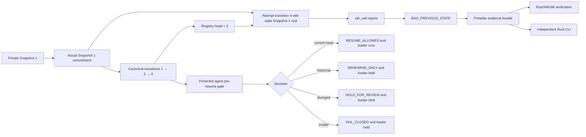

# MemoryLineage Top-1 Readiness Implementation Plan

> **For agentic workers:** REQUIRED SUB-SKILL: Use superpowers:subagent-driven-development (recommended) or superpowers:executing-plans to implement this plan task-by-task. Steps use checkbox (`- [ ]`) syntax for tracking.

**Goal:** Raise MemoryLineage's evidence-adjusted Top-1 readiness from the current analytical range of roughly 25–40% toward an approximately 50% target by making one public incident easier to understand, harder to dispute, and reproducible through the website, Rust CLI, evidence bundle, and protected agent-resume path.

**Architecture:** Preserve the existing Solidity registry, Rust reference core, independent Rust verifier, Rust/revm lane, SQLite fixture, Dioxus/WASM Inspector, and recovery receipts. Join them around one named Demo Space V2 incident: a real private snapshot root from Snapshot 1 is presented against a later canonical head at Snapshot 3, the registry rejects the attempted continuation with `BAD_PREVIOUS_STATE`, and the same evidence is replayed by the browser and CLI. Add one framework-neutral protected-resume example so the result has an operational consequence without introducing a backend, a new chain, or a semantic memory classifier.

**Tech Stack:** Rust 1.97.1, Cargo workspace, Dioxus 0.8.0-alpha.1/WASM, SQLite via `rusqlite`, Solidity 0.8.36, Alloy, `revm`, serde/JSON, existing Python/Node compatibility lanes, and the existing Sepolia read-only observation path.

**Spec:** `docs/research/2026-09-20-memorylineage-winning-patterns-and-product-evolution.md`, `docs/research/2026-09-20-memorylineage-strict-dominance-plan-audit.md`, `docs/product/problem-and-impact.md`, `docs/product/restore-preflight-recovery-rehearsal.md`, `docs/submission/claim-matrix.md`, `docs/submission/release-checklist.md`, and the user-provided Top-1 readiness gates in this plan's originating request.

## Global Constraints

- The product name remains `MemoryLineage`; the product question remains whether a private snapshot is the authorized, canonical continuation of committed history.
- Solidity registry semantics, EIP-712 fields, revert reasons, conformance vectors, mutation expectations, snapshot contents, and existing evidence formats remain compatibility targets.
- `BAD_PREVIOUS_STATE` remains the exact contract result for the stale-predecessor incident; UI prose may explain it but may not replace it.
- Raw memory, private documents, prompts, secrets, and private locator contents never enter a public evidence bundle, recovery receipt, browser export, or CLI output.
- Local fixture evidence, public Sepolia observation, protocol corpus evidence, and external reproduction reports remain distinct source classes and are never presented as interchangeable.
- `VERIFIED` is used only after the relevant checks run; `OBSERVED`, `REJECTED`, `OUT OF SCOPE`, and `NOT YET DEMONSTRATED` retain their current meanings.
- No backend, database server, token, DAO, marketplace, chatbot, semantic LLM detector, unnecessary chain, ZK layer, or unrelated agent framework is added before the vertical slice is complete.
- The plan targets readiness, not a guaranteed judge score. Official gallery coverage and unpublished judging weights cannot be inferred from this repository.
- Deployment and demo video are separate release operations. This plan prepares all artifacts and tests needed for them and never treats a local proof as a public deployment.
- The README remains at or below 300 lines and contains visual Mermaid flows rather than long prose-only descriptions.
- Existing uncommitted user changes are preserved. Each implementation task must be committed separately after its own focused test gate.

---

## Current Baseline and Honest Gaps

The current repository already has the difficult protocol and evidence foundations:

```text
Solidity registry + EIP-712 + EOA/ERC-1271 authorization
Rust reference core + independent Rust verifier
Rust/revm execution and mutation lanes
SQLite Silent Rollback V2 fixture
Dioxus/WASM Inspector with 11 routes
Recovery receipts and reference agent runtime
Local public-replay evidence
Static browser smoke and release checks
```

The readiness gap is coherence and external proof, not another protocol feature:

```text
Current local Demo Space V2  = coherent and reproducible locally
Public Sepolia incident      = separate observation unless explicitly joined
Reference agent runtime      = real fixture-scoped gate, not external adoption
External reproduction        = template exists, independent reports pending
Formal security audit       = not present and must remain NOT_FORMALLY_VERIFIED
```

The implementation therefore uses four readiness claims rather than a judge-score formula:

| Readiness claim | Required evidence | Stop condition |
| --- | --- | --- |
| A reviewer understands the problem | one plain-language sentence, one visible incident, comprehension check | reviewer describes it as semantic poisoning or generic backup integrity |
| The incident is one coherent proof | Snapshot 1 root, canonical head 3, attempt 4, exact rejection, one bundle | website, bundle, and CLI use different roots or source classes |
| Real agent integration has an operational effect | protected agent runtime opens its loader only for `RESUME_ALLOWED` | loader can run before a verified receipt |
| The evidence is independently verifiable | Rust/WASM, independent Rust verifier/CLI, clean checkout, two independent reports | any report requires hidden files, personal paths, or verbal instructions |

## File and Responsibility Map

Files are grouped by responsibility before implementation begins:

| Area | Files to create or modify | Responsibility |
| --- | --- | --- |
| Incident identity | `evidence/submission/demo-space-v2/manifest.json`, `evidence/submission/demo-space-v2/README.md`, `evidence/submission/manifest.json` | Name the canonical incident, source class, hashes, and artifact relationships |
| Local generation/replay | `crates/ml-cli/src/main.rs`, `crates/ml-evidence/src/lib.rs`, `crates/ml-spec-types/src/lib.rs` only if a passive field is required | Generate and validate one incident without changing protocol semantics |
| Recovery enforcement | `crates/ml-recovery-gate/src/lib.rs`, `crates/ml-agent-runtime/src/lib.rs`, `crates/ml-agent-runtime/examples/protected-resume-flow.rs` | Prove the runtime loader is downstream of verified preflight |
| Verification | `crates/ml-verifier-independent/src/lib.rs`, relevant tests, `scripts/smoke_web.py` | Recompute and report exact outcomes independently |
| Inspector UX | `apps/inspector/src/data.rs`, `apps/inspector/src/pages.rs`, `apps/inspector/src/components.rs`, `apps/inspector/assets/style.css` | Make one reviewer journey visible and source-labeled |
| Reproduction | `docs/reproduction/comprehension-protocol.md`, `docs/reproduction/external-developer-report.md`, `docs/reproduction/README.md` | Record clean-checkout and comprehension evidence without calling it adoption |
| Claims and release | `docs/submission/claim-matrix.md`, `docs/submission/release-checklist.md`, `docs/submission/README.md`, `docs/submission/devpost-description.md`, `README.md` | Make every public claim traceable to evidence |
| Automation | `xtask/src/main.rs`, `.github/workflows/`, `scripts/` | Make the gates repeatable without weakening existing compatibility lanes |
| Research index | `docs/research/README.md` | Link this plan as a target plan, not as completed evidence |

## Readiness Model

The implementation is complete only when the following chain is true:



The target is not “more features.” It is one falsifiable chain where each screen and command points to the same source artifact.

## Competitive Target and Why Each Task Matters

This plan uses the strongest observable pattern from the reviewed projects without copying their unsupported claims:

| Benchmark lesson | MemoryLineage response | Evidence required |
| --- | --- | --- |
| Forkline makes one rollback incident understandable quickly | make Snapshot 1 restore against canonical head 3 the only hero incident | one source-labeled incident bundle and exact rejection |
| FinalityDesk keeps a narrow verifier reproducible | keep the Rust CLI and portable evidence as a first-class audit path | clean command, hash manifest, independent replay |
| Kinetic communicates a large Web3 coordination problem | explain the trust boundary: an operator can control private memory, while a shared registry records canonical authority | plain-language Web3 necessity section and actual registry behavior |
| ArcLight packages a product visually | preserve the existing evidence workspace and reduce the first action to an old-restore check | static browser smoke, responsive smoke, keyboard path |
| DEDSEC communicates a memorable failure story | show the restored state, canonical state, and exact machine rejection in one result panel | browser result and CLI output agree |
| security-focused projects expose boundaries and failure modes | show semantic poisoning and production adoption as outside current proof | claim matrix and Security page use truthful status vocabulary |

The intended superiority is therefore measurable in the evidence envelope:

    Forkline-level incident clarity
    + FinalityDesk-level reproduction discipline
    + MemoryLineage authorization, privacy, authority-history, and cross-path evidence
    = stronger submission evidence without a wider product scope

This is a target for implementation and review, not a claim that MemoryLineage has already surpassed every submission or that a judge will award first place.


### Task 1: Freeze the Readiness Baseline and Source Classes

**Files:**
- Create: `docs/submission/readiness-register.md`
- Modify: `docs/submission/release-checklist.md`
- Modify: `docs/submission/claim-matrix.md`
- Modify: `docs/research/README.md`
- Test: the existing repository gates listed below.

**Interfaces:**
- Consumes: current release metadata, local evidence, current uncommitted UI/documentation changes, and the existing claim matrix.
- Produces: a dated register naming every target, source artifact, exact command, current status, and status-changing condition.

- [ ] **Step 1: Capture the actual starting state.**

Run from the repository root:

```bash
git status --short --branch
git log -1 --format='%H%n%s'
git describe --tags --always
cargo --version
rustc --version
```

Record the output in `docs/submission/readiness-register.md`. Do not call the current uncommitted tree a release tag.

- [ ] **Step 2: Record the existing gates before implementation changes.**

```bash
cargo fmt --all -- --check
cargo clippy --workspace --all-targets --all-features -- -D warnings
cargo test --workspace --lib --bins --tests
cargo xtask verify
cargo xtask release
```

If a command fails, record only its failing command and final error boundary. Do not mark a gate passed from an earlier run.

- [ ] **Step 3: Add the source-class table.**

Use these exact labels:

```text
DEMO_SPACE_V2_LOCAL
SEPOLIA_REFERENCE_OBSERVATION
PROTOCOL_CORPUS_LOCAL
EXTERNAL_REPRODUCTION
```

Every claim row must include `sourceClass`, relative artifact path, command, and status. Local Demo Space V2 evidence must never be presented as Sepolia evidence.

- [ ] **Step 4: Add readiness statuses without manufacturing a judge score.**

Use only:

```text
VERIFIED
OBSERVED
NOT_YET_DEMONSTRATED
OUT_OF_SCOPE
```

Cover public incident coherence, problem comprehension, Web3 necessity, protected resume enforcement, portable verification, external reproduction, impact/adoption, formal security audit, and release integrity.

- [ ] **Step 5: Verify and commit the register.**

```bash
git diff --check
wc -l README.md
git add docs/submission/readiness-register.md docs/submission/release-checklist.md docs/submission/claim-matrix.md docs/research/README.md
git commit -m "docs: add top one readiness register"
```

Expected: no whitespace errors and README remains at or below 300 lines.

### Task 2: Make Demo Space V2 One Named, Replayable Incident

**Files:**
- Create: `evidence/submission/demo-space-v2/manifest.json`
- Create: `evidence/submission/demo-space-v2/README.md`
- Create: `evidence/submission/demo-space-v2/rollback-rehearsal.json`
- Create: `evidence/submission/manifest.json`
- Modify: `crates/ml-cli/src/main.rs` only if existing output cannot be directed into the submission bundle without changing semantics.
- Modify: `xtask/src/main.rs` with a deterministic submission-bundle consistency check.
- Test: existing `ml-memory-store`, `ml-local-evm`, CLI, and xtask gates plus one temporary tamper test.

**Interfaces:**
- Consumes: `fixtures/silent-rollback-v2/snapshot-1.db`, `snapshot-2.db`, `snapshot-3.db`, the fixture manifest, and `evidence/local/demo_space_v2_evidence.json`.
- Produces: a manifest containing the actual Snapshot 1 commitment, canonical head, attempted stale predecessor, exact rejection, and SHA-256 values for referenced artifacts.

- [ ] **Step 1: Write the failing consistency check.**

The check must reject a submission bundle unless all relationships hold:

```text
snapshot-1 commitment = rollbackRehearsal.stalePredecessor
demo evidence head.sequence = 3
demo evidence head.stateRoot = rollbackRehearsal.canonicalHead
rollbackRehearsal.attemptedSequence = 4
rollbackRehearsal.revertReason = BAD_PREVIOUS_STATE
rollbackRehearsal.transactionBroadcast = false for local evidence
all referenced files exist
all recorded SHA-256 values match
```

Run the check against a temporary copy with one changed `stalePredecessor`; expect non-zero exit and `DEMO_INCIDENT_REFERENCE_MISMATCH`.

- [ ] **Step 2: Generate actual values from the fixture and local execution.**

```bash
cargo run -p ml-cli -- fixture demo-create fixtures/silent-rollback-v2
cargo run -p ml-cli -- evidence demo-v2 fixtures/silent-rollback-v2 evidence/local/demo_space_v2_evidence.json
cargo run -p ml-cli -- revm demo-space-v2 fixtures/silent-rollback-v2 > /tmp/memorylineage-demo-space-v2-revm.json
cargo run -p ml-cli -- fixture demo-manifest fixtures/silent-rollback-v2 /tmp/memorylineage-demo-space-v2-fixture-manifest.json
```

Derive Snapshot 1's V2 commitment through the existing Rust snapshot commitment function. Read the canonical head from generated evidence. Do not copy roots from screenshots or hand-edit hashes.

- [ ] **Step 3: Write the incident manifest.**

Use this field mapping when writing the artifact:

```text
schemaVersion                 = memorylineage-submission-incident-v1
incidentId                    = demo-space-v2-silent-rollback
sourceClass                   = DEMO_SPACE_V2_LOCAL
fixtureId                     = silent-rollback-v2
canonical.headSequence        = 3
canonical.headStateRoot       = EvidenceBundleV2.head.stateRoot
canonical.evidence            = evidence/local/demo_space_v2_evidence.json
restoredSnapshot.sequence     = 1
restoredSnapshot.snapshot     = fixtures/silent-rollback-v2/snapshot-1.db
restoredSnapshot.staleRoot    = snapshot_commitment_v2(snapshot-1.db)
attempt.sequence              = 4
attempt.revertReason          = BAD_PREVIOUS_STATE
attempt.transactionBroadcast  = false
attempt.execution             = revm local eth_call-equivalent
```

The committed JSON must contain concrete values from those sources. `artifacts` must include the actual SHA-256 for the fixture manifest, three snapshots, evidence bundle, revm observation, rollback rehearsal, and recovery receipt.

- [ ] **Step 4: Add the human-readable incident card.**

`evidence/submission/demo-space-v2/README.md` explains only this sequence:

```text
Snapshot 1 → Snapshot 2 → Snapshot 3 (canonical head)
restore Snapshot 1 locally
attempt transition 4 using Snapshot 1's actual root
rejection: BAD_PREVIOUS_STATE
```

It states that the evidence is local deterministic evidence and no transaction was broadcast. It links to the independent CLI command and bundle.

- [ ] **Step 5: Add the top-level submission manifest.**

List these sections and their source classes:

```text
demoIncident
protocolCorpus
runtimeIntegration
boundedAssurance
externalReproduction
```

Use `NOT_YET_DEMONSTRATED` for external reproduction until genuine independent reports exist.

- [ ] **Step 6: Run old and new gates, then commit.**

```bash
cargo xtask verify
cargo xtask release
cargo run -p ml-cli -- verify evidence/local/demo_space_v2_evidence.json
cargo run -p ml-cli -- revm demo-space-v2 fixtures/silent-rollback-v2
git diff --check
git add evidence/submission crates/ml-cli/src/main.rs xtask/src/main.rs
git commit -m "evidence: unify the Demo Space V2 incident"
```

Expected: existing vectors, fixture behavior, exact revert reason, and independent replay remain unchanged.

### Task 3: Join a Public Observation Without Pretending Deployment Exists

**Files:**
- Modify: `crates/ml-ethereum/src/lib.rs` only if the existing read-only client lacks structured head/receipt observation.
- Modify: `crates/ml-cli/src/main.rs` for source-labeled read-only capture.
- Modify: `xtask/src/main.rs` to reject source-class substitution.
- Create: `evidence/submission/demo-space-v2/public-observation.json` only after a real public deployment and readback exists.
- Modify: `docs/submission/claim-matrix.md` and `docs/submission/release-checklist.md`.
- Test: Alloy parsing tests and a no-network saved-response test.

**Interfaces:**
- Consumes: existing Alloy read-only registry calls and the local incident manifest.
- Produces: an optional `SEPOLIA_REFERENCE_OBSERVATION` artifact that can compare a public head to the local incident without overwriting its source class.

- [ ] **Step 1: Add source-separation tests.**

Reject a public observation marked `DEMO_SPACE_V2_LOCAL`, local evidence marked `SEPOLIA_REFERENCE_OBSERVATION`, or an observation that lacks registry, space ID, head, or block context.

- [ ] **Step 2: Define the observation fields.**

The artifact contains:

```text
sourceClass
network.name
network.chainId
registry.address
spaceId
observedHead.sequence
observedHead.stateRoot
blockContext.tag
blockContext.number
blockContext.hash
providerLabel
observedAt
```

It does not claim consensus, universal finality, or semantic correctness from a single read-only RPC.

- [ ] **Step 3: Implement read-only capture only.**

Use the existing Alloy client. Do not add a transaction sender, private key, deployment command, or secret configuration. If the public Demo Space V2 is not deployed, keep the artifact absent and retain `NOT_YET_DEMONSTRATED`.

- [ ] **Step 4: Verify both source paths and commit.**

```bash
cargo test -p ml-ethereum
cargo xtask verify
git diff --check
git add crates/ml-ethereum crates/ml-cli/src/main.rs xtask/src/main.rs docs/submission/claim-matrix.md docs/submission/release-checklist.md
git commit -m "evidence: separate public observations from local incident proof"
```

### Task 4: Turn the Recovery Gate into an Executable Agent-Resume Proof

**Files:**
- Modify: `crates/ml-recovery-gate/src/lib.rs`
- Modify: `crates/ml-agent-runtime/src/lib.rs`
- Create: `crates/ml-agent-runtime/examples/protected-resume-flow.rs`
- Modify: `crates/ml-cli/src/main.rs` only if the example output needs to be included in `agent reference-demo` without duplicating the gate.
- Test: recovery-gate unit tests, runtime tests, and the example binary.

**Interfaces:**
- Consumes: `EvidenceBundleV2`, a snapshot path, an explicit snapshot profile, and the existing `protected_resume_with_profile` API.
- Produces: a deterministic report proving that only `RESUME_ALLOWED` invokes the private session loader; all other classifications return a receipt and keep the loader closed.

- [ ] **Step 1: Add a failing loader-invocation matrix test.**

Use the existing V2 fixture and assert this exact matrix:

| Candidate | Classification | Action | Loader invoked | Runtime state |
| --- | --- | --- | --- | --- |
| `snapshot-3.db` | `CURRENT_HEAD` | `RESUME_ALLOWED` | `true` | active session sequence 3 |
| `snapshot-1.db` | `KNOWN_HISTORICAL_CHECKPOINT` | `REHEARSE_ONLY` | `false` | no active session |
| divergent sequence-3 snapshot | `UNKNOWN_OR_DIVERGED` | `HOLD_FOR_REVIEW` | `false` | no active session |
| invalid evidence | `UNVERIFIED`/verification error | `BLOCK_UNVERIFIED` or fail-closed error | `false` | no active session |

The test must use an atomic or mutable invocation marker inside the loader closure and assert the marker remains false for every held case.

- [ ] **Step 2: Keep the policy boundary before loading.**

`protected_resume_with_profile` must continue to perform, in this order:

```text
read private snapshot
→ derive profile-specific commitment
→ build receipt
→ independently verify receipt
→ compare recommendedAction
→ invoke loader only for RESUME_ALLOWED
```

Do not move the loader before `verify_recovery_receipt`. Do not export `MemorySnapshot.values` from the report.

- [ ] **Step 3: Add the executable example.**

`protected-resume-flow.rs` must run the four cases using `ReferenceAgentRuntime`, print one machine-readable JSON report, and include these fields for each case:

```text
case
snapshotSequence
classification
recommendedAction
loaderInvoked
rawMemoryExported
result
```

The example must return non-zero if any expected loader decision differs. It must use repository fixtures and `evidence/local/demo_space_v2_evidence.json` by default, with optional command-line paths for a clean checkout.

- [ ] **Step 4: Run focused tests and the existing runtime command.**

```bash
cargo test -p ml-recovery-gate -p ml-agent-runtime
cargo run -p ml-agent-runtime --example protected-resume-flow
cargo run -p ml-cli -- agent reference-demo fixtures/silent-rollback-v2 evidence/local/demo_space_v2_evidence.json /tmp/reference-agent-runtime.json
cargo xtask verify
```

Expected: current head loads; historical, divergent, and invalid cases never invoke the loader; `rawMemoryExported` remains false. Commit:

```bash
git add crates/ml-recovery-gate crates/ml-agent-runtime crates/ml-cli/src/main.rs
 git commit -m "feat: demonstrate protected agent resume decisions"
```

### Task 5: Make the Incident Bundle a Portable Product Artifact

**Files:**
- Modify: `crates/ml-evidence/src/lib.rs`
- Modify: `crates/ml-spec-types/src/lib.rs` only for passive submission-envelope types if validation cannot remain in `ml-evidence`.
- Modify: `crates/ml-cli/src/main.rs`
- Create: `evidence/submission/manifest.json`
- Create: `evidence/submission/README.md`
- Modify: `apps/inspector/src/data.rs` and `apps/inspector/src/pages.rs` to identify the loaded bundle and source class.
- Test: `ml-evidence` tests, independent verifier tests, browser static smoke, and bundle tamper tests.

**Interfaces:**
- Consumes: `EvidenceBundleV2`, `RecoveryDecisionReceipt`, Demo Space V2 incident manifest, runtime report, revm reports, and bounded assurance report.
- Produces: one stable submission envelope that points to artifacts, records SHA-256 values, and can be checked offline without raw memory.

- [ ] **Step 1: Define the envelope without changing V2 semantics.**

Keep `memorylineage-evidence-v2` as the protocol evidence format. Add a separate submission envelope with:

```text
schemaVersion
submissionCommit
incidentId
sourceClasses
artifacts[]
claims[]
verificationCommands[]
limitations[]
```

Each artifact entry contains `path`, `sha256`, `sourceClass`, `generatedBy`, and `status`. Do not duplicate full raw evidence inside the envelope.

- [ ] **Step 2: Add fail-closed manifest validation.**

Reject the envelope when:

```text
an artifact path escapes the repository or bundle root
an artifact hash does not match
sourceClass is absent
status is VERIFIED but no command is recorded
raw-memory field names or private locator content appear
unknown security-critical fields are silently ignored
```

Use `serde(deny_unknown_fields)` for the envelope and artifact records where compatible with existing V1/V2 import behavior.

- [ ] **Step 3: Add a CLI command that verifies the envelope.**

The command must be:

```bash
cargo run -p ml-cli -- submission verify evidence/submission/manifest.json
```

It prints:

```text
Incident identity       PASS
Artifact hashes         PASS
Source classes          PASS
Evidence replay         PASS
Recovery receipts       PASS
Privacy boundary        PASS
VERDICT                 VERIFIED
```

It must print a precise failing row and return non-zero after a one-byte artifact or manifest tamper.

- [ ] **Step 4: Connect the Inspector to the same envelope.**

The Verify page must show:

```text
loaded incident ID
source class
bundle hash
artifact count
browser verification result
Rust CLI command
```

The Home, Inspect, Lab, and History pages must consume the same normalized incident view model instead of independently hardcoding sequence, root, or revert values.

- [ ] **Step 5: Run the portable artifact checks.**

```bash
cargo test -p ml-evidence -p ml-verifier-independent -p ml-cli
cargo run -p ml-cli -- submission verify evidence/submission/manifest.json
cargo xtask verify
cargo xtask smoke-web
```

Expected: original bundle verifies; tampered bundle fails; restored bundle verifies; the UI labels local/public sources honestly. Commit:

```bash
git add crates/ml-evidence crates/ml-spec-types crates/ml-cli/src/main.rs evidence/submission apps/inspector/src/data.rs apps/inspector/src/pages.rs
 git commit -m "feat: ship a portable incident evidence bundle"
```

### Task 6: Reduce the Reviewer Journey to One Understandable Action

**Files:**
- Modify: `apps/inspector/src/data.rs`
- Modify: `apps/inspector/src/pages.rs`
- Modify: `apps/inspector/src/components.rs`
- Modify: `apps/inspector/assets/style.css`
- Modify: `scripts/smoke_web.py`
- Modify: `README.md` only if the user journey text diverges from the actual UI.
- Test: static browser smoke at desktop and 390px; keyboard traversal; Verify/Lab interaction assertions.

**Interfaces:**
- Consumes: the normalized submission incident view model and existing Rust/WASM evidence/replay functions.
- Produces: a first-time reviewer flow with one primary action: `Check an old restore`.

- [ ] **Step 1: Write failing smoke assertions for the user journey.**

The browser smoke must assert these visible facts on the relevant pages:

```text
Home: “An AI agent can restore an old private-memory backup that still looks valid.”
Inspect: canonical head and restored candidate are both visible with source labels.
Lab: “Check an old restore” reaches a real rejection state.
Lab: exact machine reason BAD_PREVIOUS_STATE is visible.
Verify: original bundle reaches VERIFIED.
Verify: changed commitment reaches TRANSITION_ID_MISMATCH.
Verify: restored bundle reaches VERIFIED again.
```

The test must fail if a page displays `LIVE` while using local bundled evidence.

- [ ] **Step 2: Implement the single primary CTA.**

The Home and Inspect primary button navigates to the Silent Rollback scenario. Secondary actions remain `View canonical history`, `Verify evidence`, and `Read security boundary`. Technical terms appear after the incident result, not before it.

- [ ] **Step 3: Show the incident in plain language.**

The first explanation must state:

```text
An AI agent can restore an old private-memory backup that still looks valid.
MemoryLineage checks whether that backup is the authorized continuation of history before the agent resumes.
```

The result panel must show the actual values from the incident view model:

```text
Current canonical state: 3
Restored local state: 1
Attempted continuation: 4
Reason: BAD_PREVIOUS_STATE
```

Do not insert values from target screenshots.

- [ ] **Step 4: Preserve the visual contract.**

Keep the existing light evidence workspace, logo, typography, restrained borders, lineage rail, exact status language, and 11-route information architecture. Do not add a dashboard page, metric-grid, decorative chain illustration, or new primary navigation item.

- [ ] **Step 5: Validate desktop, mobile, keyboard, and source labels.**

```bash
cargo xtask build-web
cargo xtask smoke-web
python3 scripts/smoke_web.py
cargo xtask release
```

Use the existing Chromium smoke configuration for approximately 1440px and 390px. Verify keyboard focus reaches the primary CTA, scenario selector, simulate button, import control, export control, and result status. Commit:

```bash
git add apps/inspector scripts/smoke_web.py README.md
 git commit -m "ux: make the old-restore incident the primary journey"
```

### Task 7: Measure Problem Comprehension Without Claiming Adoption

**Files:**
- Create: `docs/reproduction/comprehension-protocol.md`
- Modify: `docs/reproduction/external-developer-report.md`
- Modify: `docs/reproduction/README.md`
- Modify: `docs/submission/claim-matrix.md`
- Test: two completed comprehension/reproduction reports supplied by independent developers.

**Interfaces:**
- Consumes: the deployed or locally served Inspector, `README.md`, the incident bundle, and the external reproduction protocol.
- Produces: evidence that a new technical reviewer can describe the problem and boundary in their own words; it does not produce an adoption or security-audit claim.

- [ ] **Step 1: Define the controlled walkthrough.**

`docs/reproduction/comprehension-protocol.md` must give a participant only:

```text
repository URL or local archive
README URL or file
website URL or local command
```

The participant first opens Home, then may navigate freely. Do not explain ERC-8350, the intended answer, or the meaning of `BAD_PREVIOUS_STATE` beforehand.

- [ ] **Step 2: Define the two comprehension questions.**

Record the participant's unedited answers to:

```text
What does MemoryLineage check before an agent resumes from a private snapshot?
What does MemoryLineage explicitly not prove about the memory or the agent?
```

A passing answer identifies canonical continuity/authorization and explicitly excludes semantic truth or safety. An answer that says “it detects malicious memory” is a product-clarity failure to fix before release.

- [ ] **Step 3: Record task completion.**

The report records whether the participant completed:

```text
open Home
find current canonical head
run Check an old restore
observe BAD_PREVIOUS_STATE
open Verify
export/import or load evidence
observe VERIFIED
change one commitment
observe TRANSITION_ID_MISMATCH
restore and observe VERIFIED
run independent CLI command
```

Record time-to-first-correct-explanation and the first point of confusion. Do not convert two walkthroughs into a percentage of market adoption.

- [ ] **Step 4: Add the correct claim status.**

Until two genuine reports are attached, the claim matrix must say:

```text
External comprehension validation: NOT_YET_DEMONSTRATED
External developer reproduction: NOT_YET_DEMONSTRATED
Production adoption: NOT_YET_DEMONSTRATED
```

After two reports pass, change only the corresponding rows and preserve their commit, toolchain, OS, browser, command, output, and participant answers.

- [ ] **Step 5: Validate the documentation.**

```bash
rg -n "adoption|security audit|formal|NOT_YET_DEMONSTRATED" docs/reproduction docs/submission/claim-matrix.md
wc -l README.md
```

Commit only after reports are complete or the protocol documentation is ready without implying that reports already exist:

```bash
git add docs/reproduction docs/submission/claim-matrix.md
git commit -m "docs: define independent comprehension reproduction"
```

### Task 8: Execute and Record Two Clean-Checkout Reproductions

**Files:**
- Create: `docs/reproduction/reports/developer-1.json` only after a real report exists.
- Create: `docs/reproduction/reports/developer-2.json` only after a second real report exists.
- Modify: `docs/reproduction/external-developer-report.md` if the command list changes.
- Modify: `docs/submission/claim-matrix.md` and `docs/submission/release-checklist.md` after evidence is complete.
- Test: fresh clones or clean archives made by the independent developers.

**Interfaces:**
- Consumes: exact source commit, exact evidence bundle, README, and the reproducible commands.
- Produces: two independently recorded reports; no credentials, private memory, or personal absolute paths are committed.

- [ ] **Step 1: Give each developer the same bounded instructions.**

Provide only:

```bash
git clone https://github.com/AndroLay/MemoryLineage.git
cd MemoryLineage
cargo xtask verify
cargo xtask build-web
cargo xtask smoke-web
cargo run -p ml-cli -- submission verify evidence/submission/manifest.json
```

If a production URL exists, also ask them to open it directly and run the old-restore flow. If no deployment exists, use the documented local static path and label the result local.

- [ ] **Step 2: Require the exact result sequence.**

Each report must preserve the output for:

```text
BAD_PREVIOUS_STATE
TRANSITION_ID_MISMATCH
VERIFIED
```

A report is not a security audit and does not prove production adoption.

- [ ] **Step 3: Record the environment and clean-checkout proof.**

Each report records:

```text
source commit SHA
OS and architecture
rustc and cargo versions
Dioxus CLI version if used
browser version
commands and exit codes
first failure, if any
participant's two comprehension answers
```

Replace personal paths with repository-relative paths before committing. Do not commit shell history, credentials, or unredacted machine output containing secrets.

- [ ] **Step 4: Re-run the reports from the recorded commit.**

A maintainer verifies each report by checking out its exact commit in a temporary clean directory and repeating the commands. Do not alter the report to make it pass.

- [ ] **Step 5: Update claim status only from the reports.**

If both independent runs pass, mark external clean-checkout reproduction `VERIFIED` with links to both reports. If one fails, keep the status `NOT_YET_DEMONSTRATED`, record the failure, and fix the cause before repeating both runs.

### Task 9: Freeze the Claim, Provenance, and Reviewer Package

**Files:**
- Modify: `docs/submission/claim-matrix.md`
- Modify: `docs/submission/release-checklist.md`
- Modify: `docs/submission/README.md`
- Modify: `docs/submission/devpost-description.md`
- Modify: `README.md`
- Modify: `PRODUCT.md`, `DESIGN.md`, and relevant architecture/testing docs only where they contradict the current Rust/WASM product.
- Create: `docs/submission/claim-audit-report.md`
- Test: repository-wide prohibited-claim search, README line count, package check, and release manifest.

**Interfaces:**
- Consumes: final incident manifest, runtime report, bundle verification report, reproduction reports, current tags, and actual repository URLs.
- Produces: one public vocabulary shared by website, README, Devpost description, release checklist, and CLI help.

- [ ] **Step 1: Write the final claim table.**

Use rows with `claim`, `evidence`, `sourceClass`, `command`, and `status`. At minimum include:

```text
ordered committed history
stale predecessor rejection
authority history
EOA authorization
ERC-1271 execution lane
portable evidence replay
protected loader gate
raw memory absent from evidence
semantic truth
semantic memory safety
formal security verification
external reproduction
production adoption
```

The last five remain `OUT_OF_SCOPE`, `NOT_FORMALLY_VERIFIED`, or `NOT_YET_DEMONSTRATED` as applicable.

- [ ] **Step 2: Add the final provenance statement.**

Separate:

```text
prior standards and Ethereum primitives
preserved pre-existing evidence
MemoryLineage repository work
submission-specific incident/evidence work
```

Do not claim first implementation, standard authorship, third-party audit, or production adoption without an artifact that directly supports it.

- [ ] **Step 3: Run the claim audit.**

```bash
rg -n -i "first|tamper-proof|unhackable|prevents all|detects memory poisoning|formally verified|security audited|production adoption|consensus proven" README.md PRODUCT.md DESIGN.md docs apps crates
```

Every match must either be supported by the claim matrix, be explicitly negated, or be removed. The audit report records the search command and final result.

- [ ] **Step 4: Validate the release package.**

```bash
cargo xtask reviewer-package
cargo xtask release-manifest
cargo xtask package-check
git ls-files | rg '(^|/)(internal|target|node_modules|__pycache__|generated)(/|$)' && exit 1 || true
wc -l README.md
git diff --check
```

The package must exclude `internal/design`, build output, Node modules, caches, secrets, absolute machine paths, and generated untracked data.

- [ ] **Step 5: Commit the frozen claim package.**

```bash
git add README.md PRODUCT.md DESIGN.md docs/submission docs/architecture docs/testing.md docs/product
git commit -m "docs: freeze evidence-backed submission claims"
```

### Task 10: Make the Verification Gate Match the Product Claims

**Files:**
- Modify: `xtask/src/main.rs`
- Modify: `.github/workflows/` current workflow files
- Modify: `scripts/smoke_web.py` only for assertions that represent current product behavior.
- Modify: `docs/product/inspector-demo.md` and `docs/reproduction/README.md`.
- Test: `cargo xtask verify`, `cargo xtask release`, static browser smoke, and the legacy compatibility gate.

**Interfaces:**
- Consumes: all verified local tasks, incident bundle, protected-resume report, and existing Rust/revm reports.
- Produces: one command whose output accurately describes the gates it actually runs.

- [ ] **Step 1: Write the command coverage test.**

The `verify` path must invoke or validate these categories:

```text
formatting
clippy
workspace library/bin/integration tests
pinned protocol vectors
independent evidence replay
Demo Space V2 fixture and incident consistency
protected resume matrix
Rust/revm Silent Rollback
Rust/revm mutation corpus
Rust/revm ERC-1271
Rust/revm authority rotation
WASM compile
submission bundle privacy/hash invariants
public package boundary
```

The test must fail if documentation says a category is run while the command omits it.

- [ ] **Step 2: Preserve separate release-only work.**

`cargo xtask release` may additionally run static web build, Chromium smoke, release packaging, and size/report generation. Do not make `cargo xtask verify` broadcast transactions or require a production URL.

- [ ] **Step 3: Keep the dev-server limitation explicit.**

If pinned Dioxus `dx serve --web` still fails because of the upstream WASM exceptions emitter, the official command remains `cargo xtask serve-web` and static `cargo xtask smoke-web` remains the release acceptance path. Document the exact limitation and do not label it an application failure or silently upgrade the framework.

- [ ] **Step 4: Run both Rust and legacy gates.**

```bash
cargo xtask verify
cargo xtask release
npm run verify
python3 scripts/smoke_web.py
```

A failure in the legacy lane is a compatibility regression until investigated. A passing Rust lane does not permit deleting the legacy oracle before parity is recorded.

- [ ] **Step 5: Commit only after the output and documentation agree.**

```bash
git diff --check
git add xtask .github scripts docs/product docs/reproduction
git commit -m "ci: align verification gates with readiness claims"
```

### Task 11: Perform the Final Evidence Review Before Any Release Decision

**Files:**
- Create: docs/submission/final-readiness-review.md
- Modify: docs/submission/readiness-register.md
- Modify: docs/submission/release-checklist.md
- Test: every command in the final gate below from a clean checkout or clean source archive.

**Interfaces:**
- Consumes: all artifacts and reports from Tasks 1–10.
- Produces: a final readiness decision that distinguishes completed local evidence, optional public observation, external reproduction, adoption, and formal security assurance.

- [ ] **Step 1: Run the complete local gate.**

    cargo fmt --all -- --check
    cargo clippy --workspace --all-targets --all-features -- -D warnings
    cargo test --workspace --lib --bins --tests
    cargo xtask verify
    cargo xtask release
    npm run verify
    python3 scripts/smoke_web.py

Record exit codes and the exact commit. If any command fails, the release decision remains blocked until the failure is fixed or explicitly documented as an upstream limitation with a working official path.

- [ ] **Step 2: Verify the incident independently three ways.**

    cargo run -p ml-cli -- submission verify evidence/submission/manifest.json
    cargo run -p ml-cli -- verify evidence/local/demo_space_v2_evidence.json
    cargo run -p ml-agent-runtime --example protected-resume-flow

The first two must show the portable evidence verdict; the third must show the loader matrix. The local incident must retain BAD_PREVIOUS_STATE and the tamper workbench must retain TRANSITION_ID_MISMATCH.

- [ ] **Step 3: Inspect the release boundary.**

    cargo xtask reviewer-package
    cargo xtask reviewer-reproduce
    cargo xtask release-manifest
    git diff --check
    git status --short --branch

The reviewer package must be reproducible from the exact recorded commit and must not include internal/, build artifacts, credentials, raw private memory, or machine-specific absolute paths.

- [ ] **Step 4: Write the final readiness review.**

The review must contain a table with these rows and evidence paths:

    problem clarity
    Web3 necessity
    public incident
    product coherence
    protected agent runtime
    independent browser verification
    independent CLI verification
    external reproduction
    evidence quality
    UI accessibility/responsive behavior
    claim discipline
    formal security audit
    production adoption
    deployment observation

Use only VERIFIED, OBSERVED, NOT_YET_DEMONSTRATED, and OUT_OF_SCOPE. Do not convert the table into a claimed probability.

- [ ] **Step 5: Commit the final local readiness review.**

    git add docs/submission/final-readiness-review.md docs/submission/readiness-register.md docs/submission/release-checklist.md
    git commit -m "docs: record final top one readiness review"

## Stop Rules and Deferred Work

Stop implementation and review the evidence if any of these occurs:

- Snapshot 1's actual root no longer produces BAD_PREVIOUS_STATE against canonical head 3.
- Rust, Solidity, revm, browser, and CLI disagree on a published vector.
- The protected loader runs for historical, divergent, or invalid evidence.
- A UI source badge says live/public while the data is local.
- A public bundle includes raw memory, private locator content, credentials, or absolute developer paths.
- A requested enhancement requires changing Solidity semantics, EIP-712 fields, fixture content, mutation expectations, or revert reasons.
- The change adds a new product surface without improving one of clarity, falsifiability, reproducibility, or evidence quality.
- A clean-checkout report fails and the cause is not understood.
- cargo xtask verify, cargo xtask release, or npm run verify fails after a change.

The following remain explicitly deferred until the vertical slice and release gates are complete:

    new chains or Polkadot production support
    new agent frameworks
    semantic memory safety detection
    formal verification
    third-party security audit
    production adoption
    marketplace/token/DAO features
    additional primary pages
    demo video and presentation production

## Definition of Done

The readiness plan is complete when all of these are true:

- [ ] A first-time reviewer can explain the problem from Home without learning ERC-8350 first.
- [ ] Home, Inspect, History, Lab, Verify, and CLI refer to the same named Demo Space V2 incident.
- [ ] Snapshot 1's actual V2 commitment is the stale predecessor used by the incident.
- [ ] Canonical head 3 and attempted transition 4 are recorded in one source-labeled bundle.
- [ ] The stale attempt returns the exact BAD_PREVIOUS_STATE result.
- [ ] An evidence commitment edit returns the exact TRANSITION_ID_MISMATCH result.
- [ ] Restoring the original bundle returns VERIFIED in browser/WASM and CLI paths.
- [ ] The protected runtime invokes its loader only for RESUME_ALLOWED.
- [ ] The bundle contains hashes and commands and excludes raw memory.
- [ ] Public observations, if present, remain clearly separate from local proof.
- [ ] Two independent developers complete the recorded clean-checkout flow, or the claim remains NOT_YET_DEMONSTRATED.
- [ ] The release gate output matches the claims in the docs.
- [ ] The README remains at or below 300 lines and uses visual Mermaid flows.
- [ ] Static packaging excludes internal design references and build artifacts.
- [ ] Formal security audit, production adoption, and deployment are reported only when their own evidence exists.
- [ ] Video is the only intentionally omitted submission artifact after the non-video gates are complete.

## Execution Order

Run the plan in these reviewable slices:

    Task 1  baseline and source classes
    Task 2  unified local incident
    Task 3  optional public observation boundary
    Task 4  protected agent resume proof
    Task 5  portable evidence product
    Task 6  reviewer journey and UI clarity
    Task 7  comprehension protocol
    Task 8  two independent reproductions
    Task 9  claim and provenance freeze
    Task 10 verification and CI alignment
    Task 11 final evidence review

Tasks 2–6 are the core vertical slice. Tasks 7–11 are evidence and release hardening. Do not start a deferred feature between these slices.
